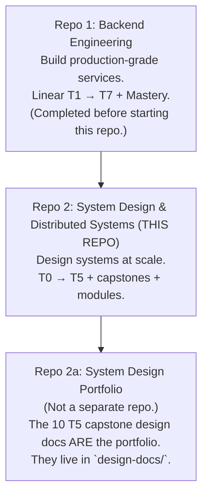
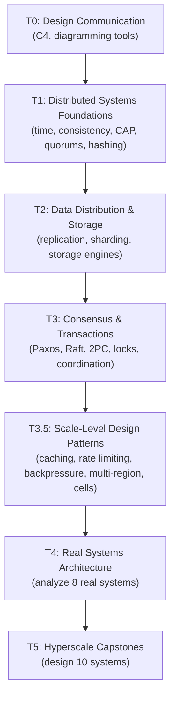

# System Design & Distributed Systems

> A linear, design-focused curriculum for mastering distributed systems theory and hyperscale system design.
> Covers distributed systems fundamentals, data distribution, consensus, scale patterns, and 10 MAANG capstone designs.
> Complements **Backend Engineering (Repo 1)** — that repo teaches you to build services; this one teaches you to design them at scale.

---

## 1. What This Curriculum Is

A hands-on path from "I can build a service" to "I can design a distributed system at hyperscale and defend the design."

**Core principle**: every topic is either **LEARN** (understand a concept), **ANALYZE** (reverse-engineer a real system), or **DESIGN** (produce a design doc). No code is written in this curriculum. Every artifact is a document, a diagram, or a defense transcript.

**Relationship to Backend Engineering**: Backend Engineering teaches you how to *use* tools (Postgres, Redis, Kafka, BullMQ, Envoy, CDNs). This curriculum teaches you how those tools work at scale, why they break, and how to design systems that combine them correctly.

**Non-goal**: this is *not* a build curriculum. No implementations of Raft, no consistent hashing code, no CRDT prototypes. Design literacy, not engineering hands-on.

**Interview relevance**: the T5 capstones are the same design drills you'd encounter in MAANG system design interviews. The Mock Defense Protocol is designed to prepare you for the real thing.

---

## 2. The Three-Repo Structure



**Build order**: Repo 1 → Repo 2. Do not start Repo 2 until Repo 1's Core Mastery projects are done.

**Repo 2a doesn't exist as a separate repo.** The portfolio is the collection of capstone design docs + defense transcripts produced in T5. They live inside this repo at `design-docs/` and `defense-transcripts/`.

---

## 3. The 7 Tiers

| Tier | Name | Mode | Artifacts |
|---|---|---|---|
| **T0** | Design Communication Foundations | LEARN + hands-on | 1 C4 diagram |
| **T1** | Distributed Systems Foundations | LEARN | None |
| **T2** | Data Distribution & Storage at Scale | LEARN | None |
| **T3** | Consensus, Coordination & Transactions | LEARN | None |
| **T3.5** | Scale-Level Design Patterns | LEARN + ANALYZE | 2–3 analysis docs |
| **T4** | Real Systems Architecture | ANALYZE | 8 analysis docs |
| **T5** | Hyperscale Design Capstones | DESIGN | 10 design docs + 10 defense transcripts |

**Tiers are hierarchical, not compositional.** T1–T3 build a mental toolkit of distributed systems primitives. T3.5 adds the scale-level patterns that don't fit T1–T3. T4 reverse-engineers how real systems combine them. T5 asks you to combine them yourself.

**Why T3.5 exists**: T1–T3 covers the *algorithmic* foundation (consensus, replication, quorums). T3.5 covers the *system design* foundation (caching at scale, rate limiting at edge, backpressure, multi-region, cells, observability). Without T3.5, T5 capstones would fail on practical concerns.

---

## 4. The 12-Tag Legend

Every topic carries these tags. Format is compact — two lines per topic.

| Tag | Meaning |
|---|---|
| `LEARN` / `ANALYZE` / `DESIGN` | Depth mode. LEARN = understand a concept. ANALYZE = reverse-engineer a real system. DESIGN = produce a capstone design doc. |
| `Anchor: <tier-name>` | The analysis doc or capstone this topic feeds into. |
| `Deps: <topics>` | What must come before this topic. |
| `Fails: <symptom>` | What breaks in production if you don't know this. |
| `Interview: Y/N/S` | Frequently asked in MAANG system design interviews (Y = yes, N = no, S = sometimes). |
| `Artifact: <file>` | The written output proving you learned it. |
| `Mistake: <trap>` | Common misconception about this topic. |
| `Ref: <tier>` | Where this topic is reused *within this repo*. |
| `Ref: Backend <tier>.<topic>` | Points to the Backend Engineering tier where the usage level was covered. When present, the AI instructor skips re-teaching basics and focuses on the design/scale layer. |
| `Theory X / Practice Y` | Weight split for this topic (higher theory than Backend Engineering). |
| `Paper: <name>` | Which paper (if any) is the canonical source. |
| `Reading: <time>` | Estimated time to engage with this topic. |

**Example** (topic + tags, as they appear in tier files):

```
- **CAP theorem**: consistency, availability, partition tolerance — pick 2
  `LEARN` · `Anchor: —` · `Deps: T1.3 eventual` · `Fails: no principled choice under partition` · `Interview: Y` · `Artifact: —` · `Mistake: treating CAP as binary (it isn't during non-partition)` · `Ref: T2, T3, T5` · `Theory 80/Practice 20` · `Reading: 40 min`
```

```
- **Rate limiting at scale**: distributed GCRA, edge rate limiting (Cloudflare WAF scale)
  `LEARN` · `Anchor: T3.5-ratelimit-analysis` · `Deps: T3.5.1` · `Fails: in-memory limiter doesn't work multi-region` · `Ref: Backend T3c.5, T4.6` · `Interview: Y` · `Artifact: —` · `Mistake: rate limiter as SPOF` · `Ref: T4, T5` · `Theory 60/Practice 40` · `Reading: 35 min`
```

---

## 5. Learning Flow — Learn → Analyze → Design



**T0–T3**: build the toolkit. You learn concepts and confirm understanding. No artifacts.

**T3.5**: fill the gap between theory and practice. Learn scale patterns, produce 2–3 small analysis docs.

**T4**: reverse-engineer. You analyze Kafka, Spanner, Dynamo, Cassandra, Redis Cluster, Envoy, CDN architecture, GFS/Bigtable/Aurora. One analysis doc per system.

**T5**: design. You produce 10 capstone design docs, defended via the Mock Defense Protocol.

---

## 6. The Mock Defense Protocol (T5)

Every capstone in T5 goes through a **5-phase defense**:

1. **Sketch** — the learner designs on paper/Excalidraw, untimed. AI does not help.
2. **Write** — the learner produces the 7-part design doc. AI does not help.
3. **Defend** — the AI acts as a FAANG Staff Engineer. Grills on SPOFs, 10x/100x spikes, edge cases, trade-offs. One question at a time.
4. **Reveal** — the AI reveals a reference solution + gap analysis.
5. **Revise** — the learner revises their design doc based on the gap analysis.

The design doc + defense transcript together form the portfolio artifact.

---

## 7. The Design Doc Format (7 parts)

Every T5 capstone produces a design doc with this structure:

```
# [System Name] — Design Doc

## 1. Requirements & Scope
Functional requirements, non-functional requirements (p99 latency, availability, consistency), out of scope.

## 2. Capacity Estimation
QPS (read/write), storage per year, bandwidth, cache sizing. Back-of-the-envelope math shown.

## 3. High-Level Design
End-to-end architecture diagram (Mermaid). Component responsibilities. Data flow.

## 4. Low-Level Design
Database schemas, indexes. API contracts. Caching strategy. Sharding/partitioning strategy.

## 5. Trade-offs & Alternatives
Why this design over alternatives. What you're giving up.

## 6. Failure Modes & Mitigations
What breaks under 10x traffic. What breaks under partition. What breaks under datacenter failure.

## 7. Defense Transcript
AI grill questions + your answers. Gap analysis (your design vs reference).
```

Full protocol in `instructor-rules.md` Rules 15 & 16.

---

## 8. The Two Modules

Modules run in parallel with the tiers — they're not sequential.

### Module A — Papers Vault (`08-papers-vault.md`)

18 papers with digest → read → analysis treatment. Each paper is tagged with the tier where it becomes relevant. Papers are read **inline** as the learner reaches the relevant concept.

Examples:
- **Lamport (1978)** — read during T1.2
- **Paxos Made Simple (2001)** — read during T3.1
- **Spanner (2012)** — read during T4.2
- **Raft (2014)** — read during T3.1

### Module B — Case Studies Vault (`09-case-studies-vault.md`)

26 real-world engineering stories. Each case study reinforces specific tiers.

Examples:
- **Segment's $1M Kafka incident** — reinforces T4.1
- **Discord Cassandra → ScyllaDB** — reinforces T4.4
- **Cloudflare BGP outage** — reinforces T4.6
- **Roblox 73-hour outage** — reinforces T3.3

Case studies are read on demand — the AI never proactively suggests them.

---

## 9. IN / OUT Boundary

### ✅ IN (System Design)

- Distributed systems theory (CAP, PACELC, FLP, consistency models)
- Consensus protocols (Paxos, Raft, ZAB, EPaxos) — theory level
- Distributed transactions (2PC, 3PC, TCC, Sagas theory)
- Replication, sharding, quorums, consistent hashing
- Real system architecture (Kafka, Spanner, Dynamo, Cassandra, Envoy, CDN)
- Scale-level patterns (caching, rate limiting, backpressure, multi-region, cells)
- Hyperscale design drills (10 MAANG-style capstones)
- Capacity planning, back-of-envelope math
- Failure domain design, blast radius analysis
- Papers and case studies

### ❌ OUT (→ Backend Engineering)

- Building services, code, tests, Docker, CI/CD
- Tool *usage* (as opposed to design): using Postgres, Redis, Kafka, BullMQ, Envoy
- Auth implementation, security hardening, rate limiter code
- Container orchestration at developer level (K8s manifests, probes)
- Project scaffolding, deployment pipelines
- Hands-on implementations of any algorithm

**Rule of thumb**: if a topic requires *writing code* to learn, it belongs in Backend Engineering. If it requires *reasoning about a design*, it belongs here.

### Cross-References (from Backend Engineering)

Some topics in this curriculum carry `Ref: Backend <tier>.<topic>` tags — meaning the learner has already covered the usage level in Backend Engineering. The AI instructor **skips re-teaching basics** and focuses on the design/scale layer.

Examples:
- "Rate limiting at scale" → `Ref: Backend T3c.5, T4.6`
- "Kafka architecture" → `Ref: Backend T5.7`
- "Consistent hashing" (in some tiers) → `Ref: Backend T1.5 awareness`

---

## 10. The Portfolio (Repo 2a — Never Built Separately)

The portfolio is **the collection of T5 capstone design docs + defense transcripts**.

- Each capstone produces one design doc (7 parts).
- Each capstone produces one defense transcript.
- Together, 10 capstones = 20 artifacts.

**Where they live**:
- `design-docs/01-url-shortener.md` ... `design-docs/10-collaborative-editor.md`
- `defense-transcripts/01-url-shortener.md` ... `defense-transcripts/10-collaborative-editor.md`

**No separate repo.** No code. Just documents.

---

## 11. Repo Files

```
system_design/
├── SESSION-START.md
├── 00-overview.md
├── 01-tier-0-design-communication.md
├── 02-tier-1-foundations.md
├── 03-tier-2-data-distribution.md
├── 04-tier-3-consensus-transactions.md
├── 05-tier-3.5-scale-patterns.md
├── 06-tier-4-real-systems.md
├── 07-tier-5-capstones.md
├── 08-papers-vault.md
├── 09-case-studies-vault.md
├── 10-progress-tracker.md
├── 11-problems-patterns-index.md
├── 12-error-journal.md
├── instructor-rules.md
├── deep-dives/
│   ├── 01-tier-0/
│   ├── 02-tier-1/
│   ├── 03-tier-2/
│   ├── 04-tier-3/
│   ├── 05-tier-3.5/
│   ├── 06-tier-4/
│   └── 07-tier-5/
├── design-docs/                        ← T5 portfolio
├── defense-transcripts/                ← T5 mock defense transcripts
├── paper-deep-dives/                   ← on-demand
└── case-study-deep-dives/              ← on-demand
```

**The ENTRY POINT is `SESSION-START.md`.** Every session begins there.

---

## 12. How to Use This Repo

You are working with an AI instructor (Antigravity) that reads and writes files directly.

**Every session:**

1. Open the repo in Antigravity.
2. Say: **"Read SESSION-START.md and start."**
3. The AI reads `SESSION-START.md`, `instructor-rules.md`, `10-progress-tracker.md`, and the current tier file.
4. The AI restates your position and waits for confirmation.
5. You confirm. Session begins.
6. When done, say **"that's enough for today."** The AI updates the tracker, error journal, tier retrospective, and any design docs (if a capstone was completed).

**You don't paste anything.** The AI reads from disk. The AI writes deep-dive files, design docs, tracker updates, and error journal entries directly to disk and shows you a diff.

**Reference files** (`08-papers-vault.md`, `09-case-studies-vault.md`, `11-problems-patterns-index.md`) — the AI reads these only when relevant.

---

## 13. What "Done" Looks Like

You've completed this curriculum when:

- All T0–T5 topics are engaged with in order
- T4's 8 analysis docs are written
- T5's 10 capstone design docs + 10 defense transcripts are complete
- You can walk into a MAANG system design interview and defend a design under grilling
- You can read a systems paper and follow the reasoning without hand-waving

The portfolio (10 design docs + 10 defense transcripts) is what you show interviewers.