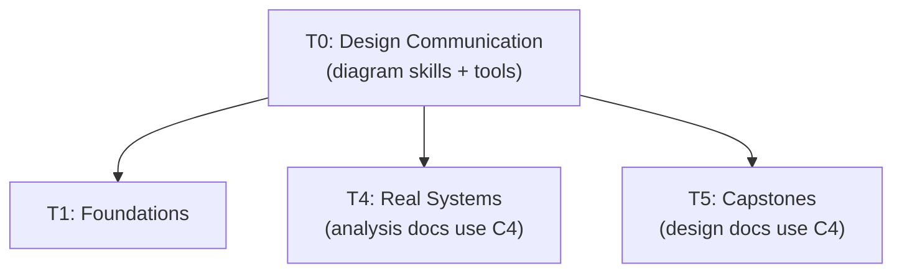

# Tier 0 — Design Communication Foundations

> Learn the meta-skill: how to communicate system designs with diagrams and words. This tier runs before T1 because every subsequent tier produces documents and diagrams — you need this skill first.

---

## Purpose

By the end of T0, you can:

- Draw a C4 model diagram at the correct level of abstraction
- Use consistent visual conventions (arrows, shapes, boundaries)
- Choose the right tool for the right diagram (Excalidraw for reviews, Mermaid for docs)
- Explain a system in one diagram without cluttering it

T0 is short (~5–7 topics) but non-optional. Every T4 analysis doc and T5 capstone design doc depends on it.

---

## Anchored Artifact

**T0-diagram**: One C4 Container diagram of the Backend Engineering `commerce-gateway` (which you built) in Excalidraw, exported as PNG/SVG and saved as a markdown file with the diagram embedded.

**Deliverable**: `deep-dives/01-tier-0/T0-commerce-gateway-c4.md` — a document containing the diagram, a legend, and a one-paragraph explanation.

---

## How T0 Fits the Architecture

**What it produces**: diagram fluency used in every subsequent tier.

---

## Topics (Linear Spine)

### T0.1 — The C4 Model

- **C4 Model overview**: Context, Container, Component, Code — four levels of abstraction
  `LEARN` · `Anchor: T0-diagram` · `Deps: —` · `Fails: diagrams mixing abstraction levels become unreadable` · `Interview: S` · `Artifact: —` · `Mistake: skipping Context (jump straight to Container)` · `Ref: T5` · `Theory 70/Practice 30` · `Reading: 30 min`

- **Context diagram**: system, users, external systems
  `LEARN` · `Anchor: T0-diagram` · `Deps: T0.1 c4` · `Fails: no shared vocabulary for scope` · `Interview: S` · `Artifact: —` · `Mistake: including internal services in Context` · `Ref: T5` · `Theory 60/Practice 40` · `Reading: 20 min`

- **Container diagram**: services, databases, queues, frontends — the boundary between system and infrastructure
  `LEARN` · `Anchor: T0-diagram` · `Deps: T0.1 context` · `Fails: unclear component boundaries during design review` · `Interview: Y` · `Artifact: —` · `Mistake: drawing every microservice (should be every deployable unit)` · `Ref: T4, T5` · `Theory 50/Practice 50` · `Reading: 30 min`

- **Component diagram**: modules within a container
  `LEARN` · `Anchor: T0-diagram` · `Deps: T0.1 container` · `Fails: internal structure unexplained in deep dives` · `Interview: S` · `Artifact: —` · `Mistake: using Component where Container suffices` · `Ref: T5` · `Theory 60/Practice 40` · `Reading: 20 min`

- **Code diagram**: class-level (rarely used at design level)
  `LEARN` · `Anchor: T0-diagram` · `Deps: T0.1 component` · `Fails: over-detailing in early design` · `Interview: N` · `Artifact: —` · `Mistake: drawing Code before Container` · `Ref: T5` · `Theory 80/Practice 20` · `Reading: 10 min`

**Deep-dive candidates**: C4 model walkthrough with examples — generate on demand.

---

### T0.2 — Diagram Conventions

- **Solid vs dashed arrows**: sync calls vs async events
  `LEARN` · `Anchor: T0-diagram` · `Deps: T0.1 c4` · `Fails: readers assume sync where async exists` · `Interview: S` · `Artifact: —` · `Mistake: mixing notations across diagrams` · `Ref: T4, T5` · `Theory 40/Practice 60` · `Reading: 15 min`

- **Shape semantics**: rectangle = service, cylinder = DB, diamond = decision, cloud = external
  `LEARN` · `Anchor: T0-diagram` · `Deps: T0.2 arrows` · `Fails: ambiguous diagrams; readers guess` · `Interview: N` · `Artifact: —` · `Mistake: decorative shapes without meaning` · `Ref: T4` · `Theory 40/Practice 60` · `Reading: 15 min`

- **Storage vs compute distinction**: stateful vs stateless components
  `LEARN` · `Anchor: T0-diagram` · `Deps: T0.2 shapes` · `Fails: readers can't tell what scales horizontally` · `Interview: S` · `Artifact: —` · `Mistake: no visual distinction for stateful nodes` · `Ref: T2, T4` · `Theory 40/Practice 60` · `Reading: 15 min`

- **Data flow vs control flow**: which arrow means what
  `LEARN` · `Anchor: T0-diagram` · `Deps: T0.2 arrows` · `Fails: ambiguous flow direction` · `Interview: N` · `Artifact: —` · `Mistake: bidirectional arrows without labels` · `Ref: T4` · `Theory 50/Practice 50` · `Reading: 15 min`

- **Legends and annotation discipline**: when to add a legend, when it's obvious
  `LEARN` · `Anchor: T0-diagram` · `Deps: T0.2 shapes` · `Fails: diagrams illegible to non-authors` · `Interview: N` · `Artifact: —` · `Mistake: no legend for custom notation` · `Ref: T5` · `Theory 40/Practice 60` · `Reading: 10 min`

- **Boundaries and trust zones**: what's inside the system vs outside; network boundaries
  `LEARN` · `Anchor: T0-diagram` · `Deps: T0.2 shapes` · `Fails: unclear security or failure boundaries` · `Interview: S` · `Artifact: —` · `Mistake: no boundary for "external" systems` · `Ref: T3.5.10, T4` · `Theory 50/Practice 50` · `Reading: 15 min`

**Deep-dive candidates**: diagram conventions with annotated examples — generate on demand.

---

### T0.3 — Tools & Practice

- **Excalidraw**: offline-capable, free, ideal for hand-drawn architecture
  `LEARN` · `Anchor: T0-diagram` · `Deps: —` · `Fails: no tool means no diagrams` · `Interview: N` · `Artifact: excalidraw-setup` · `Mistake: over-decorating (should look sketched)` · `Ref: T5` · `Theory 20/Practice 80` · `Reading: 20 min`

- **Mermaid**: text-based diagrams, version-controllable in git
  `LEARN` · `Anchor: T0-diagram` · `Deps: —` · `Fails: diagrams not version-controlled` · `Interview: N` · `Artifact: mermaid-setup` · `Mistake: Mermaid for complex diagrams (Excalidraw better)` · `Ref: T5` · `Theory 30/Practice 70` · `Reading: 20 min`

- **draw.io**: free, browser-based, supports both sketch and formal styles
  `LEARN` · `Anchor: T0-diagram` · `Deps: T0.3 excalidraw, mermaid` · `Fails: tool mismatch with use case` · `Interview: N` · `Artifact: —` · `Mistake: forcing one tool for everything` · `Ref: T5` · `Theory 30/Practice 70` · `Reading: 15 min`

- **When to use which tool**: Excalidraw for design reviews, Mermaid for docs, draw.io for both
  `LEARN` · `Anchor: T0-diagram` · `Deps: T0.3 excalidraw, mermaid, drawio` · `Fails: tool mismatch with use case` · `Interview: N` · `Artifact: —` · `Mistake: forcing one tool for everything` · `Ref: T5` · `Theory 50/Practice 50` · `Reading: 15 min`

- **Hands-on: diagram the commerce-gateway at Container level**
  `LEARN` · `Anchor: T0-diagram` · `Deps: T0.1 container, T0.2 conventions, T0.3 excalidraw` · `Fails: no practice means no skill` · `Interview: N` · `Artifact: T0-commerce-gateway-c4.md` · `Mistake: drawing without a legend` · `Ref: T5` · `Theory 20/Practice 80` · `Reading: 60 min`

---

## Exit Criteria

You've completed T0 when you can:

- Draw a C4 Context, Container, and Component diagram without mixing abstraction levels
- Explain the difference between solid and dashed arrows in a diagram
- Choose Excalidraw vs Mermaid vs draw.io based on the diagram's purpose
- Produce a Container-level diagram of a system you built, with a legend and readable layout

---

## Cross-Tier References

**Depends on**: Backend Engineering T7 (you've built the `commerce-gateway` — you'll diagram it).

**Depended on by**:
- T4 — analysis docs use C4 Container diagrams
- T5 — capstone design docs use C4 diagrams

---

## Common Failure Modes for the Tier as a Whole

- **Skipping T0**: you'll draw spaghetti diagrams for T4 and T5. Both tiers become unreadable.
- **Drawing at the wrong level**: Context diagrams with internal services, Container diagrams with class details — both unreadable.
- **No legend**: readers guess what arrows mean. Misunderstandings proliferate.
- **Over-decorating in Excalidraw**: hand-drawn aesthetic is fine; decorative noise isn't.
- **Not using diagrams in T4/T5**: documents become walls of text; trade-offs are invisible.

---

## Case Studies & Papers

None assigned to T0. Case studies for later tiers start at T1.