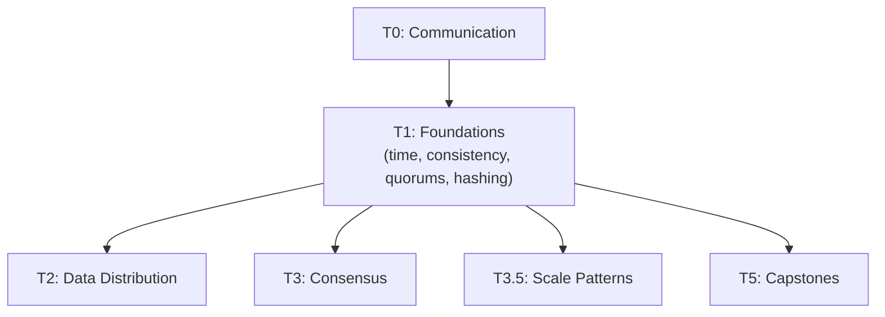

# Tier 1 — Distributed Systems Foundations

> Reason about time, failure, consistency, and the fundamental limits of distributed systems. This is the deepest theory tier — it's the foundation every later tier builds on.

---

## Purpose

By the end of T1, you can:

- Explain the fallacies of distributed computing and why they bite
- Reason about time and ordering without hand-waving
- Distinguish consistency models and choose between them
- Understand CAP/PACELC/FLP as design constraints, not slogans
- Reason about quorums, consistent hashing, and load distribution
- Understand gossip protocols and membership

T1 is where "distributed systems are hard" becomes "here are the specific ways they're hard, and here's how to reason about each."

---

## Anchored Artifact

**None.** T1 is LEARN-only. You confirm understanding after each topic; no design doc is produced.

The understanding from T1 is what feeds T5 capstones later.

---

## How T1 Fits the Architecture

**What it produces**: the mental model every later tier uses. No artifacts, but every T4 analysis and T5 design depends on this tier.

---

## Topics (Linear Spine)

### T1.1 — Why Distributed Systems Are Hard

- **Fallacies of distributed computing**: the 8 false assumptions
  `LEARN` · `Anchor: —` · `Deps: T0` · `Fails: designing as if network is reliable/low-latency` · `Interview: Y` · `Artifact: —` · `Mistake: assuming synchronous systems` · `Ref: T2, T3, T3.5, T4, T5` · `Theory 80/Practice 20` · `Reading: 20 min`

- **Partial failure**: some nodes fail, others don't — the hardest failure mode
  `LEARN` · `Anchor: —` · `Deps: T1.1 fallacies` · `Fails: blind spots in failure handling` · `Interview: Y` · `Artifact: —` · `Mistake: treating failure as binary` · `Ref: T3, T4, T5` · `Theory 70/Practice 30` · `Reading: 25 min`

- **Network partitions**: split-brain, asymmetric partitions, healing
  `LEARN` · `Anchor: —` · `Deps: T1.1 fallacies` · `Fails: no partition handling strategy` · `Interview: Y` · `Artifact: —` · `Mistake: assuming partitions are rare` · `Ref: T3, T3.5` · `Theory 70/Practice 30` · `Reading: 30 min`

- **Failure detectors**: heartbeats, timeouts, phi-accrual, uncertainty
  `LEARN` · `Anchor: —` · `Deps: T1.1 partial failure` · `Fails: no reliable node-health detection` · `Interview: S` · `Artifact: —` · `Mistake: fixed timeouts without tuning` · `Ref: T3` · `Theory 70/Practice 30` · `Reading: 25 min`

- **Byzantine failures**: malicious or corrupted nodes
  `LEARN` · `Anchor: —` · `Deps: T1.1 partial failure` · `Fails: no defense against adversarial behavior` · `Interview: S` · `Artifact: —` · `Mistake: Byzantine solutions for non-Byzantine problems` · `Ref: T3` · `Theory 80/Practice 20` · `Reading: 30 min` · `Paper: Lamport, Shostak, Pease (1982)`

**Deep-dive candidates**: partial failure and partitions — generate on demand.

---

### T1.2 — Time, Clocks & Ordering

- **Physical clocks**: NTP, drift, monotonic vs wall clocks
  `LEARN` · `Anchor: —` · `Deps: T1.1` · `Fails: time-based logic breaks across machines` · `Interview: Y` · `Artifact: —` · `Mistake: relying on wall clock for ordering` · `Ref: T3, T3.5` · `Theory 70/Practice 30` · `Reading: 30 min`

- **Lamport clocks**: logical ordering, partial order, total order
  `LEARN` · `Anchor: —` · `Deps: T1.2 physical` · `Fails: event ordering across nodes fails` · `Interview: Y` · `Artifact: —` · `Mistake: using Lamport clocks for causality detection` · `Ref: T3` · `Theory 80/Practice 20` · `Reading: 40 min` · `Paper: Lamport (1978)`

- **Vector clocks**: causality tracking, concurrent events, conflict detection
  `LEARN` · `Anchor: —` · `Deps: T1.2 lamport` · `Fails: can't detect concurrent writes` · `Interview: Y` · `Artifact: —` · `Mistake: vector clocks for total ordering` · `Ref: T3, T3.5, T4` · `Theory 80/Practice 20` · `Reading: 45 min`

- **Hybrid Logical Clocks (HLC)**: combining physical + logical time
  `LEARN` · `Anchor: —` · `Deps: T1.2 vector` · `Fails: no bounded clock skew handling` · `Interview: S` · `Artifact: —` · `Mistake: HLC for causality, not total order` · `Ref: T4` · `Theory 80/Practice 20` · `Reading: 30 min`

- **TrueTime (Spanner)**: bounded clock uncertainty with GPS + atomic clocks
  `LEARN` · `Anchor: —` · `Deps: T1.2 HLC` · `Fails: no global ordering without atomic clocks` · `Interview: Y` · `Artifact: —` · `Mistake: assuming TrueTime works with NTP alone` · `Ref: T4, T5` · `Theory 80/Practice 20` · `Reading: 40 min` · `Paper: Spanner (2012)`

**Deep-dive candidates**: Lamport vs vector clocks, TrueTime mechanics — generate on demand.

---

### T1.3 — Consistency Models

- **Strong consistency (linearizability)**: the gold standard, and its cost
  `LEARN` · `Anchor: —` · `Deps: T1.2` · `Fails: no guarantee on read-your-write` · `Interview: Y` · `Artifact: —` · `Mistake: assuming linearizability scales cheaply` · `Ref: T3, T4, T5` · `Theory 80/Practice 20` · `Reading: 40 min`

- **Sequential consistency**: weaker than linearizable, still useful
  `LEARN` · `Anchor: —` · `Deps: T1.3 strong` · `Fails: subtle bugs when only sequential is guaranteed` · `Interview: S` · `Artifact: —` · `Mistake: conflating sequential with strong` · `Ref: T3` · `Theory 80/Practice 20` · `Reading: 30 min`

- **Causal consistency**: causality preserved, no global order
  `LEARN` · `Anchor: —` · `Deps: T1.3 sequential` · `Fails: users see replies before originals` · `Interview: Y` · `Artifact: —` · `Mistake: causal for cooperative edits` · `Ref: T3.5, T4` · `Theory 80/Practice 20` · `Reading: 40 min`

- **Eventual consistency**: eventual convergence, unknown timing
  `LEARN` · `Anchor: —` · `Deps: T1.3 causal` · `Fails: users see stale data indefinitely` · `Interview: Y` · `Artifact: —` · `Mistake: eventual consistency without a convergence strategy` · `Ref: T3.5, T4, T5` · `Theory 70/Practice 30` · `Reading: 35 min`

- **Read-your-writes, monotonic reads, monotonic writes**: session guarantees
  `LEARN` · `Anchor: —` · `Deps: T1.3 eventual` · `Fails: user UX breaks under eventual consistency` · `Interview: Y` · `Artifact: —` · `Mistake: no client-side session stickiness` · `Ref: T3.5, T5` · `Theory 70/Practice 30` · `Reading: 30 min`

- **CAP theorem**: consistency, availability, partition tolerance — pick 2
  `LEARN` · `Anchor: —` · `Deps: T1.3 eventual` · `Fails: no principled choice under partition` · `Interview: Y` · `Artifact: —` · `Mistake: treating CAP as binary (it isn't during non-partition)` · `Ref: T2, T3, T5` · `Theory 80/Practice 20` · `Reading: 40 min`

- **PACELC**: extends CAP to latency vs consistency during normal operation
  `LEARN` · `Anchor: —` · `Deps: T1.3 cap` · `Fails: forgetting latency as a design axis` · `Interview: Y` · `Artifact: —` · `Mistake: CAP-only framing` · `Ref: T2, T4, T5` · `Theory 80/Practice 20` · `Reading: 30 min`

- **FLP impossibility**: no deterministic consensus in fully async systems
  `LEARN` · `Anchor: —` · `Deps: T1.3 cap` · `Fails: surprise when consensus can't be guaranteed` · `Interview: S` · `Artifact: —` · `Mistake: FLP as a reason to give up` · `Ref: T3` · `Theory 90/Practice 10` · `Reading: 40 min` · `Paper: Fischer, Lynch, Paterson (1985)`

**Deep-dive candidates**: consistency model hierarchy, CAP vs PACELC in practice — generate on demand.

---

### T1.4 — Quorums & Consensus Primitives

- **Quorum math**: R + W > N, quorum sizes, fault tolerance
  `LEARN` · `Anchor: —` · `Deps: T1.3 cap` · `Fails: no formula for durability/latency trade-off` · `Interview: Y` · `Artifact: —` · `Mistake: fixed quorum without workload awareness` · `Ref: T2, T3, T5` · `Theory 70/Practice 30` · `Reading: 35 min`

- **Sloppy quorums & hinted handoff**: availability over strict consistency
  `LEARN` · `Anchor: —` · `Deps: T1.4 quorum` · `Fails: partition reduces availability unnecessarily` · `Interview: S` · `Artifact: —` · `Mistake: sloppy quorums for financial data` · `Ref: T2, T4` · `Theory 80/Practice 20` · `Reading: 30 min` · `Paper: Dynamo (2007)`

- **Read repair & anti-entropy**: converging replicas over time
  `LEARN` · `Anchor: —` · `Deps: T1.4 sloppy quorum` · `Fails: replicas drift silently` · `Interview: S` · `Artifact: —` · `Mistake: read repair for cold data` · `Ref: T2, T4` · `Theory 80/Practice 20` · `Reading: 35 min` · `Paper: Dynamo (2007)`

- **Merkle trees**: efficient reconciliation across replicas
  `LEARN` · `Anchor: —` · `Deps: T1.4 read repair` · `Fails: O(N) reconciliation cost` · `Interview: S` · `Artifact: —` · `Mistake: rebuilding Merkle trees too often` · `Ref: T2, T4` · `Theory 80/Practice 20` · `Reading: 30 min` · `Paper: Dynamo (2007)`

**Deep-dive candidates**: quorum math worked examples, Merkle tree reconciliation — generate on demand.

---

### T1.5 — Consistent Hashing & Load Distribution

- **Hash-based partitioning basics**: modulo hashing and its problems
  `LEARN` · `Anchor: —` · `Deps: T1.4` · `Fails: cascading reshuffle on any node change` · `Interview: Y` · `Artifact: —` · `Mistake: modulo hashing for dynamic clusters` · `Ref: T2, T5` · `Theory 60/Practice 40` · `Reading: 30 min`

- **Consistent hashing**: ring, virtual nodes, rebalancing cost
  `LEARN` · `Anchor: —` · `Deps: T1.5 hash basics` · `Fails: uneven distribution, hot nodes` · `Interview: Y` · `Artifact: —` · `Mistake: too few virtual nodes (unbalanced ring)` · `Ref: T2, T4, T5` · `Theory 80/Practice 20` · `Reading: 45 min` · `Paper: Chord (2001)`

- **Load balancing algorithms**: round-robin, least-conn, least-response-time, weighted
  `LEARN` · `Anchor: —` · `Deps: T1.5 consistent hashing` · `Fails: no algorithm choice framework` · `Interview: Y` · `Artifact: —` · `Mistake: round-robin for heterogeneous backends` · `Ref: Backend T7.4` · `Ref: T3.5, T4, T5` · `Theory 60/Practice 40` · `Reading: 35 min`

- **Power-of-two-choices**: why it beats least-conn at scale
  `LEARN` · `Anchor: —` · `Deps: T1.5 LB` · `Fails: LB becomes bottleneck under coordination` · `Interview: S` · `Artifact: —` · `Mistake: choosing one algorithm without workload analysis` · `Ref: T4, T5` · `Theory 80/Practice 20` · `Reading: 25 min`

- **Health checks & flap damping**: reliable node removal
  `LEARN` · `Anchor: —` · `Deps: T1.5 LB` · `Fails: flapping nodes cause thundering herds` · `Interview: S` · `Artifact: —` · `Mistake: single failed check triggers removal` · `Ref: Backend T2.8` · `Ref: T4, T5` · `Theory 60/Practice 40` · `Reading: 25 min`

- **Anycast and DNS-based LB**: routing across regions
  `LEARN` · `Anchor: —` · `Deps: T1.5 LB` · `Fails: no global traffic steering` · `Interview: S` · `Artifact: —` · `Mistake: anycast for stateful connections` · `Ref: T3.5, T4` · `Theory 80/Practice 20` · `Reading: 30 min`

- **Global server load balancing (GSLB)**: latency, geo, and health-based routing
  `LEARN` · `Anchor: —` · `Deps: T1.5 anycast` · `Fails: no cross-region traffic strategy` · `Interview: S` · `Artifact: —` · `Mistake: GSLB without failover` · `Ref: T3.5.4, T4` · `Theory 70/Practice 30` · `Reading: 30 min`

**Deep-dive candidates**: consistent hashing math walkthrough, LB algorithm comparison — generate on demand.

---

### T1.6 — Gossip Protocols & Membership

- **Gossip (epidemic) protocols**: spread information in O(log N) rounds
  `LEARN` · `Anchor: —` · `Deps: T1.5` · `Fails: centralized membership becomes SPOF` · `Interview: S` · `Artifact: —` · `Mistake: gossip for critical consistency data` · `Ref: T2, T4` · `Theory 80/Practice 20` · `Reading: 35 min`

- **SWIM**: scalable membership protocol used in Cassandra, Consul
  `LEARN` · `Anchor: —` · `Deps: T1.6 gossip` · `Fails: unreliable node failure detection` · `Interview: S` · `Artifact: —` · `Mistake: SWIM for consensus (it's membership only)` · `Ref: T4` · `Theory 80/Practice 20` · `Reading: 40 min`

- **Phi-accrual failure detection**: adaptive heartbeat-based detection
  `LEARN` · `Anchor: —` · `Deps: T1.6 swim` · `Fails: fixed thresholds break under varying conditions` · `Interview: N` · `Artifact: —` · `Mistake: no Phi tuning for workload` · `Ref: T4` · `Theory 80/Practice 20` · `Reading: 30 min`

- **Gossip vs centralized membership**: trade-offs at scale
  `LEARN` · `Anchor: —` · `Deps: T1.6 phi-accrual` · `Fails: wrong choice for cluster size` · `Interview: N` · `Artifact: —` · `Mistake: gossip for small clusters` · `Ref: T4` · `Theory 70/Practice 30` · `Reading: 25 min`

**Deep-dive candidates**: SWIM protocol mechanics, gossip propagation math — generate on demand.

---

## Exit Criteria

You've completed T1 when you can:

- Explain why distributed systems are fundamentally different from single-node systems
- Reason about time, causality, and ordering across nodes
- Choose a consistency model for a given workload and justify the trade-offs
- Apply CAP and PACELC as decision frameworks, not slogans
- Compute quorum sizes for a given fault tolerance target
- Explain why consistent hashing beats modulo hashing
- Describe how gossip protocols achieve O(log N) membership propagation

---

## Cross-Tier References

**Depends on**: T0.

**Depended on by**:
- T2 — replication and sharding build on consistency and quorums
- T3 — consensus and coordination depend on time and failure models
- T3.5 — scale patterns (caching, backpressure, multi-region) use CAP and consistency
- T4 — real systems (Dynamo, Spanner, Cassandra) are analyses of these concepts
- T5 — every capstone applies these concepts

---

## Common Failure Modes for the Tier as a Whole

- **Treating CAP as binary**: it's not. During non-partition, systems choose latency vs consistency (that's PACELC).
- **Assuming time is consistent**: wall clocks drift, NTP is imprecise. Use logical clocks for ordering.
- **Skipping FLP**: it's why consensus needs either partial synchrony or randomization.
- **Confusing consistency models**: causal ≠ eventual ≠ strong. Each has specific guarantees.
- **Assuming quorums = strong consistency**: R + W > N gives you read-your-write for a single client, not global linearizability.
- **Believing consistent hashing = perfect balance**: virtual nodes are required; too few leads to hotspots.
- **Ignoring failure detectors**: unreliable detectors cause false failovers and cascading issues.

---

## Case Studies & Papers

Relevant case studies and papers (from the vaults):

**Papers read during T1**:
- Lamport, Time, Clocks, and the Ordering of Events (1978) — T1.2
- Fischer, Lynch, Paterson (1985) — T1.3
- Chord (2001) — T1.5
- Dynamo (2007) — T1.4

**Case studies**:
- Cloudflare BGP outage (2020) — T1.1, T1.5
- Facebook BGP+DNS outage (2021) — T1.1, T1.5
- AWS S3 outage (2017) — T1.1