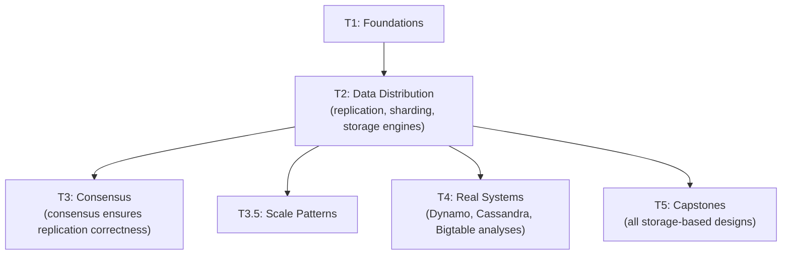

# Tier 2 — Data Distribution & Storage at Scale

> Design how data is stored, replicated, and distributed across nodes. This tier is the foundation for every storage-based capstone in T5.

---

## Purpose

By the end of T2, you can:

- Choose between replication strategies for a given workload
- Design sharding schemes and reason about hot shards
- Explain B-tree vs LSM-tree trade-offs
- Design distributed secondary indexes
- Reason about time-series, graph, and object storage

T2 is where "the database is a black box" becomes "here's how data survives node failure at scale."

---

## Anchored Artifact

**None.** T2 is LEARN-only. Understanding from T2 feeds T4 analyses and T5 capstones.

---

## How T2 Fits the Architecture

**What it produces**: the storage-design toolkit used in every storage-related capstone.

---

## Topics (Linear Spine)

### T2.1 — Replication Strategies

- **Single-leader replication**: primary + followers, sync vs async
  `LEARN` · `Anchor: —` · `Deps: T1` · `Fails: replication lag causes stale reads` · `Interview: Y` · `Artifact: —` · `Mistake: async replication for financial writes` · `Ref: T4, T5` · `Theory 70/Practice 30` · `Reading: 40 min`

- **Multi-leader replication**: write to any leader, conflict resolution
  `LEARN` · `Anchor: —` · `Deps: T2.1 single-leader` · `Fails: write conflicts unhandled` · `Interview: Y` · `Artifact: —` · `Mistake: multi-leader for strong consistency` · `Ref: T3.5, T4` · `Theory 80/Practice 20` · `Reading: 45 min`

- **Leaderless replication (Dynamo-style)**: quorum reads/writes on any node
  `LEARN` · `Anchor: —` · `Deps: T2.1 multi-leader` · `Fails: no way to guarantee freshness` · `Interview: Y` · `Artifact: —` · `Mistake: leaderless for transactions` · `Ref: T4, T5` · `Theory 80/Practice 20` · `Reading: 40 min` · `Paper: Dynamo (2007)`

- **Replication lag & consistency guarantees**: read-your-writes, monotonic reads with lag
  `LEARN` · `Anchor: —` · `Deps: T2.1 single-leader` · `Fails: users see stale data after write` · `Interview: Y` · `Artifact: —` · `Mistake: no lag monitoring` · `Ref: T3.5, T5` · `Theory 70/Practice 30` · `Reading: 35 min`

- **Chain replication**: sequential replication pipeline
  `LEARN` · `Anchor: —` · `Deps: T2.1 single-leader` · `Fails: linear write throughput` · `Interview: N` · `Artifact: —` · `Mistake: chain replication for high-write workloads` · `Ref: T4` · `Theory 80/Practice 20` · `Reading: 30 min`

- **Synchronous vs asynchronous replication trade-offs**: durability vs latency
  `LEARN` · `Anchor: —` · `Deps: T2.1 single-leader` · `Fails: data loss on leader failure` · `Interview: Y` · `Artifact: —` · `Mistake: sync replication across regions` · `Ref: T3.5.4, T5` · `Theory 70/Practice 30` · `Reading: 35 min`

- **Quorum-based replication**: R + W > N applied to real systems
  `LEARN` · `Anchor: —` · `Deps: T1.4 quorum` · `Fails: no tunable consistency` · `Interview: Y` · `Artifact: —` · `Mistake: quorum without understanding failure modes` · `Ref: T4, T5` · `Theory 80/Practice 20` · `Reading: 30 min`

**Deep-dive candidates**: replication lag handling, multi-leader conflict resolution — generate on demand.

---

### T2.2 — Sharding / Partitioning

- **Range-based sharding**: contiguous key ranges per shard
  `LEARN` · `Anchor: —` · `Deps: T2.1` · `Fails: hotspot shards from uneven key distribution` · `Interview: Y` · `Artifact: —` · `Mistake: range sharding on sequential IDs` · `Ref: T4, T5` · `Theory 70/Practice 30` · `Reading: 35 min`

- **Hash-based sharding**: consistent hashing on keys
  `LEARN` · `Anchor: —` · `Deps: T2.2 range` · `Fails: rebalancing cost on shard changes` · `Interview: Y` · `Artifact: —` · `Mistake: hash sharding without virtual nodes` · `Ref: T1.5 consistent hashing` · `Ref: T4, T5` · `Theory 70/Practice 30` · `Reading: 30 min`

- **Directory-based sharding**: lookup service for shard assignment
  `LEARN` · `Anchor: —` · `Deps: T2.2 hash` · `Fails: directory becomes SPOF` · `Interview: S` · `Artifact: —` · `Mistake: single directory without HA` · `Ref: T4` · `Theory 70/Practice 30` · `Reading: 30 min`

- **Cross-shard queries**: scatter-gather, cost analysis
  `LEARN` · `Anchor: —` · `Deps: T2.2 hash` · `Fails: expensive cross-shard queries kill latency` · `Interview: Y` · `Artifact: —` · `Mistake: ignoring query patterns when sharding` · `Ref: T3.5, T5` · `Theory 70/Practice 30` · `Reading: 35 min`

- **Zero-downtime resharding**: dual-write, shadow verification, atomic cutover
  `LEARN` · `Anchor: —` · `Deps: T2.2 cross-shard` · `Fails: resharding causes outage` · `Interview: S` · `Artifact: —` · `Mistake: no rollback plan` · `Ref: Backend T3a.6` · `Ref: T3.5, T4` · `Theory 70/Practice 30` · `Reading: 40 min` · `Paper: GitHub Vitess (case study)`

- **Hot shard mitigation**: key salting, caching, shard splitting
  `LEARN` · `Anchor: —` · `Deps: T2.2 hash` · `Fails: celebrity problem; one shard overwhelmed` · `Interview: Y` · `Artifact: —` · `Mistake: no key distribution analysis` · `Ref: T3.5, T5` · `Theory 70/Practice 30` · `Reading: 30 min`

- **Geo-sharding & data residency**: compliance and latency constraints
  `LEARN` · `Anchor: —` · `Deps: T2.2 directory` · `Fails: GDPR/data residency violations` · `Interview: S` · `Artifact: —` · `Mistake: sharding without considering regulation` · `Ref: T3.5, T4` · `Theory 70/Practice 30` · `Reading: 30 min`

- **Consistent hashing vs modulo sharding**: when each is appropriate
  `LEARN` · `Anchor: —` · `Deps: T2.2 hash` · `Fails: wrong choice for dynamic clusters` · `Interview: Y` · `Artifact: —` · `Mistake: modulo for elastic clusters` · `Ref: T1.5 consistent hashing` · `Ref: T4` · `Theory 70/Practice 30` · `Reading: 25 min`

**Deep-dive candidates**: hot shard mitigation, resharding without downtime — generate on demand.

---

### T2.3 — Storage Engines

- **B-Trees**: balanced tree, page-based, range-scan friendly
  `LEARN` · `Anchor: —` · `Deps: T2.2` · `Fails: random write amplification on SSDs` · `Interview: Y` · `Artifact: —` · `Mistake: assuming B-tree always optimal` · `Ref: T4` · `Theory 80/Practice 20` · `Reading: 35 min`

- **LSM Trees**: log-structured merge, write-optimized, compaction
  `LEARN` · `Anchor: —` · `Deps: T2.3 b-trees` · `Fails: read amplification on high-write workloads` · `Interview: Y` · `Artifact: —` · `Mistake: LSM for read-heavy workloads` · `Ref: T4` · `Theory 80/Practice 20` · `Reading: 45 min` · `Paper: Bigtable (2006)`

- **Write-ahead log (WAL)**: durability and recovery
  `LEARN` · `Anchor: —` · `Deps: T2.3 lsm` · `Fails: data loss on crash` · `Interview: Y` · `Artifact: —` · `Mistake: no fsync tuning` · `Ref: T4, T5` · `Theory 70/Practice 30` · `Reading: 40 min` · `Paper: Aurora (2017)`

- **MVCC**: concurrent reads and writes without locking
  `LEARN` · `Anchor: —` · `Deps: T2.3 WAL` · `Fails: readers block writers under load` · `Interview: Y` · `Artifact: —` · `Mistake: MVCC without vacuuming` · `Ref: Backend T3a.3` · `Ref: T4` · `Theory 80/Practice 20` · `Reading: 40 min`

- **Columnar vs row-oriented storage**: OLTP vs OLAP
  `LEARN` · `Anchor: —` · `Deps: T2.3 b-trees` · `Fails: wrong engine for analytical queries` · `Interview: Y` · `Artifact: —` · `Mistake: row storage for aggregation-heavy workloads` · `Ref: T3.5, T4` · `Theory 70/Practice 30` · `Reading: 35 min` · `Paper: Dremel (2010)`

- **Vectorized execution & predicate pushdown**: query engine optimizations
  `LEARN` · `Anchor: —` · `Deps: T2.3 columnar` · `Fails: slow analytical queries` · `Interview: N` · `Artifact: —` · `Mistake: ignoring query engine internals` · `Ref: T3.5` · `Theory 80/Practice 20` · `Reading: 30 min`

- **B-Tree vs LSM trade-offs**: read vs write amplification
  `LEARN` · `Anchor: —` · `Deps: T2.3 b-trees, lsm` · `Fails: wrong engine for workload` · `Interview: Y` · `Artifact: —` · `Mistake: assuming one engine fits all` · `Ref: T4` · `Theory 70/Practice 30` · `Reading: 35 min`

- **Compaction strategies**: leveled, tiered, hybrid
  `LEARN` · `Anchor: —` · `Deps: T2.3 lsm` · `Fails: write pauses during compaction` · `Interview: S` · `Artifact: —` · `Mistake: compaction tuned for read-only workload` · `Ref: T4` · `Theory 80/Practice 20` · `Reading: 30 min`

**Deep-dive candidates**: LSM vs B-Tree mechanics, columnar storage internals — generate on demand.

---

### T2.4 — Indexing at Scale

- **Distributed secondary indexes**: local vs global
  `LEARN` · `Anchor: —` · `Deps: T2.2` · `Fails: full scan across shards` · `Interview: S` · `Artifact: —` · `Mistake: global indexes without query analysis` · `Ref: T3.5, T4` · `Theory 70/Practice 30` · `Reading: 35 min`

- **Inverted index at scale**: sharded search engines
  `LEARN` · `Anchor: —` · `Deps: T2.4 distributed` · `Fails: search latency from full fan-out` · `Interview: Y` · `Artifact: —` · `Mistake: one big index for global scale` · `Ref: Backend T7.6` · `Ref: T3.5, T4, T5` · `Theory 70/Practice 30` · `Reading: 40 min`

- **Bloom filters**: probabilistic membership testing
  `LEARN` · `Anchor: —` · `Deps: T2.4 inverted` · `Fails: unnecessary disk lookups` · `Interview: S` · `Artifact: —` · `Mistake: Bloom filter for exact membership` · `Ref: T4` · `Theory 70/Practice 30` · `Reading: 30 min`

- **Count-Min Sketch, HyperLogLog**: probabilistic data structures
  `LEARN` · `Anchor: —` · `Deps: T2.4 bloom` · `Fails: exact counting doesn't scale` · `Interview: S` · `Artifact: —` · `Mistake: probabilistic structure for exact results` · `Ref: T3.5, T4` · `Theory 80/Practice 20` · `Reading: 35 min`

- **Bitmap indexes**: compressed indexes for low-cardinality columns
  `LEARN` · `Anchor: —` · `Deps: T2.4 bloom` · `Fails: uncompressed indexes blow up storage` · `Interview: N` · `Artifact: —` · `Mistake: bitmap for high-cardinality columns` · `Ref: T4` · `Theory 80/Practice 20` · `Reading: 25 min`

- **Local vs global secondary indexes**: trade-offs
  `LEARN` · `Anchor: —` · `Deps: T2.4 distributed` · `Fails: index becomes cross-shard bottleneck` · `Interview: S` · `Artifact: —` · `Mistake: global index for write-heavy workloads` · `Ref: T4` · `Theory 70/Practice 30` · `Reading: 30 min`

**Deep-dive candidates**: Bloom filter math, HyperLogLog internals — generate on demand.

---

### T2.5 — Time-Series & Specialized Storage

- **Time-series databases**: partitioning by time, retention policies
  `LEARN` · `Anchor: —` · `Deps: T2.3` · `Fails: unbounded storage growth` · `Interview: S` · `Artifact: —` · `Mistake: TSDB for transactional data` · `Ref: T3.5, T4` · `Theory 70/Practice 30` · `Reading: 35 min`

- **Downsampling & retention tiers**: hot/warm/cold storage
  `LEARN` · `Anchor: —` · `Deps: T2.5 tsdb` · `Fails: cost grows linearly with time` · `Interview: N` · `Artifact: —` · `Mistake: no retention policy` · `Ref: T3.5, T4` · `Theory 70/Practice 30` · `Reading: 30 min`

- **Graph databases**: property graphs, traversals at scale
  `LEARN` · `Anchor: —` · `Deps: T2.3` · `Fails: expensive multi-hop queries in relational DBs` · `Interview: S` · `Artifact: —` · `Mistake: graph DB for hierarchical data` · `Ref: T4` · `Theory 70/Practice 30` · `Reading: 30 min`

- **Object storage internals**: S3-like storage architecture
  `LEARN` · `Anchor: —` · `Deps: T2.3` · `Fails: blob storage costs explode` · `Interview: S` · `Artifact: —` · `Mistake: treating S3 as POSIX filesystem` · `Ref: Backend T5.6` · `Ref: T4, T5` · `Theory 70/Practice 30` · `Reading: 35 min` · `Paper: GFS (2003)`

- **Wide-column stores**: Cassandra/ScyllaDB data model
  `LEARN` · `Anchor: —` · `Deps: T2.3 lsm` · `Fails: relational thinking fails on wide-column` · `Interview: S` · `Artifact: —` · `Mistake: joins in wide-column stores` · `Ref: T4` · `Theory 70/Practice 30` · `Reading: 35 min`

- **Search engine storage**: inverted index persistence
  `LEARN` · `Anchor: —` · `Deps: T2.4 inverted` · `Fails: slow search after restart` · `Interview: N` · `Artifact: —` · `Mistake: no index persistence` · `Ref: T4` · `Theory 70/Practice 30` · `Reading: 30 min`

**Deep-dive candidates**: TSDB internals, wide-column data modeling — generate on demand.

---

## Exit Criteria

You've completed T2 when you can:

- Choose a replication strategy for a given consistency and latency requirement
- Design a sharding scheme and predict its hot spots
- Explain why B-tree and LSM-tree engines differ and when to pick each
- Design distributed secondary indexes for a query workload
- Reason about object storage, time-series, and wide-column models

---

## Cross-Tier References

**Depends on**: T0, T1.

**Depended on by**:
- T3 — consensus depends on replication correctness
- T3.5 — caching, rate limiting, and scale patterns sit on top of data distribution
- T4 — real-system analyses (Dynamo, Cassandra, Bigtable, GFS, Aurora)
- T5 — every storage-based capstone

---

## Common Failure Modes for the Tier as a Whole

- **Single-leader without failover planning**: leader fails → 30-minute outage.
- **Async replication for financial writes**: data loss on primary crash.
- **Modulo sharding on dynamic clusters**: reshuffling on every node add/remove.
- **Range sharding on sequential IDs**: all writes go to one shard.
- **LSM for read-heavy workloads**: read amplification destroys latency.
- **B-tree for write-heavy workloads**: random writes and page splits kill throughput.
- **No secondary index strategy**: cross-shard queries take minutes.
- **Bloom filter for exact membership**: false positives corrupt application logic.

---

## Case Studies & Papers

**Papers read during T2**:
- Dynamo (2007) — T2.1
- Bigtable (2006) — T2.3
- GFS (2003) — T2.5
- Dremel (2010) — T2.3
- Amazon Aurora (2017) — T2.3

**Case studies**:
- Instagram Postgres sharding — T2.2
- Discord Cassandra → ScyllaDB — T2.1, T2.3
- Google GFS & Bigtable in practice — T2.3, T2.5
- Amazon Dynamo vs DynamoDB — T2.1