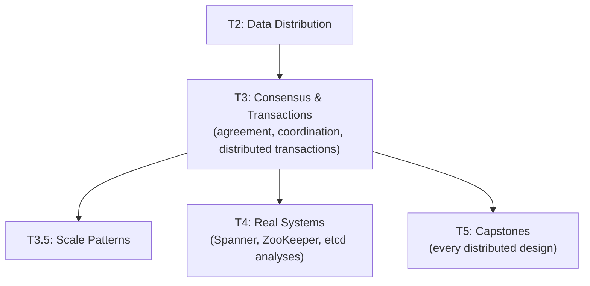

# Tier 3 — Consensus, Coordination & Transactions

> Understand how distributed systems reach agreement, coordinate, and execute transactions. This tier is the theoretical heart of distributed systems.

---

## Purpose

By the end of T3, you can:

- Explain the consensus problem and why it's fundamental
- Compare Paxos, Raft, ZAB, and EPaxos at a design level
- Reason about 2PC, 3PC, TCC, and Sagas
- Design distributed locks correctly (and know when not to)
- Understand how coordination services work

T3 is where "how do nodes agree?" becomes a concrete, answerable question with multiple trade-off-laden answers.

---

## Anchored Artifact

**None.** T3 is LEARN-only. Understanding feeds T4 analyses and T5 capstones (especially distributed KV, lock service, and payment capstones).

---

## How T3 Fits the Architecture

**What it produces**: the coordination toolkit used in every distributed design.

---

## Topics (Linear Spine)

### T3.1 — Consensus Fundamentals

- **The consensus problem**: agreement despite failures
  `LEARN` · `Anchor: —` · `Deps: T2` · `Fails: no way to solve leader election, atomic commit` · `Interview: Y` · `Artifact: —` · `Mistake: consensus for simple decisions` · `Ref: T4, T5` · `Theory 80/Practice 20` · `Reading: 40 min`

- **Safety vs liveness**: consensus invariants
  `LEARN` · `Anchor: —` · `Deps: T3.1 consensus` · `Fails: protocol design that never terminates or violates correctness` · `Interview: S` · `Artifact: —` · `Mistake: assuming liveness always holds` · `Ref: T3.1 paxos, raft` · `Theory 80/Practice 20` · `Reading: 30 min`

- **Paxos**: proposer/acceptor/learner, safety, liveness
  `LEARN` · `Anchor: —` · `Deps: T3.1 consensus` · `Fails: no understanding of consensus primitives` · `Interview: Y` · `Artifact: —` · `Mistake: Paxos for practical implementation` · `Ref: T4, T5` · `Theory 90/Practice 10` · `Reading: 90 min` · `Paper: Paxos Made Simple (2001)`

- **Multi-Paxos**: repeated consensus with stable leader
  `LEARN` · `Anchor: —` · `Deps: T3.1 paxos` · `Fails: Paxos per decision is expensive` · `Interview: S` · `Artifact: —` · `Mistake: one-shot Paxos for log replication` · `Ref: T4` · `Theory 80/Practice 20` · `Reading: 60 min`

- **Raft**: leader election, log replication, safety
  `LEARN` · `Anchor: —` · `Deps: T3.1 paxos` · `Fails: hard to understand Paxos means difficult to implement` · `Interview: Y` · `Artifact: —` · `Mistake: Raft for byzantine failures` · `Ref: T4, T5` · `Theory 80/Practice 20` · `Reading: 120 min` · `Paper: Raft (2014)`

- **ZAB (ZooKeeper Atomic Broadcast)**: leader-based atomic broadcast
  `LEARN` · `Anchor: —` · `Deps: T3.1 raft` · `Fails: no understanding of coordination services` · `Interview: S` · `Artifact: —` · `Mistake: ZAB details for Kafka-only teams` · `Ref: T4` · `Theory 80/Practice 20` · `Reading: 60 min` · `Paper: ZooKeeper (2010)`

- **EPaxos & leaderless consensus**: consensus without a stable leader
  `LEARN` · `Anchor: —` · `Deps: T3.1 raft` · `Fails: no alternative to leader bottleneck` · `Interview: N` · `Artifact: —` · `Mistake: EPaxos for simple workloads` · `Ref: T4` · `Theory 90/Practice 10` · `Reading: 45 min`

- **Consensus vs primary-backup**: when consensus is overkill
  `LEARN` · `Anchor: —` · `Deps: T3.1 raft` · `Fails: consensus cost for trivially simple cases` · `Interview: S` · `Artifact: —` · `Mistake: consensus everywhere` · `Ref: T4, T5` · `Theory 70/Practice 30` · `Reading: 30 min`

**Deep-dive candidates**: Paxos vs Raft comparison, Raft leader election walkthrough — generate on demand.

---

### T3.2 — Distributed Transactions

- **ACID across nodes**: what's easy, what's hard
  `LEARN` · `Anchor: —` · `Deps: T3.1` · `Fails: assumptions from single-node ACID break` · `Interview: Y` · `Artifact: —` · `Mistake: distributed ACID without coordination overhead` · `Ref: Backend T3a.3` · `Ref: T3.3, T4, T5` · `Theory 70/Practice 30` · `Reading: 35 min`

- **Two-Phase Commit (2PC)**: prepare + commit, blocking on coordinator failure
  `LEARN` · `Anchor: —` · `Deps: T3.2 acid` · `Fails: coordinator failure leaves participants blocked` · `Interview: Y` · `Artifact: —` · `Mistake: 2PC for high-latency cross-region calls` · `Ref: T4, T5` · `Theory 80/Practice 20` · `Reading: 45 min`

- **Three-Phase Commit (3PC)**: non-blocking but assumes synchronous network
  `LEARN` · `Anchor: —` · `Deps: T3.2 2pc` · `Fails: false confidence in synchronous assumptions` · `Interview: N` · `Artifact: —` · `Mistake: 3PC in real async networks` · `Ref: T4` · `Theory 80/Practice 20` · `Reading: 30 min`

- **Sagas (theory level)**: compensating transactions, choreography vs orchestration
  `LEARN` · `Anchor: —` · `Deps: T3.2 2pc` · `Fails: no way to undo distributed operations` · `Interview: Y` · `Artifact: —` · `Mistake: Sagas for cross-row operations` · `Ref: Backend T5.1` · `Ref: T3.3, T4, T5` · `Theory 70/Practice 30` · `Reading: 45 min` · `Paper: Sagas (1987)`

- **TCC (Try-Confirm-Cancel)**: reserving resources before commit
  `LEARN` · `Anchor: —` · `Deps: T3.2 sagas` · `Fails: no two-phase business transaction pattern` · `Interview: S` · `Artifact: —` · `Mistake: TCC for simple operations` · `Ref: T4, T5` · `Theory 70/Practice 30` · `Reading: 35 min`

- **Transactional outbox pattern**: reliable event publishing
  `LEARN` · `Anchor: —` · `Deps: T3.2 sagas` · `Fails: DB commit + event publish inconsistency` · `Interview: Y` · `Artifact: —` · `Mistake: direct publish without outbox` · `Ref: Backend T5.1` · `Ref: T4, T5` · `Theory 60/Practice 40` · `Reading: 40 min` · `Paper: The Log Manifesto (2013)`

- **Idempotency keys at distributed scale**: avoiding duplicate side effects
  `LEARN` · `Anchor: —` · `Deps: T3.2 outbox` · `Fails: duplicate effects on retry` · `Interview: Y` · `Artifact: —` · `Mistake: per-service idempotency (no coordination)` · `Ref: Backend T4.7, T5.1` · `Ref: T4, T5` · `Theory 50/Practice 50` · `Reading: 30 min` · `Paper: Stripe idempotency (case study)`

- **Distributed transactions vs eventual consistency**: when to give up ACID
  `LEARN` · `Anchor: —` · `Deps: T3.2 idempotency` · `Fails: ACID in cases where it can't scale` · `Interview: Y` · `Artifact: —` · `Mistake: ACID for cross-region writes` · `Ref: T3.5.4, T4, T5` · `Theory 70/Practice 30` · `Reading: 35 min`

**Deep-dive candidates**: 2PC vs Sagas decision framework, outbox pattern end-to-end — generate on demand.

---

### T3.3 — Distributed Locks & Coordination

- **Distributed locks**: mutex across nodes, failure modes
  `LEARN` · `Anchor: —` · `Deps: T3.2` · `Fails: two workers do the same job` · `Interview: Y` · `Artifact: —` · `Mistake: Redis `SET NX` without fencing tokens` · `Ref: Backend T3c.3` · `Ref: T4, T5` · `Theory 70/Practice 30` · `Reading: 35 min`

- **Redlock debate**: Kleppmann vs antirez
  `LEARN` · `Anchor: —` · `Deps: T3.3 locks` · `Fails: false confidence in distributed locks` · `Interview: S` · `Artifact: —` · `Mistake: Redlock for correctness-critical locks` · `Ref: T4` · `Theory 80/Practice 20` · `Reading: 40 min`

- **Fencing tokens**: monotonic tokens to detect stale lock holders
  `LEARN` · `Anchor: —` · `Deps: T3.3 redlock` · `Fails: lock holder writes after losing lock` · `Interview: S` · `Artifact: —` · `Mistake: locks without fencing` · `Ref: T4, T5` · `Theory 80/Practice 20` · `Reading: 30 min`

- **Leases & timeouts**: bounded ownership with automatic expiry
  `LEARN` · `Anchor: —` · `Deps: T3.3 fencing` · `Fails: deadlock from crashed holders` · `Interview: S` · `Artifact: —` · `Mistake: leases without clock skew awareness` · `Ref: T4, T5` · `Theory 70/Practice 30` · `Reading: 30 min`

- **Leader election**: who runs the singleton job
  `LEARN` · `Anchor: —` · `Deps: T3.3 leases` · `Fails: multiple leaders, split-brain` · `Interview: Y` · `Artifact: —` · `Mistake: leader election without consensus` · `Ref: Backend T5.3` · `Ref: T4, T5` · `Theory 70/Practice 30` · `Reading: 35 min`

- **Coordination services**: ZooKeeper, etcd, Consul
  `LEARN` · `Anchor: —` · `Deps: T3.3 leader election` · `Fails: reinvent coordination from scratch` · `Interview: S` · `Artifact: —` · `Mistake: coordination service as general DB` · `Ref: T4` · `Theory 70/Practice 30` · `Reading: 40 min` · `Paper: ZooKeeper (2010)`

- **Watch/notification semantics**: how coordination services notify clients
  `LEARN` · `Anchor: —` · `Deps: T3.3 coordination-services` · `Fails: polling coordination services (wasteful)` · `Interview: N` · `Artifact: —` · `Mistake: watch storms under mass updates` · `Ref: T4` · `Theory 70/Practice 30` · `Reading: 25 min`

- **Barrier and queue primitives**: sync primitives built on coordination
  `LEARN` · `Anchor: —` · `Deps: T3.3 coordination-services` · `Fails: reinvent sync primitives` · `Interview: N` · `Artifact: —` · `Mistake: barrier for cross-region sync` · `Ref: T4` · `Theory 70/Practice 30` · `Reading: 25 min`

**Deep-dive candidates**: Redlock debate analysis, coordination service comparison — generate on demand.

---

### T3.4 — Time in Distributed Transactions

- **Monotonic vs wall clocks**: which to use for what
  `LEARN` · `Anchor: —` · `Deps: T3.3` · `Fails: duration calculations broken by clock jumps` · `Interview: S` · `Artifact: —` · `Mistake: wall clock for latency measurement` · `Ref: T1.2` · `Ref: T4` · `Theory 70/Practice 30` · `Reading: 25 min`

- **Clock skew across regions**: bounded vs unbounded
  `LEARN` · `Anchor: —` · `Deps: T3.4 monotonic` · `Fails: order violations across machines` · `Interview: S` · `Artifact: —` · `Mistake: assuming NTP keeps clocks in sync` · `Ref: T1.2 HLC` · `Ref: T4` · `Theory 80/Practice 20` · `Reading: 30 min`

- **Timestamp ordering & TSO**: distributed timestamp oracle
  `LEARN` · `Anchor: —` · `Deps: T3.4 skew` · `Fails: no total order across distributed transactions` · `Interview: S` · `Artifact: —` · `Mistake: TSO as SPOF` · `Ref: T4` · `Theory 80/Practice 20` · `Reading: 35 min` · `Paper: Spanner (2012)`

- **Clock drift and lease safety**: why leases need bounded clocks
  `LEARN` · `Anchor: —` · `Deps: T3.4 skew` · `Fails: lease violates mutual exclusion under drift` · `Interview: N` · `Artifact: —` · `Mistake: leases without drift bounds` · `Ref: T4` · `Theory 80/Practice 20` · `Reading: 30 min`

- **Timestamp as transaction ordering primitive**: MVCC, snapshot reads
  `LEARN` · `Anchor: —` · `Deps: T3.4 TSO` · `Fails: no consistent snapshot without timestamps` · `Interview: S` · `Artifact: —` · `Mistake: timestamps from unsynchronized clocks` · `Ref: T4` · `Theory 70/Practice 30` · `Reading: 30 min`

**Deep-dive candidates**: TrueTime deep dive, lease safety analysis — generate on demand.

---

## Exit Criteria

You've completed T3 when you can:

- Explain why consensus is fundamental to distributed systems
- Compare Paxos, Raft, ZAB at a design level
- Choose between 2PC, TCC, and Sagas for a distributed transaction
- Design a distributed lock with fencing tokens
- Explain how coordination services (ZooKeeper, etcd) work at a design level
- Reason about time in distributed transactions (monotonic clocks, TSOs, leases)

---

## Cross-Tier References

**Depends on**: T0, T1, T2.

**Depended on by**:
- T3.5 — scale patterns (multi-region, cells) depend on consensus and coordination
- T4 — Spanner, ZooKeeper, Kafka, Cassandra analyses
- T5 — every distributed capstone (KV store, payments, chat, etc.)

---

## Common Failure Modes for the Tier as a Whole

- **Confusing consensus with replication**: replication copies data; consensus decides order.
- **Paxos for practical systems**: Raft is more understandable and equally correct.
- **2PC for high-latency links**: blocks on coordinator failure, kills availability.
- **Locks without fencing tokens**: a stale lock holder can still write, corrupting state.
- **Sagas for single-row operations**: eventual consistency where ACID is available.
- **Missing outbox pattern**: DB commit succeeds, event publish fails → silent drift.
- **Unbounded clock skew with leases**: mutual exclusion breaks silently.

---

## Case Studies & Papers

**Papers read during T3**:
- Sagas (1987) — T3.2
- Paxos Made Simple (2001) — T3.1
- ZooKeeper (2010) — T3.3
- The Log Manifesto (2013) — T3.2
- Raft (2014) — T3.1
- Spanner (2012) — T3.4

**Case studies**:
- Roblox 73-hour outage (2021) — T3.3
- Google authentication outage (2020) — T3.3
- Stripe idempotency architecture — T3.2
- Kafka KRaft migration — T3.1, T4.1