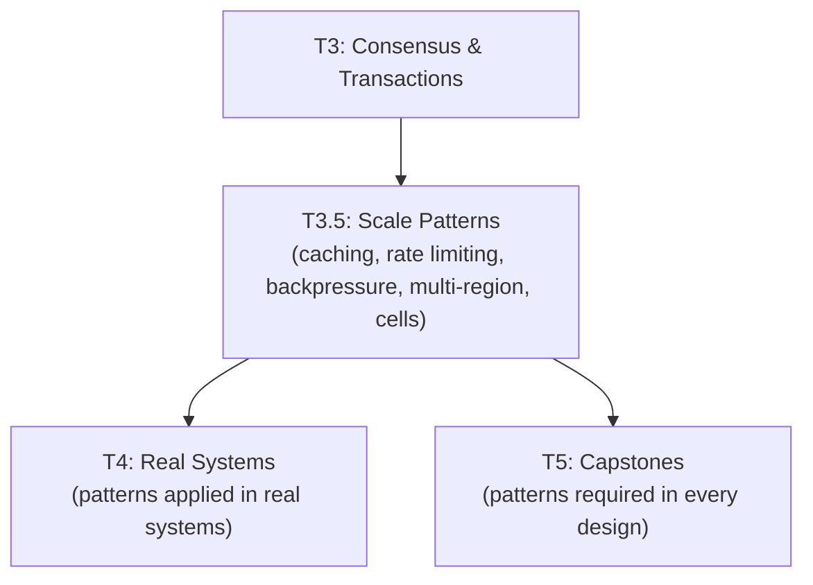

# Tier 3.5 — Scale-Level Design Patterns

> Learn the design patterns that make systems work at hyperscale — the layer between distributed systems theory and real-world application. This is the tier that makes T5 capstones achievable.

---

## Purpose

By the end of T3.5, you can:

- Design caching layers that survive stampedes, hot keys, and cross-region invalidation
- Design rate limiting and admission control at edge scale
- Apply backpressure and load shedding to prevent cascading failures
- Reason about multi-region active-active topologies
- Design cell-based architectures with bounded blast radius
- Handle search, time-series, and OLAP at scale
- Run schema migrations and evolutions at billions of rows
- Design eventual consistency UX and observability at scale

T3.5 is where "I know the theory" becomes "I can apply the theory to the pattern layer that real systems use."

---

## Anchored Artifact

**2–3 small analysis docs.** Not full design docs — focused analyses of specific pattern trade-offs.

Suggested artifacts:
1. `design-docs/t3.5-caching-analysis.md` — compare caching strategies from 3 real systems (Facebook memcache, Instagram cache, Cloudflare edge)
2. `design-docs/t3.5-ratelimit-analysis.md` — compare rate limiting architectures in 3 systems (Stripe, Cloudflare, GitHub)
3. `design-docs/t3.5-backpressure-analysis.md` — analyze overload handling in Netflix, Amazon, Google

---

## How T3.5 Fits the Architecture

**What it produces**: the pattern toolkit used in every T5 capstone.

---

## Topics (Linear Spine)

### T3.5.1 — Caching at Scale

- **Cache-aside, write-through, write-behind at scale**: when each breaks
  `LEARN` · `Anchor: T3.5-caching-analysis` · `Deps: T3.4` · `Fails: cache and DB diverge under failure` · `Interview: Y` · `Artifact: —` · `Mistake: write-through for write-heavy workloads` · `Ref: Backend T3c.6` · `Ref: T4, T5` · `Theory 60/Practice 40` · `Reading: 35 min`

- **Cache stampede, thundering herd, avalanche at scale**: mitigation strategies
  `LEARN` · `Anchor: T3.5-caching-analysis` · `Deps: T3.5.1 cache-aside` · `Fails: DB overload after cache expires` · `Interview: Y` · `Artifact: —` · `Mistake: no single-flight for hot keys` · `Ref: Backend T3c.6` · `Ref: T4, T5` · `Theory 60/Practice 40` · `Reading: 30 min`

- **Hot key mitigation at hyperscale**: sharded cache, L1+L2
  `LEARN` · `Anchor: T3.5-caching-analysis` · `Deps: T3.5.1 stampede` · `Fails: one key saturates a cache node` · `Interview: Y` · `Artifact: —` · `Mistake: no L1 for hottest keys` · `Ref: Backend T5.5` · `Ref: T4, T5` · `Theory 70/Practice 30` · `Reading: 35 min`

- **Cache invalidation across regions**: TTL, write-invalidate, versioned keys
  `LEARN` · `Anchor: T3.5-caching-analysis` · `Deps: T3.5.1 hot key` · `Fails: stale data after cross-region writes` · `Interview: Y` · `Artifact: —` · `Mistake: invalidation via broadcast (thundering herd)` · `Ref: T4, T5` · `Theory 70/Practice 30` · `Reading: 35 min`

- **Two-tier caching (in-process + distributed)**: latency vs consistency
  `LEARN` · `Anchor: T3.5-caching-analysis` · `Deps: T3.5.1 cache-aside` · `Fails: L1 serves stale after L2 update` · `Interview: S` · `Artifact: —` · `Mistake: L1 without TTL` · `Ref: Backend T5.5` · `Ref: T4, T5` · `Theory 70/Practice 30` · `Reading: 30 min`

- **CDN edge caching & origin shielding**: what to cache at edge
  `LEARN` · `Anchor: T3.5-caching-analysis` · `Deps: T3.5.1 cache-aside` · `Fails: origin overload; expensive egress` · `Interview: S` · `Artifact: —` · `Mistake: caching personalized data at edge` · `Ref: Backend T5.6` · `Ref: T4, T5` · `Theory 70/Practice 30` · `Reading: 35 min`

- **Negative caching & cache penetration**: caching "not found"
  `LEARN` · `Anchor: T3.5-caching-analysis` · `Deps: T3.5.1 cache-aside` · `Fails: repeated lookups for non-existent keys` · `Interview: S` · `Artifact: —` · `Mistake: no negative cache for hot misses` · `Ref: Backend T3c.6` · `Ref: T5` · `Theory 60/Practice 40` · `Reading: 25 min`

- **Cache coherence across tiers**: read-your-writes with multiple cache layers
  `LEARN` · `Anchor: T3.5-caching-analysis` · `Deps: T3.5.1 two-tier` · `Fails: client sees stale after own write` · `Interview: S` · `Artifact: —` · `Mistake: no cache coherence strategy` · `Ref: T3.5.8, T5` · `Theory 70/Practice 30` · `Reading: 30 min`

**Analysis artifact**: `design-docs/t3.5-caching-analysis.md` — compare Facebook memcache, Instagram cache, Cloudflare edge.

---

### T3.5.2 — Rate Limiting & Admission Control at Scale

- **Distributed rate limiting**: GCRA, sliding window at cluster scale
  `LEARN` · `Anchor: T3.5-ratelimit-analysis` · `Deps: T3.5.1` · `Fails: in-memory limiter doesn't work multi-region` · `Interview: Y` · `Artifact: —` · `Mistake: rate limiter as SPOF` · `Ref: Backend T3c.5` · `Ref: T4, T5` · `Theory 60/Practice 40` · `Reading: 35 min`

- **Edge rate limiting (WAF scale)**: Cloudflare/AWS Shield
  `LEARN` · `Anchor: T3.5-ratelimit-analysis` · `Deps: T3.5.2 distributed` · `Fails: DDoS reaches origin` · `Interview: S` · `Artifact: —` · `Mistake: only app-layer rate limiting` · `Ref: Backend T4.6` · `Ref: T4, T5` · `Theory 70/Practice 30` · `Reading: 30 min`

- **Quotas vs rate limits vs load shedding**: different semantics
  `LEARN` · `Anchor: T3.5-ratelimit-analysis` · `Deps: T3.5.2 distributed` · `Fails: wrong tool for the problem` · `Interview: S` · `Artifact: —` · `Mistake: quota as rate limit` · `Ref: Backend T4.6` · `Ref: T4, T5` · `Theory 60/Practice 40` · `Reading: 25 min`

- **Fail-open vs fail-closed**: rate limiter availability
  `LEARN` · `Anchor: T3.5-ratelimit-analysis` · `Deps: T3.5.2 distributed` · `Fails: rate limiter outage takes down service` · `Interview: S` · `Artifact: —` · `Mistake: fail-closed for non-critical limits` · `Ref: T4, T5` · `Theory 70/Practice 30` · `Reading: 25 min`

- **Adaptive rate limiting**: CPU-aware, latency-aware throttling
  `LEARN` · `Anchor: T3.5-ratelimit-analysis` · `Deps: T3.5.2 fail-open` · `Fails: static limits ignore service health` · `Interview: S` · `Artifact: —` · `Mistake: adaptive without hysteresis` · `Ref: T4, T5` · `Theory 70/Practice 30` · `Reading: 30 min`

- **Per-tenant tiered quotas**: free/pro/enterprise
  `LEARN` · `Anchor: T3.5-ratelimit-analysis` · `Deps: T3.5.2 quotas` · `Fails: one tenant starves others` · `Interview: S` · `Artifact: —` · `Mistake: same limits for all tenants` · `Ref: Backend T7.7` · `Ref: T4, T5` · `Theory 60/Practice 40` · `Reading: 25 min`

- **Burst allowance vs sustained rate**: token bucket vs leaky bucket at edge
  `LEARN` · `Anchor: T3.5-ratelimit-analysis` · `Deps: T3.5.2 distributed` · `Fails: either bursty clients fail or providers overload` · `Interview: S` · `Artifact: —` · `Mistake: no burst allowance` · `Ref: Backend T3c.5` · `Ref: T4, T5` · `Theory 60/Practice 40` · `Reading: 30 min`

- **Rate limiter failure modes**: SPOF, thundering herd on retry
  `LEARN` · `Anchor: T3.5-ratelimit-analysis` · `Deps: T3.5.2 fail-open` · `Fails: rate limiter itself becomes the outage` · `Interview: S` · `Artifact: —` · `Mistake: no rate limiter redundancy` · `Ref: T4, T5` · `Theory 70/Practice 30` · `Reading: 30 min`

**Analysis artifact**: `design-docs/t3.5-ratelimit-analysis.md` — compare Stripe, Cloudflare, GitHub rate limiters.

---

### T3.5.3 — Backpressure, Load Shedding & Bulkheads

- **Backpressure across layers**: TCP → queue → app → client
  `LEARN` · `Anchor: T3.5-backpressure-analysis` · `Deps: T3.5.2` · `Fails: unbounded queues cause OOM` · `Interview: Y` · `Artifact: —` · `Mistake: unbounded queues "just in case"` · `Ref: Backend T5.4` · `Ref: T4, T5` · `Theory 70/Practice 30` · `Reading: 35 min`

- **Adaptive load shedding**: drop low-priority under pressure
  `LEARN` · `Anchor: T3.5-backpressure-analysis` · `Deps: T3.5.3 backpressure` · `Fails: system collapses instead of shedding` · `Interview: S` · `Artifact: —` · `Mistake: no priority classes` · `Ref: Backend T5.4` · `Ref: T4, T5` · `Theory 70/Practice 30` · `Reading: 30 min`

- **Bulkhead isolation**: separate pools per dependency
  `LEARN` · `Anchor: T3.5-backpressure-analysis` · `Deps: T3.5.3 backpressure` · `Fails: one slow dependency exhausts the system` · `Interview: S` · `Artifact: —` · `Mistake: shared pool for all dependencies` · `Ref: Backend T5.4` · `Ref: T4, T5` · `Theory 70/Practice 30` · `Reading: 30 min`

- **Circuit breakers at scale**: state machines, half-open
  `LEARN` · `Anchor: T3.5-backpressure-analysis` · `Deps: T3.5.3 bulkheads` · `Fails: cascading failures from dead dependencies` · `Interview: Y` · `Artifact: —` · `Mistake: no half-open state` · `Ref: Backend T5.4` · `Ref: T4, T5` · `Theory 60/Practice 40` · `Reading: 30 min`

- **Graceful degradation**: fallback to stale, degraded, or default
  `LEARN` · `Anchor: T3.5-backpressure-analysis` · `Deps: T3.5.3 circuit-breakers` · `Fails: total failure instead of partial success` · `Interview: S` · `Artifact: —` · `Mistake: no fallback for non-critical paths` · `Ref: Backend T5.4` · `Ref: T4, T5` · `Theory 60/Practice 40` · `Reading: 30 min`

- **Timeout discipline across hops**: deadline propagation
  `LEARN` · `Anchor: T3.5-backpressure-analysis` · `Deps: T3.5.3 circuit-breakers` · `Fails: no way to bound total latency` · `Interview: S` · `Artifact: —` · `Mistake: per-hop timeout without total budget` · `Ref: Backend T5.4` · `Ref: T4, T5` · `Theory 60/Practice 40` · `Reading: 25 min`

- **Retry budgeting**: cap retry volume during incident
  `LEARN` · `Anchor: T3.5-backpressure-analysis` · `Deps: T3.5.3 timeout` · `Fails: retries amplify load during outage` · `Interview: S` · `Artifact: —` · `Mistake: unlimited retries` · `Ref: Backend T5.4` · `Ref: T4, T5` · `Theory 70/Practice 30` · `Reading: 30 min`

- **Overload handling case study**: how Google/Netflix shed load
  `LEARN` · `Anchor: T3.5-backpressure-analysis` · `Deps: T3.5.3 retry-budget` · `Fails: no reference for overload design` · `Interview: S` · `Artifact: —` · `Mistake: not studying proven patterns` · `Ref: T4, T5` · `Theory 60/Practice 40` · `Reading: 35 min`

**Analysis artifact**: `design-docs/t3.5-backpressure-analysis.md` — analyze overload handling in Netflix, Amazon, Google.

---

### T3.5.4 — Multi-Region Active-Active

- **Active-passive vs active-active vs active-active-active**: trade-offs
  `LEARN` · `Anchor: T5-capstone-multiregion` · `Deps: T3.5.3` · `Fails: no framework for region topology choice` · `Interview: Y` · `Artifact: —` · `Mistake: active-active without conflict resolution` · `Ref: T4, T5` · `Theory 70/Practice 30` · `Reading: 40 min`

- **Regional vs global service categorization**: stateless vs stateful
  `LEARN` · `Anchor: T5-capstone-multiregion` · `Deps: T3.5.4 topologies` · `Fails: no clear deployment strategy` · `Interview: S` · `Artifact: —` · `Mistake: active-active for stateful services without CRDTs` · `Ref: T4, T5` · `Theory 60/Practice 40` · `Reading: 30 min`

- **Cross-region routing**: latency-based, geo, health-based
  `LEARN` · `Anchor: T5-capstone-multiregion` · `Deps: T3.5.4 topologies` · `Fails: users routed to distant regions` · `Interview: S` · `Artifact: —` · `Mistake: no failover routing` · `Ref: T1.5 GSLB` · `Ref: T4, T5` · `Theory 60/Practice 40` · `Reading: 35 min`

- **Data replication topologies**: single-leader, multi-leader, quorum across regions
  `LEARN` · `Anchor: T5-capstone-multiregion` · `Deps: T3.5.4 routing` · `Fails: replication lag between regions` · `Interview: Y` · `Artifact: —` · `Mistake: sync replication across regions` · `Ref: T2.1` · `Ref: T4, T5` · `Theory 70/Practice 30` · `Reading: 40 min`

- **Conflict resolution at scale**: LWW, vector clocks, CRDTs
  `LEARN` · `Anchor: T5-capstone-multiregion` · `Deps: T3.5.4 replication` · `Fails: data loss on concurrent writes` · `Interview: Y` · `Artifact: —` · `Mistake: LWW for mergeable data` · `Ref: T1.2 vector clocks` · `Ref: T4, T5` · `Theory 80/Practice 20` · `Reading: 45 min`

- **Failover & split-brain prevention**: quorum-based failover
  `LEARN` · `Anchor: T5-capstone-multiregion` · `Deps: T3.5.4 conflict` · `Fails: split-brain writes diverge` · `Interview: Y` · `Artifact: —` · `Mistake: failover without quorum` · `Ref: T3.1 raft` · `Ref: T4, T5` · `Theory 70/Practice 30` · `Reading: 40 min`

- **Cross-region consistency vs latency trade-offs**: PACELC in practice
  `LEARN` · `Anchor: T5-capstone-multiregion` · `Deps: T3.5.4 failover` · `Fails: latency SLAs miss under strong consistency` · `Interview: Y` · `Artifact: —` · `Mistake: strong consistency globally without design cost` · `Ref: T1.3 pacelc` · `Ref: T4, T5` · `Theory 70/Practice 30` · `Reading: 35 min`

- **Global transactions vs regional transactions**: when global ACID is required
  `LEARN` · `Anchor: T5-capstone-multiregion` · `Deps: T3.5.4 consistency` · `Fails: no framework for global transactions` · `Interview: Y` · `Artifact: —` · `Mistake: global ACID for every operation` · `Ref: T4.2 spanner` · `Ref: T4, T5` · `Theory 70/Practice 30` · `Reading: 35 min`

**Deep-dive candidates**: Netflix multi-region failover case study, CRDT vs LWW analysis — generate on demand.

---

### T3.5.5 — Cell-Based Architecture & Blast Radius

- **Cells, pods, shards**: bounded failure domains
  `LEARN` · `Anchor: T5-capstone-cell` · `Deps: T3.5.4` · `Fails: one failure takes down the entire system` · `Interview: S` · `Artifact: —` · `Mistake: cells without routing logic` · `Ref: T4, T5` · `Theory 70/Practice 30` · `Reading: 35 min`

- **Blast radius calculation**: how many users affected per failure
  `LEARN` · `Anchor: T5-capstone-cell` · `Deps: T3.5.5 cells` · `Fails: no SLA impact model` · `Interview: S` · `Artifact: —` · `Mistake: no blast radius target` · `Ref: T4, T5` · `Theory 70/Practice 30` · `Reading: 30 min`

- **Cell routing**: consistent hashing by tenant, lookup service
  `LEARN` · `Anchor: T5-capstone-cell` · `Deps: T3.5.5 blast radius` · `Fails: routing overhead per request` · `Interview: N` · `Artifact: —` · `Mistake: no fallback route when cell down` · `Ref: T1.5 consistent hashing` · `Ref: T4, T5` · `Theory 70/Practice 30` · `Reading: 30 min`

- **Tenant migration across cells**: zero-downtime moves
  `LEARN` · `Anchor: T5-capstone-cell` · `Deps: T3.5.5 routing` · `Fails: no way to move noisy tenants` · `Interview: N` · `Artifact: —` · `Mistake: cross-cell writes during migration` · `Ref: T4, T5` · `Theory 70/Practice 30` · `Reading: 30 min` · `Paper: Shopify Pods (case study)`

- **Cell isolation guarantees**: fault isolation, resource isolation
  `LEARN` · `Anchor: T5-capstone-cell` · `Deps: T3.5.5 routing` · `Fails: one cell's failure impacts others` · `Interview: S` · `Artifact: —` · `Mistake: shared infrastructure between cells` · `Ref: T4, T5` · `Theory 70/Practice 30` · `Reading: 30 min`

- **Cell-aware observability**: per-cell metrics and alerts
  `LEARN` · `Anchor: T5-capstone-cell` · `Deps: T3.5.5 isolation` · `Fails: can't diagnose which cell is unhealthy` · `Interview: N` · `Artifact: —` · `Mistake: global metrics without per-cell breakdown` · `Ref: T4, T5` · `Theory 60/Practice 40` · `Reading: 25 min`

**Analysis artifact**: analyze Shopify Pods + AWS cell-based architecture (from case studies).

---

### T3.5.6 — Search, Time-Series & OLAP at Scale

- **Sharded inverted indexes**: Elasticsearch at cluster scale
  `LEARN` · `Anchor: T5-capstone-search` · `Deps: T3.5.5` · `Fails: search latency from full fan-out` · `Interview: S` · `Artifact: —` · `Mistake: too few shards (imbalance), too many (overhead)` · `Ref: Backend T7.6` · `Ref: T4, T5` · `Theory 70/Practice 30` · `Reading: 40 min`

- **Scatter-gather queries**: cross-shard search
  `LEARN` · `Anchor: T5-capstone-search` · `Deps: T3.5.6 sharded-index` · `Fails: slow queries from broad fan-out` · `Interview: S` · `Artifact: —` · `Ref: T4, T5` · `Theory 60/Practice 40` · `Reading: 30 min`

- **Index rebuild at scale**: hot-swap vs incremental
  `LEARN` · `Anchor: T5-capstone-search` · `Deps: T3.5.6 sharded-index` · `Fails: schema migrations cause search outage` · `Interview: N` · `Artifact: —` · `Mistake: no blue-green index swap` · `Ref: T4, T5` · `Theory 70/Practice 30` · `Reading: 30 min`

- **Time-series partitioning**: by time + tags
  `LEARN` · `Anchor: T5-capstone-timeseries` · `Deps: T3.5.6 sharded-index` · `Fails: unbounded storage growth` · `Interview: S` · `Artifact: —` · `Mistake: no retention tiers` · `Ref: T2.5 tsdb` · `Ref: T4, T5` · `Theory 70/Practice 30` · `Reading: 30 min`

- **Columnar storage & Dremel**: nested records, shredding
  `LEARN` · `Anchor: T5-capstone-olap` · `Deps: T3.5.6 timeseries` · `Fails: slow analytical queries` · `Interview: S` · `Artifact: —` · `Mistake: row storage for aggregations` · `Ref: T2.3 columnar` · `Ref: T4, T5` · `Theory 80/Practice 20` · `Reading: 40 min` · `Paper: Dremel (2010)`

- **OLAP query engines**: Presto/Trino, ClickHouse, BigQuery internals
  `LEARN` · `Anchor: T5-capstone-olap` · `Deps: T3.5.6 columnar` · `Fails: no understanding of analytical query engines` · `Interview: S` · `Artifact: —` · `Ref: T4, T5` · `Theory 70/Practice 30` · `Reading: 40 min`

- **Materialized views at scale**: refreshing aggregated views
  `LEARN` · `Anchor: T5-capstone-olap` · `Deps: T3.5.6 query-engines` · `Fails: stale materialized views serve wrong data` · `Interview: N` · `Artifact: —` · `Mistake: incremental refresh without backfill` · `Ref: T4, T5` · `Theory 70/Practice 30` · `Reading: 30 min`

**Analysis artifact**: analyze Elasticsearch cluster architecture + BigQuery/Dremel.

---

### T3.5.7 — Schema Evolution & Migration at Scale

- **Expand-contract at billions of rows**: dual-write, shadow reads, cutover
  `LEARN` · `Anchor: T5-capstone-migration` · `Deps: T3.5.6` · `Fails: migration causes downtime` · `Interview: S` · `Artifact: —` · `Mistake: single-shot migration on large tables` · `Ref: Backend T3a.6` · `Ref: T4, T5` · `Theory 60/Practice 40` · `Reading: 40 min` · `Paper: GitHub Vitess (case study)`

- **Online schema change tools**: gh-ost, pt-online-schema-change
  `LEARN` · `Anchor: T5-capstone-migration` · `Deps: T3.5.7 expand-contract` · `Fails: manual ALTER locks the table` · `Interview: N` · `Artifact: —` · `Ref: T4` · `Theory 70/Practice 30` · `Reading: 30 min`

- **Backfill without locking**: batched, idempotent, rate-limited
  `LEARN` · `Anchor: T5-capstone-migration` · `Deps: T3.5.7 expand-contract` · `Fails: unbounded UPDATE locks table for hours` · `Interview: S` · `Artifact: —` · `Mistake: no rate limiting on backfill` · `Ref: Backend T3a.6` · `Ref: T4, T5` · `Theory 60/Practice 40` · `Reading: 30 min`

- **Multi-service coordinated schema changes**: contract-first, version coordination
  `LEARN` · `Anchor: T5-capstone-migration` · `Deps: T3.5.7 backfill` · `Fails: services break each other during migration` · `Interview: N` · `Artifact: —` · `Ref: T4, T5` · `Theory 70/Practice 30` · `Reading: 30 min`

- **Data backfill vs schema migration**: two different operations
  `LEARN` · `Anchor: T5-capstone-migration` · `Deps: T3.5.7 backfill` · `Fails: conflating schema changes with data changes` · `Interview: S` · `Artifact: —` · `Mistake: same pipeline for both` · `Ref: T4, T5` · `Theory 70/Practice 30` · `Reading: 25 min`

- **Rollback planning**: reversible vs irreversible migrations
  `LEARN` · `Anchor: T5-capstone-migration` · `Deps: T3.5.7 multi-service` · `Fails: no way to roll back a bad migration` · `Interview: S` · `Artifact: —` · `Ref: Backend T3a.6` · `Ref: T4, T5` · `Theory 70/Practice 30` · `Reading: 30 min`

**Analysis artifact**: analyze GitHub Vitess migration + Shopify schema evolution.

---

### T3.5.8 — Eventual Consistency UX

- **Read-your-writes, monotonic reads, session consistency**: user-facing guarantees
  `LEARN` · `Anchor: T5-capstone-ux` · `Deps: T3.5.7` · `Fails: users see stale data after their own write` · `Interview: Y` · `Artifact: —` · `Mistake: no session stickiness` · `Ref: T1.3 session guarantees` · `Ref: T4, T5` · `Theory 60/Practice 40` · `Reading: 35 min`

- **Client-side consistency controls**: "strong read" buttons, read-after-write tokens
  `LEARN` · `Anchor: T5-capstone-ux` · `Deps: T3.5.8 session consistency` · `Fails: no escape hatch from eventual consistency` · `Interview: S` · `Artifact: —` · `Mistake: strong read at any cost` · `Ref: T4, T5` · `Theory 70/Practice 30` · `Reading: 30 min`

- **Compensation UX**: pending, failed, retrying states
  `LEARN` · `Anchor: T5-capstone-ux` · `Deps: T3.5.8 client-controls` · `Fails: users confused by async operations` · `Interview: S` · `Artifact: —` · `Mistake: no status UI for async ops` · `Ref: Backend T5.1` · `Ref: T5` · `Theory 60/Practice 40` · `Reading: 30 min`

- **Cross-device consistency**: same user, different devices
  `LEARN` · `Anchor: T5-capstone-ux` · `Deps: T3.5.8 session consistency` · `Fails: device A sees old data after device B writes` · `Interview: N` · `Artifact: —` · `Mistake: no cross-device sync` · `Ref: T5` · `Theory 70/Practice 30` · `Reading: 25 min`

- **Consistency-aware UI patterns**: spinners, optimistic updates, staleness indicators
  `LEARN` · `Anchor: T5-capstone-ux` · `Deps: T3.5.8 compensation-ux` · `Fails: no UX design for eventual consistency` · `Interview: N` · `Artifact: —` · `Mistake: no staleness signaling` · `Ref: T5` · `Theory 70/Practice 30` · `Reading: 25 min`

- **Eventual consistency in collaborative apps**: how Google Docs/Figma handle it
  `LEARN` · `Anchor: T5-capstone-ux` · `Deps: T3.5.8 cross-device` · `Fails: no framework for collaborative UX` · `Interview: S` · `Artifact: —` · `Mistake: CRDT without understanding UX` · `Ref: T5.10` · `Theory 60/Practice 40` · `Reading: 35 min` · `Paper: Figma CRDT vs OT (case study)`

**Deep-dive candidates**: cross-device consistency patterns, compensation UX examples — generate on demand.

---

### T3.5.9 — Observability at Scale

- **Distributed tracing with sampling**: head-based, tail-based
  `LEARN` · `Anchor: T5-capstone-obs` · `Deps: T3.5.8` · `Fails: full trace storage costs exceed compute` · `Interview: S` · `Artifact: —` · `Mistake: 100% sampling in prod` · `Ref: Backend T6.6` · `Ref: T4, T5` · `Theory 60/Practice 40` · `Reading: 35 min` · `Paper: Dapper (2010)`

- **Metrics aggregation across regions**: federated Prometheus
  `LEARN` · `Anchor: T5-capstone-obs` · `Deps: T3.5.9 tracing` · `Fails: no global view of metrics` · `Interview: N` · `Artifact: —` · `Mistake: single Prometheus for global scale` · `Ref: Backend T6.6` · `Ref: T4, T5` · `Theory 70/Practice 30` · `Reading: 30 min`

- **Log aggregation at petabyte scale**: hot/warm/cold tiers
  `LEARN` · `Anchor: T5-capstone-obs` · `Deps: T3.5.9 metrics` · `Fails: log storage costs explode` · `Interview: N` · `Artifact: —` · `Mistake: no retention tiers` · `Ref: Backend T6.6` · `Ref: T4, T5` · `Theory 70/Practice 30` · `Reading: 30 min`

- **SLO burn-rate alerting**: multi-window, multi-burn
  `LEARN` · `Anchor: T5-capstone-obs` · `Deps: T3.5.9 metrics` · `Fails: either too many alerts or missed degradations` · `Interview: S` · `Artifact: —` · `Mistake: single-window alerts` · `Ref: Backend T6.7` · `Ref: T4, T5` · `Theory 70/Practice 30` · `Reading: 35 min`

- **Cardinality explosion prevention**: label discipline
  `LEARN` · `Anchor: T5-capstone-obs` · `Deps: T3.5.9 metrics` · `Fails: Prometheus index explodes; cardinality becomes the outage` · `Interview: S` · `Artifact: —` · `Mistake: user_id as label` · `Ref: Backend T6.6` · `Ref: T4, T5` · `Theory 70/Practice 30` · `Reading: 30 min`

- **Per-tenant observability**: dashboards and alerts segmented by tenant
  `LEARN` · `Anchor: T5-capstone-obs` · `Deps: T3.5.9 cardinality` · `Fails: can't see if one tenant is degraded` · `Interview: N` · `Artifact: —` · `Mistake: cardinality explosion from tenant labels` · `Ref: T5` · `Theory 70/Practice 30` · `Reading: 25 min`

**Analysis artifact**: analyze Google Dapper + Prometheus federation architecture.

---

### T3.5.10 — Security at Scale

- **mTLS & service identity**: zero-trust architecture
  `LEARN` · `Anchor: T5-capstone-security` · `Deps: T3.5.9` · `Fails: no service-to-service auth` · `Interview: S` · `Artifact: —` · `Mistake: static credentials between services` · `Ref: Backend T4.7` · `Ref: T4, T5` · `Theory 70/Practice 30` · `Reading: 35 min`

- **Secret rotation at cluster scale**: dual-secret windows
  `LEARN` · `Anchor: T5-capstone-security` · `Deps: T3.5.10 mtls` · `Fails: secret rotation causes outages` · `Interview: N` · `Artifact: —` · `Ref: Backend T4.7` · `Ref: T4, T5` · `Theory 70/Practice 30` · `Reading: 30 min`

- **Rate limiting as DDoS defense**: edge vs app layer
  `LEARN` · `Anchor: T5-capstone-security` · `Deps: T3.5.10 mtls` · `Fails: DDoS reaches application` · `Interview: S` · `Artifact: —` · `Ref: Backend T4.6` · `Ref: T3.5.2 edge-ratelimit` · `Ref: T4, T5` · `Theory 60/Practice 40` · `Reading: 25 min`

- **Encryption at rest and in transit at scale**: KMS, key rotation
  `LEARN` · `Anchor: T5-capstone-security` · `Deps: T3.5.10 mtls` · `Fails: compliance violations` · `Interview: S` · `Artifact: —` · `Ref: Backend T6.6` · `Ref: T4, T5` · `Theory 70/Practice 30` · `Reading: 35 min`

- **Zero-trust networking**: every service authenticated, no implicit trust
  `LEARN` · `Anchor: T5-capstone-security` · `Deps: T3.5.10 mtls` · `Fails: lateral movement after breach` · `Interview: S` · `Artifact: —` · `Ref: T4.6 envoy` · `Ref: T4, T5` · `Theory 70/Practice 30` · `Reading: 30 min`

- **Data residency & jurisdiction at scale**: region-aware data placement
  `LEARN` · `Anchor: T5-capstone-security` · `Deps: T3.5.10 zero-trust` · `Fails: GDPR violations` · `Interview: S` · `Artifact: —` · `Ref: T3.5.4 multi-region` · `Ref: T4, T5` · `Theory 70/Practice 30` · `Reading: 30 min`

**Analysis artifact**: analyze Google BeyondCorp + Envoy mTLS architecture.

---

## Exit Criteria

You've completed T3.5 when you can:

- Design a caching layer with stampede prevention, hot-key mitigation, and cross-region invalidation
- Design rate limiting that survives SPOF, fail-open policy, and edge scale
- Apply backpressure, load shedding, and bulkhead isolation to prevent cascading failures
- Reason about multi-region topologies and conflict resolution
- Design cell-based architectures with bounded blast radius
- Design sharded search, time-series, and OLAP systems
- Execute zero-downtime schema migrations at billions of rows
- Design UX for eventual consistency and observability at scale

---

## Cross-Tier References

**Depends on**: T0, T1, T2, T3.

**Depended on by**:
- T4 — every real system applies these patterns
- T5 — every capstone requires these patterns

---

## Common Failure Modes for the Tier as a Whole

- **Cache stampede without single-flight**: DB overload after hot-key expiry.
- **Rate limiter as SPOF**: rate limiter failure takes down the service it protects.
- **No backpressure**: unbounded queues cause OOM under load.
- **No bulkheads**: one slow dependency exhausts the entire system.
- **Active-active without conflict resolution**: silent data loss on concurrent writes.
- **Cells without isolation**: one cell's failure impacts all cells.
- **No index rebuild strategy**: search outages during schema migrations.
- **Migration without rollback plan**: no way to undo a bad migration.
- **100% trace sampling**: observability costs exceed compute costs.
- **Cardinality explosion**: metrics index becomes the outage.
- **Zero-trust without mTLS**: lateral movement after breach.
- **No data residency enforcement**: GDPR violations.

---

## Case Studies & Papers

**Papers read during T3.5**:
- Dapper (2010) — T3.5.9
- Dremel (2010) — T3.5.6
- TAO (2013) — T3.5.1

**Case studies**:
- Facebook TAO — T3.5.1
- Netflix multi-region failover — T3.5.4
- Stripe's rate limiter — T3.5.2
- Shopify Pods — T3.5.5
- GitHub Vitess — T3.5.7
- Slack 2021 outage — T3.5.3
- Reddit 2023 outages — T3.5.3