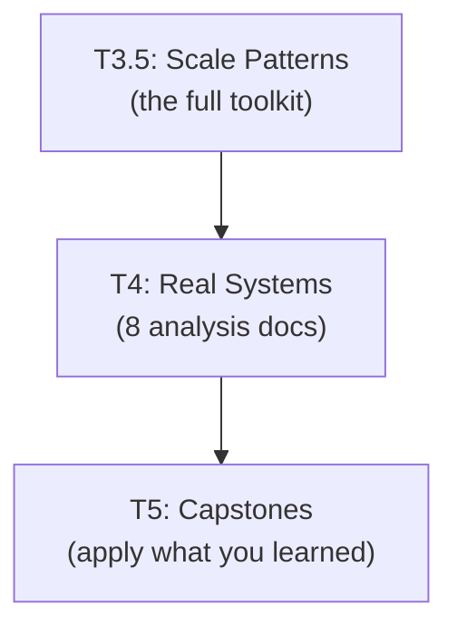

# Tier 4 — Real Systems Architecture

> Reverse-engineer how real systems combine the techniques from T1–T3.5. This is where theory becomes concrete, and where you see how the pieces fit together before designing your own.

---

## Purpose

By the end of T4, you can:

- Explain the architecture of Kafka, Spanner, Dynamo, Cassandra, Redis Cluster, Envoy, CDN, and GFS/Bigtable/Aurora
- Identify which T1–T3.5 concepts each system uses
- Reason about each system's trade-offs and design decisions
- Recognize patterns you can reuse in your own designs

T4 is the bridge between "I know the theory" and "I can design systems." Real systems teach composition by example.

---

## Anchored Artifact

**One analysis doc per system.** 8 systems → 8 analysis docs.

Each analysis doc follows a 4-part structure:
1. 💡 Context — who built it, when, what problem
2. 🔬 Architecture Walkthrough — design as built, with diagrams
3. ⚠️ Trade-offs & Failure Modes — what they accepted, what broke
4. 🎯 What You Can Apply — patterns transferable to your own designs

**Location**: `deep-dives/06-tier-4/[system-slug].md`

---

## How T4 Fits the Architecture

**What it produces**: 8 analysis docs, each reverse-engineering a real production system.

**Mode**: ANALYZE only. The AI presents the analysis; you confirm understanding; the analysis doc is written to disk.

---

## Topics (Linear Spine)

### T4.1 — Kafka

- **Kafka architecture**: distributed commit log, partitions, brokers
  `ANALYZE` · `Anchor: T4-kafka` · `Deps: T3.5` · `Fails: no understanding of event-driven systems at scale` · `Interview: Y` · `Artifact: deep-dives/06-tier-4/kafka.md` · `Mistake: Kafka for simple queues` · `Ref: Backend T5.7` · `Ref: T5` · `Theory 70/Practice 30` · `Reading: 60 min` · `Paper: Kafka (2011)`

- **Partitions & consumer groups**: parallel consumption, rebalancing
  `ANALYZE` · `Anchor: T4-kafka` · `Deps: T4.1 kafka` · `Fails: throughput collapse during rebalance` · `Interview: Y` · `Artifact: —` · `Mistake: too many partitions (rebalance cost), too few (throughput cap)` · `Ref: T5` · `Theory 70/Practice 30` · `Reading: 45 min`

- **Kafka replication & ISR**: leader/follower, in-sync replicas, durability
  `ANALYZE` · `Anchor: T4-kafka` · `Deps: T4.1 partitions` · `Fails: data loss under acks=1` · `Interview: Y` · `Artifact: —` · `Mistake: acks=all without understanding ISR` · `Ref: T2.1 replication` · `Ref: T5` · `Theory 70/Practice 30` · `Reading: 45 min`

- **Kafka log compaction & retention**: key-based compaction, time/size retention
  `ANALYZE` · `Anchor: T4-kafka` · `Deps: T4.1 replication` · `Fails: unbounded log growth or premature data loss` · `Interview: S` · `Artifact: —` · `Mistake: compaction for append-only event logs` · `Ref: T5` · `Theory 70/Practice 30` · `Reading: 30 min`

- **Kafka's design trade-offs**: why not a queue, why a log
  `ANALYZE` · `Anchor: T4-kafka` · `Deps: T4.1 log-compaction` · `Fails: misuse as traditional message queue` · `Interview: Y` · `Artifact: —` · `Mistake: consumer-per-message model` · `Ref: T5` · `Theory 70/Practice 30` · `Reading: 40 min` · `Paper: The Log Manifesto (2013)`

- **KRaft migration**: Kafka removing ZooKeeper dependency
  `ANALYZE` · `Anchor: T4-kafka` · `Deps: T4.1 architecture` · `Fails: no understanding of consensus consolidation` · `Interview: N` · `Artifact: —` · `Mistake: Kafka without understanding its coordinator` · `Ref: T3.1 raft` · `Ref: T5` · `Theory 70/Practice 30` · `Reading: 35 min` · `Paper: Kafka KRaft (case study)`

**Deep-dive candidates**: Kafka partition rebalancing, ISR mechanics — generate on demand.

---

### T4.2 — Spanner

- **Spanner architecture**: TrueTime, Paxos groups, sharding
  `ANALYZE` · `Anchor: T4-spanner` · `Deps: T3.5` · `Fails: no understanding of global ACID` · `Interview: Y` · `Artifact: deep-dives/06-tier-4/spanner.md` · `Mistake: Spanner replication with NTP alone` · `Ref: T3.1 paxos` · `Ref: T5` · `Theory 70/Practice 30` · `Reading: 90 min` · `Paper: Spanner (2012)`

- **TrueTime and external consistency**: how Spanner commits globally
  `ANALYZE` · `Anchor: T4-spanner` · `Deps: T4.2 spanner` · `Fails: misapply Spanner's guarantees` · `Interview: Y` · `Artifact: —` · `Mistake: TrueTime without atomic clocks` · `Ref: T1.2 truetime` · `Ref: T1.3 strong-consistency` · `Mistake: TrueTime as general-purpose time` · `Ref: T5` · `Theory 80/Practice 20` · `Reading: 60 min`

- **Paxos groups across shards**: how Spanner replicates each shard
  `ANALYZE` · `Anchor: T4-spanner` · `Deps: T4.2 truetime` · `Fails: no understanding of horizontal scaling with consensus` · `Interview: S` · `Artifact: —` · `Mistake: Paxos per transaction (correct is per shard)` · `Ref: T3.1 paxos` · `Ref: T5` · `Theory 80/Practice 20` · `Reading: 60 min`

- **Read-write transactions & snapshot reads**: how Spanner handles both
  `ANALYZE` · `Anchor: T4-spanner` · `Deps: T4.2 paxos-groups` · `Fails: no read-scaling strategy` · `Interview: S` · `Artifact: —` · `Mistake: read-write for analytical queries` · `Ref: T4.2 spanner` · `Ref: T5` · `Theory 70/Practice 30` · `Reading: 45 min`

- **Spanner's design trade-offs**: latency vs consistency globally
  `ANALYZE` · `Anchor: T4-spanner` · `Deps: T4.2 snapshot-reads` · `Fails: expect global low-latency ACID` · `Interview: Y` · `Artifact: —` · `Mistake: Spanner for latency-critical workloads` · `Ref: T5` · `Theory 70/Practice 30` · `Reading: 45 min`

- **CockroachDB / YugabyteDB comparison**: leaderless vs leader-based consensus
  `ANALYZE` · `Anchor: T4-spanner` · `Deps: T4.2 spanner` · `Fails: no understanding of Spanner alternatives` · `Interview: S` · `Artifact: —` · `Mistake: Spanner without atomic clocks` · `Ref: T3.1 raft` · `Ref: T5` · `Theory 70/Practice 30` · `Reading: 45 min`

**Deep-dive candidates**: TrueTime internals, Spanner vs CockroachDB comparison — generate on demand.

---

### T4.3 — Dynamo / DynamoDB

- **Dynamo architecture**: consistent hashing, vector clocks, quorums
  `ANALYZE` · `Anchor: T4-dynamo` · `Deps: T3.5` · `Fails: no design for eventually consistent KV at scale` · `Interview: Y` · `Artifact: deep-dives/06-tier-4/dynamo.md` · `Mistake: strong consistency on Dynamo` · `Ref: T1.4 quorum` · `Ref: T1.5 consistent hashing` · `Ref: T5` · `Theory 70/Practice 30` · `Reading: 90 min` · `Paper: Dynamo (2007)`

- **Sloppy quorums & hinted handoff in practice**: how Dynamo stays available
  `ANALYZE` · `Anchor: T4-dynamo` · `Deps: T4.3 dynamo` · `Fails: no availability strategy under partition` · `Interview: S` · `Artifact: —` · `Mistake: sloppy quorums for financial data` · `Ref: T1.4 sloppy-quorum` · `Ref: T5` · `Theory 80/Practice 20` · `Reading: 45 min`

- **Conflict resolution via vector clocks**: how Dynamo handles concurrent writes
  `ANALYZE` · `Anchor: T4-dynamo` · `Deps: T4.3 sloppy-quorums` · `Fails: silent data loss on concurrent writes` · `Interview: Y` · `Artifact: —` · `Mistake: LWW for mergeable data` · `Ref: T1.2 vector-clocks` · `Ref: T5` · `Theory 80/Practice 20` · `Reading: 45 min`

- **DynamoDB productization**: what changed from paper to product
  `ANALYZE` · `Anchor: T4-dynamo` · `Deps: T4.3 conflict-resolution` · `Fails: theoretical Dynamo vs practical DynamoDB gap` · `Interview: S` · `Artifact: —` · `Mistake: DynamoDB as Dynamo equivalent` · `Ref: T5` · `Theory 70/Practice 30` · `Reading: 45 min`

- **DynamoDB single-table design**: partition keys, sort keys, GSIs
  `ANALYZE` · `Anchor: T4-dynamo` · `Deps: T4.3 dynamodb` · `Fails: relational thinking fails on DynamoDB` · `Interview: Y` · `Artifact: —` · `Mistake: multiple tables for related data` · `Ref: T5` · `Theory 70/Practice 30` · `Reading: 45 min`

- **Hot partition mitigation in DynamoDB**: adaptive capacity, key salting
  `ANALYZE` · `Anchor: T4-dynamo` · `Deps: T4.3 single-table` · `Fails: celebrity problem in KV stores` · `Interview: S` · `Artifact: —` · `Mistake: monotonic keys with insufficient partitioning` · `Ref: T3.5.1 hot-key` · `Ref: T5` · `Theory 70/Practice 30` · `Reading: 35 min`

**Deep-dive candidates**: Dynamo vector clocks, DynamoDB single-table design — generate on demand.

---

### T4.4 — Cassandra / ScyllaDB

- **Cassandra architecture**: peer-to-peer, gossip, tunable consistency
  `ANALYZE` · `Anchor: T4-cassandra` · `Deps: T3.5` · `Fails: no design for wide-column storage` · `Interview: Y` · `Artifact: deep-dives/06-tier-4/cassandra.md` · `Mistake: Cassandra for read-heavy workloads` · `Ref: T1.6 gossip` · `Ref: T2.2 sharding` · `Ref: T5` · `Theory 70/Practice 30` · `Reading: 60 min`

- **Data modeling in Cassandra**: partition keys, clustering keys, no joins
  `ANALYZE` · `Anchor: T4-cassandra` · `Deps: T4.4 cassandra` · `Fails: relational thinking fails on Cassandra` · `Interview: Y` · `Artifact: —` · `Mistake: joins in Cassandra` · `Ref: T2.5 wide-column` · `Ref: T5` · `Theory 70/Practice 30` · `Reading: 45 min`

- **Tunable consistency in Cassandra**: quorum, ALL, ONE, LOCAL_QUORUM
  `ANALYZE` · `Anchor: T4-cassandra` · `Deps: T4.4 data-modeling` · `Fails: no consistency tuning` · `Interview: S` · `Artifact: —` · `Mistake: LOCAL_QUORUM without understanding failure modes` · `Ref: T1.4 quorum` · `Ref: T5` · `Theory 70/Practice 30` · `Reading: 40 min`

- **Repair & anti-entropy in Cassandra**: hinted handoff, Merkle trees
  `ANALYZE` · `Anchor: T4-cassandra` · `Deps: T4.4 tunable-consistency` · `Fails: replicas drift silently` · `Interview: S` · `Artifact: —` · `Mistake: repair too frequent (kills throughput)` · `Ref: T1.4 merkle-trees` · `Ref: T5` · `Theory 70/Practice 30` · `Reading: 40 min`

- **ScyllaDB migration**: C++ rewrite, latency improvements
  `ANALYZE` · `Anchor: T4-cassandra` · `Deps: T4.4 repair` · `Fails: no understanding of rewrite trade-offs` · `Interview: N` · `Artifact: —` · `Mistake: rewriting without profiling` · `Ref: T5` · `Theory 70/Practice 30` · `Reading: 45 min` · `Paper: Discord migration (case study)`

- **Cassandra vs DynamoDB comparison**: different paths to the same goal
  `ANALYZE` · `Anchor: T4-cassandra` · `Deps: T4.4 scylladb` · `Fails: no framework for KV store choice` · `Interview: S` · `Artifact: —` · `Mistake: assuming one is universally better` · `Ref: T5` · `Theory 70/Practice 30` · `Reading: 35 min`

**Deep-dive candidates**: Cassandra data modeling, ScyllaDB rewrite analysis — generate on demand.

---

### T4.5 — Redis Cluster

- **Redis Cluster architecture**: sharding, gossip, failover
  `ANALYZE` · `Anchor: T4-redis` · `Deps: T3.5` · `Fails: no understanding of cached state at scale` · `Interview: S` · `Artifact: deep-dives/06-tier-4/redis-cluster.md` · `Mistake: Redis for durable data` · `Ref: Backend T3c.4` · `Ref: T5` · `Theory 70/Practice 30` · `Reading: 45 min`

- **Hash slots and resharding**: 16384 slots, online resharding
  `ANALYZE` · `Anchor: T4-redis` · `Deps: T4.5 redis-cluster` · `Fails: hot slots overwhelm one node` · `Interview: S` · `Artifact: —` · `Mistake: hash tags to shard hot keys` · `Ref: T1.5 consistent hashing` · `Ref: T5` · `Theory 70/Practice 30` · `Reading: 35 min`

- **Hot slot / hot key mitigation**: cluster-aware caching
  `ANALYZE` · `Anchor: T4-redis` · `Deps: T4.5 hash-slots` · `Fails: one key saturates a node` · `Interview: S` · `Artifact: —` · `Mistake: no L1 for hottest keys` · `Ref: T3.5.1 hot-key` · `Ref: T5` · `Theory 70/Practice 30` · `Reading: 30 min`

- **Redis persistence & failover**: RDB, AOF, replica promotion
  `ANALYZE` · `Anchor: T4-redis` · `Deps: T4.5 redis-cluster` · `Fails: data loss on failover` · `Interview: S` · `Artifact: —` · `Ref: Backend T3c.7` · `Mistake: Redis persistence for durability` · `Ref: T5` · `Theory 70/Practice 30` · `Reading: 35 min`

- **Redis vs Memcached vs DragonflyDB**: modern alternatives
  `ANALYZE` · `Anchor: T4-redis` · `Deps: T4.5 persistence` · `Fails: no framework for cache engine choice` · `Interview: N` · `Artifact: —` · `Mistake: assuming Redis is always optimal` · `Ref: T5` · `Theory 70/Practice 30` · `Reading: 30 min`

**Deep-dive candidates**: Redis Cluster failover, hot slot mitigation — generate on demand.

---

### T4.6 — Envoy / Istio / Service Mesh

- **Envoy architecture**: sidecar proxy, filters, clusters
  `ANALYZE` · `Anchor: T4-envoy` · `Deps: T3.5` · `Fails: no understanding of service mesh internals` · `Interview: S` · `Artifact: deep-dives/06-tier-4/envoy.md` · `Mistake: mesh for single-digit services` · `Ref: Backend T7.4` · `Ref: T5` · `Theory 70/Practice 30` · `Reading: 60 min`

- **Istio control plane**: Envoy fleet configuration
  `ANALYZE` · `Anchor: T4-envoy` · `Deps: T4.6 envoy` · `Fails: no understanding of fleet-wide policy` · `Interview: N` · `Artifact: —` · `Mistake: control plane as SPOF` · `Ref: T5` · `Theory 70/Practice 30` · `Reading: 45 min`

- **mTLS and service identity**: how service mesh secures internal traffic
  `ANALYZE` · `Anchor: T4-envoy` · `Deps: T4.6 istio` · `Fails: lateral movement after breach` · `Interview: S` · `Artifact: —` · `Ref: T3.5.10 mtls` · `Ref: T5` · `Theory 70/Practice 30` · `Reading: 40 min`

- **Service mesh trade-offs**: latency overhead, operational complexity
  `ANALYZE` · `Anchor: T4-envoy` · `Deps: T4.6 mtls` · `Fails: mesh makes latency worse` · `Interview: S` · `Artifact: —` · `Mistake: mesh without measuring overhead` · `Ref: T5` · `Theory 70/Practice 30` · `Reading: 30 min`

- **Service mesh vs API gateway**: different layers of the same problem
  `ANALYZE` · `Anchor: T4-envoy` · `Deps: T4.6 trade-offs` · `Fails: mesh for external clients` · `Interview: S` · `Artifact: —` · `Mistake: conflating mesh with gateway` · `Ref: Backend T7.4` · `Ref: T5` · `Theory 70/Practice 30` · `Reading: 30 min`

**Deep-dive candidates**: Envoy filter chain, Istio xDS protocol — generate on demand.

---

### T4.7 — CDN Architecture (Cloudflare / Akamai)

- **CDN edge architecture**: POPs, origin shielding, anycast routing
  `ANALYZE` · `Anchor: T4-cdn` · `Deps: T3.5` · `Fails: no understanding of global content delivery` · `Interview: S` · `Artifact: deep-dives/06-tier-4/cdn.md` · `Mistake: CDN as reverse proxy` · `Ref: Backend T5.6` · `Ref: T5` · `Theory 70/Practice 30` · `Reading: 45 min`

- **Cache invalidation at edge**: purge, tag-based, soft purge
  `ANALYZE` · `Anchor: T4-cdn` · `Deps: T4.7 cdn` · `Fails: stale content after updates` · `Interview: S` · `Artifact: —` · `Ref: T3.5.1 edge-caching` · `Mistake: no invalidation strategy` · `Ref: T5` · `Theory 70/Practice 30` · `Reading: 30 min`

- **DNS and anycast routing**: how requests reach the closest POP
  `ANALYZE` · `Anchor: T4-cdn` · `Deps: T4.7 invalidation` · `Fails: users routed to distant POP` · `Interview: S` · `Artifact: —` · `Ref: T1.5 anycast` · `Ref: T5` · `Theory 70/Practice 30` · `Reading: 35 min`

- **CDN as DDoS shield**: edge rate limiting, WAF, bot mitigation
  `ANALYZE` · `Anchor: T4-cdn` · `Deps: T4.7 dns-anycast` · `Fails: DDoS reaches origin` · `Interview: S` · `Artifact: —` · `Ref: T3.5.2 edge-ratelimit` · `Ref: T5` · `Theory 70/Practice 30` · `Reading: 30 min`

- **CDN trade-offs**: cost, latency, cache hit ratio
  `ANALYZE` · `Anchor: T4-cdn` · `Deps: T4.7 ddos-shield` · `Fails: CDN costs exceed origin costs` · `Interview: N` · `Artifact: —` · `Mistake: CDN for dynamic content` · `Ref: T5` · `Theory 70/Practice 30` · `Reading: 30 min`

**Deep-dive candidates**: Cloudflare edge architecture, Akamai origin shield — generate on demand.

---

### T4.8 — GFS / Bigtable / Aurora

- **GFS architecture**: single master, chunk servers, append-only
  `ANALYZE` · `Anchor: T4-gfs` · `Deps: T3.5` · `Fails: no understanding of distributed file systems` · `Interview: S` · `Artifact: deep-dives/06-tier-4/gfs-bigtable-aurora.md` · `Mistake: GFS for low-latency workloads` · `Ref: T2.5 object-storage` · `Ref: T5` · `Theory 70/Practice 30` · `Reading: 60 min` · `Paper: GFS (2003)`

- **Bigtable architecture**: LSM, SSTable, column families
  `ANALYZE` · `Anchor: T4-gfs` · `Deps: T4.8 gfs` · `Fails: no understanding of wide-column storage engines` · `Interview: S` · `Artifact: —` · `Mistake: Bigtable for OLTP` · `Ref: T2.3 lsm-trees` · `Ref: T5` · `Theory 70/Practice 30` · `Reading: 60 min` · `Paper: Bigtable (2006)`

- **Aurora architecture**: log as database, decoupled compute/storage
  `ANALYZE` · `Anchor: T4-gfs` · `Deps: T4.8 bigtable` · `Fails: no understanding of cloud-native DB design` · `Interview: S` · `Artifact: —` · `Mistake: Aurora as Postgres replacement` · `Ref: T2.3 WAL` · `Ref: T5` · `Theory 70/Practice 30` · `Reading: 60 min` · `Paper: Aurora (2017)`

- **GFS → Colossus evolution**: how Google replaced GFS
  `ANALYZE` · `Anchor: T4-gfs` · `Deps: T4.8 aurora` · `Fails: no understanding of storage engine evolution` · `Interview: N` · `Artifact: —` · `Mistake: assuming GFS is still the design` · `Ref: T5` · `Theory 70/Practice 30` · `Reading: 40 min`

- **Distributed file system vs object storage**: when each is right
  `ANALYZE` · `Anchor: T4-gfs` · `Deps: T4.8 colossus` · `Fails: wrong choice for workload` · `Interview: S` · `Artifact: —` · `Mistake: POSIX semantics on object storage` · `Ref: T2.5 object-storage` · `Ref: T5` · `Theory 70/Practice 30` · `Reading: 35 min`

**Deep-dive candidates**: Bigtable LSM mechanics, Aurora storage layer — generate on demand.

---

## Exit Criteria

You've completed T4 when you can:

- Explain the architecture of 8 major distributed systems
- Identify which T1–T3.5 concepts each system uses
- Reason about trade-offs each system accepted
- Recognize patterns reusable in your own designs
- Have 8 analysis docs written, one per system

---

## Cross-Tier References

**Depends on**: T0, T1, T2, T3, T3.5.

**Depended on by**:
- T5 — every capstone draws patterns from T4 analyses

---

## Common Failure Modes for the Tier as a Whole

- **Skipping T4**: you'll design T5 capstones without seeing how real systems solved the same problems.
- **Reading without analysis**: consuming without writing your own analysis doc misses the active-learning step.
- **Memorizing architectures**: focusing on details instead of design decisions.
- **Not connecting T4 to T1–T3.5**: seeing Kafka but missing its use of replication, consistency, and backpressure patterns.
- **One-size-fits-all thinking**: assuming one system is universally superior.

---

## Case Studies & Papers

**Papers read during T4**:
- GFS (2003) — T4.8
- Bigtable (2006) — T4.8
- Dynamo (2007) — T4.3
- Kafka (2011) — T4.1
- Spanner (2012) — T4.2
- Aurora (2017) — T4.8

**Case studies**:
- Segment Kafka incident — T4.1
- Discord Cassandra → ScyllaDB — T4.4
- Cloudflare BGP outage — T4.6, T4.7
- Facebook 2021 BGP + DNS outage — T4.6, T4.7
- AWS S3 2017 outage — T4.5
- Heroku 2021 DNS outage — T4.7
- Netflix multi-region failover — T4.6, T3.5.4