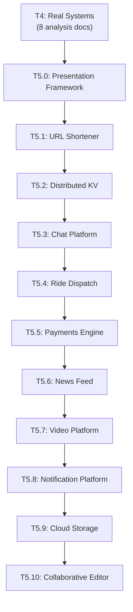

# Tier 5 — Hyperscale Design Capstones

> Design 10 real systems at MAANG scale. Combine everything from T0–T4. Produce 10 design docs + 10 defense transcripts. This is the portfolio.

---

## Purpose

By the end of T5, you can:

- Design a hyperscale system end-to-end from requirements to failure modes
- Defend the design under Staff-Engineer-level grilling
- Revise designs based on gap analysis
- Build a portfolio of 10 design docs + 10 defense transcripts

T5 is the payoff. Everything from T0–T4 converges here.

---

## Anchored Artifact

**10 design docs + 10 defense transcripts.**

Each capstone produces:
- `design-docs/[capstone-slug].md` — the 7-part design doc (written by you)
- `defense-transcripts/[capstone-slug].md` — the mock defense transcript (written by AI)

**Deliverables**: 20 documents total.

---

## The Mock Defense Protocol

Every capstone goes through 5 phases:

1. **Sketch** — you design on paper/Excalidraw, untimed. AI does not help.
2. **Write** — you produce the 7-part design doc. AI does not help.
3. **Defend** — AI acts as FAANG Staff Engineer. Grills on SPOFs, 10x/100x spikes, edge cases. One question at a time.
4. **Reveal** — AI presents a reference solution + gap analysis.
5. **Revise** — you revise your design doc based on the gap analysis.

Full protocol in `instructor-rules.md` Rule 16.

---

## The 7-Part Design Doc Format

```
# [System Name] — Design Doc

## 1. Requirements & Scope
Functional requirements, non-functional requirements (p99 latency, availability, consistency), out of scope.

## 2. Capacity Estimation
QPS (read/write), storage per year, bandwidth, cache sizing. Back-of-the-envelope math shown.

## 3. High-Level Design
End-to-end architecture diagram (Mermaid). Component responsibilities. Data flow.

## 4. Low-Level Design
Database schemas, indexes. API contracts. Caching strategy. Sharding/partitioning strategy.

## 5. Trade-offs & Alternatives
Why this design over alternatives. What you're giving up.

## 6. Failure Modes & Mitigations
What breaks under 10x traffic. What breaks under partition. What breaks under datacenter failure.

## 7. Defense Transcript
AI grill questions + your answers. Gap analysis (your design vs reference).
```

---

## How T5 Fits the Architecture



**What it produces**: 10 design docs + 10 defense transcripts — the portfolio.

---

## Topics (Linear Spine)

### T5.0 — Staff Engineer Presentation Framework

- **The 5-step structured presentation**: scoping → capacity → HLD → LLD → trade-offs
  `LEARN` · `Anchor: T5-defenses` · `Deps: T4` · `Fails: unstructured presentations lose the room` · `Interview: Y` · `Artifact: —` · `Mistake: dive into HLD before scope` · `Ref: T0.1 c4` · `Ref: T5` · `Theory 40/Practice 60` · `Reading: 30 min`

- **Time-boxing the presentation**: 45-min interview, 30-min design review
  `LEARN` · `Anchor: T5-defenses` · `Deps: T5.0 framework` · `Fails: run out of time before trade-offs` · `Interview: Y` · `Artifact: —` · `Mistake: skip capacity math` · `Ref: T5` · `Theory 30/Practice 70` · `Reading: 20 min`

- **Handling interruptions**: "wait, why not use X?"
  `LEARN` · `Anchor: T5-defenses` · `Deps: T5.0 framework` · `Fails: lose composure under grilling` · `Interview: Y` · `Artifact: —` · `Mistake: defend without hearing the question` · `Ref: T5` · `Theory 40/Practice 60` · `Reading: 25 min`

- **Diagram-driven narration**: walking through diagrams while talking
  `LEARN` · `Anchor: T5-defenses` · `Deps: T5.0 framework` · `Fails: diagram and speech out of sync` · `Interview: S` · `Artifact: —` · `Ref: T0` · `Mistake: reading from the diagram` · `Ref: T5` · `Theory 30/Practice 70` · `Reading: 20 min`

- **Defending trade-offs without being defensive**: how to answer "why not X?"
  `LEARN` · `Anchor: T5-defenses` · `Deps: T5.0 framework` · `Fails: defensive answers invite more grilling` · `Interview: Y` · `Artifact: —` · `Mistake: dismissal instead of comparison` · `Ref: T5` · `Theory 40/Practice 60` · `Reading: 25 min`

---

### T5.1 — URL Shortener at 100M DAU

- **Design URL shortener**: requirements, capacity, HLD, LLD, trade-offs, failure modes
  `DESIGN` · `Anchor: T5-capstone-url` · `Deps: T4` · `Fails: no practical design experience` · `Interview: Y` · `Artifact: design-docs/01-url-shortener.md + defense-transcripts/01-url-shortener.md` · `Mistake: no capacity estimation` · `Ref: Backend Mastery Project 1` · `Ref: —` · `Theory 30/Practice 70` · `Reading: 120 min`

**Focus areas for the defense**:
- Base62 key generation strategy
- Cache tier sizing (hot 20% of keys)
- Read/write ratio handling
- SPOF in key generation service
- Cache stampede on viral short URLs
- Redirect latency under 100k QPS peak

---

### T5.2 — Distributed Key-Value Store

- **Design a Dynamo-style KV store**: consistent hashing, quorums, vector clocks, hinted handoff
  `DESIGN` · `Anchor: T5-capstone-kv` · `Deps: T4` · `Fails: no distributed storage design skills` · `Interview: Y` · `Artifact: design-docs/02-distributed-kv.md + defense-transcripts/02-distributed-kv.md` · `Mistake: no conflict resolution strategy` · `Ref: T4.3 dynamo` · `Ref: —` · `Theory 40/Practice 60` · `Reading: 150 min`

**Focus areas for the defense**:
- Consistent hashing ring sizing (virtual nodes)
- Quorum configuration (R, W, N)
- Conflict resolution strategy
- Hinted handoff implementation
- Merkle tree reconciliation
- Node failure cascades

---

### T5.3 — Real-Time Chat & Presence Platform

- **Design a WhatsApp/Discord-style chat**: WebSocket fleet, presence, message ordering, fan-out
  `DESIGN` · `Anchor: T5-capstone-chat` · `Deps: T4` · `Fails: no real-time system design experience` · `Interview: Y` · `Artifact: design-docs/03-chat-platform.md + defense-transcripts/03-chat-platform.md` · `Mistake: no reconnect sync strategy` · `Ref: Backend T7.5` · `Ref: —` · `Theory 30/Practice 70` · `Reading: 150 min`

**Focus areas for the defense**:
- WebSocket connection fleet sizing
- Message ordering (per-channel sequence numbers)
- Presence tracking at scale
- Group fan-out (100k member groups)
- Offline message delivery
- Reconnect sync without gaps
- Cross-device consistency

---

### T5.4 — Geo-Spatial Ride Dispatch

- **Design Uber's dispatch system**: location ingestion, H3 indexing, matching, reservation
  `DESIGN` · `Anchor: T5-capstone-ride` · `Deps: T4` · `Fails: no spatial indexing experience` · `Interview: Y` · `Artifact: design-docs/04-ride-dispatch.md + defense-transcripts/04-ride-dispatch.md` · `Mistake: no double-dispatch prevention` · `Ref: T3.5.6 search` · `Ref: —` · `Theory 40/Practice 60` · `Reading: 150 min`

**Focus areas for the defense**:
- Location ingestion at 1M drivers / 4s updates
- H3 vs geohash choice
- Matching latency (sub-2s)
- Driver reservation without double-dispatch
- Surge pricing calculation
- Regional failover
- Cellular congestion handling

---

### T5.5 — Financial Ledger & Payments

- **Design Stripe/Square**: double-entry ledger, idempotency, reconciliation
  `DESIGN` · `Anchor: T5-capstone-payments` · `Deps: T4` · `Fails: no transactional system design` · `Interview: Y` · `Artifact: design-docs/05-payments-engine.md + defense-transcripts/05-payments-engine.md` · `Mistake: floats for money` · `Ref: T3.2 distributed-transactions` · `Ref: —` · `Theory 50/Practice 50` · `Reading: 150 min`

**Focus areas for the defense**:
- Double-entry bookkeeping schema
- Idempotency key lifecycle
- 2PC vs Saga for multi-bank settlement
- Reconciliation pipeline
- Handling unknown PSP states
- Audit trail completeness
- Multi-currency handling

---

### T5.6 — News Feed & Social Timeline

- **Design Twitter/Instagram feed**: fanout-on-write vs read, hybrid
  `DESIGN` · `Anchor: T5-capstone-feed` · `Deps: T4` · `Fails: no social system design experience` · `Interview: Y` · `Artifact: design-docs/06-news-feed.md + defense-transcripts/06-news-feed.md` · `Mistake: no celebrity handling` · `Ref: T3.5.1 hot-key` · `Ref: —` · `Theory 30/Practice 70` · `Reading: 150 min`

**Focus areas for the defense**:
- Fanout-on-write vs fanout-on-read
- Celebrity problem handling
- Timeline cache eviction policy
- Feed ranking / freshness
- Cold storage for old timelines
- Consistency across devices
- Cache stampede on viral posts

---

### T5.7 — Video Streaming & Transcoding

- **Design YouTube/Netflix**: upload, transcode, HLS, CDN
  `DESIGN` · `Anchor: T5-capstone-video` · `Deps: T4` · `Fails: no media pipeline design` · `Interview: Y` · `Artifact: design-docs/07-video-platform.md + defense-transcripts/07-video-platform.md` · `Mistake: no adaptive bitrate` · `Ref: T4.7 cdn` · `Ref: —` · `Theory 40/Practice 60` · `Reading: 150 min`

**Focus areas for the defense**:
- Chunked upload pipeline
- Transcoding worker fleet scaling
- HLS segmentation and manifest generation
- Adaptive bitrate streaming
- CDN origin shielding for viral videos
- Storage tiering (hot/warm/cold)
- Global startup latency (sub-second)

---

### T5.8 — Distributed Notification Platform

- **Design Twilio/Firebase**: multi-channel, preferences, rate limits, DLQ
  `DESIGN` · `Anchor: T5-capstone-notify` · `Deps: T4` · `Fails: no multi-channel system design` · `Interview: Y` · `Artifact: design-docs/08-notification-platform.md + defense-transcripts/08-notification-platform.md` · `Mistake: no priority queue` · `Ref: T3.5.2 ratelimit` · `Ref: —` · `Theory 40/Practice 60` · `Reading: 120 min`

**Focus areas for the defense**:
- Multi-channel provider abstraction
- Per-user channel preference enforcement
- Rate limiting per user / per provider
- Priority queue (OTP vs marketing)
- Provider downtime fallback
- Duplicate suppression
- Broadcast campaign handling (50M push in 5 min)

---

### T5.9 — Cloud Storage & File Sync

- **Design Dropbox/Google Drive**: block splitter, CDC, deduplication, delta sync
  `DESIGN` · `Anchor: T5-capstone-storage` · `Deps: T4` · `Fails: no file sync design experience` · `Interview: Y` · `Artifact: design-docs/09-cloud-storage.md + defense-transcripts/09-cloud-storage.md` · `Mistake: full-file sync instead of delta` · `Ref: T2.5 object-storage` · `Ref: —` · `Theory 50/Practice 50` · `Reading: 150 min`

**Focus areas for the defense**:
- Content-defined chunking (Rabin fingerprinting)
- Block-level deduplication at scale
- Metadata DB schemas for file hierarchy
- Delta sync protocol
- Conflict resolution (offline edits)
- Interrupted large file uploads
- Cross-device notification protocol

---

### T5.10 — Real-Time Collaborative Editor

- **Design Google Docs/Figma**: OT vs CRDT, sync, conflict resolution
  `DESIGN` · `Anchor: T5-capstone-editor` · `Deps: T4` · `Fails: no CRDT/OT design experience` · `Interview: Y` · `Artifact: design-docs/10-collaborative-editor.md + defense-transcripts/10-collaborative-editor.md` · `Mistake: no history compaction` · `Ref: T3.5.4 conflict-resolution` · `Ref: —` · `Theory 50/Practice 50` · `Reading: 150 min`

**Focus areas for the defense**:
- OT vs CRDT choice
- Operation sequencing (vector clocks)
- Room/document server failover
- Snapshot generation and log compaction
- Undo/redo semantics
- Sub-50ms keystroke sync
- Offline editing and reconciliation

---

## Exit Criteria

You've completed T5 when you can:

- Walk into a MAANG system design interview and defend a design under grilling
- Explain the trade-offs of your design choices without hesitation
- Identify the top 3 failure modes of any design you produce
- Produce a design doc that a senior engineer would accept in review

And you have 10 design docs + 10 defense transcripts — the portfolio.

---

## Cross-Tier References

**Depends on**: T0, T1, T2, T3, T3.5, T4.

**Depended on by**:
- Nothing (T5 is the terminal tier of this curriculum)

---

## Common Failure Modes for the Tier as a Whole

- **Skipping capacity estimation**: designs without numbers are guesses.
- **No failure modes section**: designs that ignore failures are incomplete.
- **Defensive answers during defense**: accepting grilling is a skill; defending with comparison is stronger.
- **Not revising after defense**: the gap analysis is the learning; ignoring it wastes the exercise.
- **One-shot thinking**: treating the first design as final.
- **Skipping defense**: a design doc without a defense is half the artifact.

---

## Case Studies & Papers

**Relevant case studies** (from the vault):
- Stripe's idempotency architecture — T5.5
- Figma/Google Docs CRDT vs OT — T5.10
- Uber H3 geospatial — T5.4
- Discord Cassandra → ScyllaDB — T5.3
- Netflix multi-region failover — all capstones

**Relevant papers**:
- Dynamo (2007) — T5.2
- Spanner (2012) — T5.5
- Kafka (2011) — T5.3, T5.6
- Raft (2014) — T5.2
- Sagas (1987) — T5.5