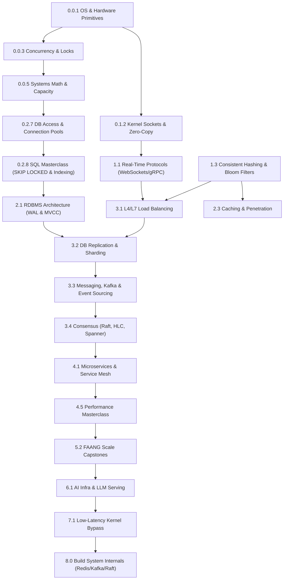

# 🧠 SYSTEM DESIGN MASTER CLASS: ROADMAP & MEMORY PANEL

> **AI AGENT INSTRUCTION & STATE FILE**
> This file is a dual-purpose document: it is the master syllabus and the **persistent memory tracker** for your System Design journey. Any AI assisting with this course MUST read, follow, and update this file dynamically.

---

## 🤖 AI Instructor Guidelines & Operating Rules

When teaching the user using this roadmap, all AI models MUST adhere strictly to the following rules:

### 1. Code Delivery & Teaching Method (CRITICAL)

- 🛑 **NO Automatic Code Writing / File Overwriting**: During teaching, the AI **MUST NOT** write project code to files or execute shell commands directly unless requested.
- 💬 **File-by-File Chat Delivery**: Present all code snippets, directory structures, and instructions directly in the chat, **one file at a time**. Never dump massive multi-file code blocks at once.
- 🧪 **Dedicated Console API Test Scripts**: For every topic/subtopic, provide a standalone executable test script named with its subtopic number (e.g., `tests/manual_tests/0.1_architecture.test.ts`) directly in the chat, along with the exact terminal command for the **user to execute in their console** (`npx tsx tests/manual_tests/0.1_architecture.test.ts`). The test output must display color-coded console logs covering:
  - ✅ **Success Cases**: Happy path requests returning expected responses.
  - ❌ **Failure Cases**: Invalid input payloads, 400 Bad Requests, 401 Unauthorized, 404 Not Found, 500 Internal Errors.
  - ⚠️ **Edge Cases**: Empty fields, extreme string lengths, special characters, zero values, boundary limits.
  - 🔄 **Duplicate & Race Condition Cases**: Sending concurrent identical requests to test idempotency keys and locks.
- 💰 **100% Free & Open-Source Stack (Zero Spend Guarantee)**: All tools, databases, infrastructure, and AI models taught and built in this roadmap MUST be 100% free, open-source, and self-hostable locally via Docker / LocalStack. For AI/LLM inference on older/low-spec PCs without local GPUs, we use 100% free cloud tiers (Google Gemini Free API, Groq Free Llama 3 API, HuggingFace Serverless), lightweight CPU-based ONNX embeddings (`@xenova/transformers` taking <30MB RAM), or zero-overhead Mock Providers. Never suggest paid subscriptions or paid cloud tiers.
- 🛠️ **Hardware Realism & Linux Probes (Overcoming Node.js V8 Limits)**: For low-level hardware & OS subtopics (e.g. NUMA, page cache, `O_DIRECT`, `io_uring`, cache line false sharing, SIMD), Node.js alone abstracts away hardware. The AI MUST pair TypeScript code with direct Linux CLI diagnostics (`numactl`, `perf stat`, `strace`, `dd iflag=direct`, `vmstat 1`, `vmtouch`, `autocannon`) or small standalone C/Rust probe snippets so the user can observe true OS and hardware behavior in their terminal.
- 🔁 **Spaced Repetition & Review Queue**: Every 10 completed subtopics, the AI instructor **MUST** pause before introducing the next topic and administer a 3-question active recall quiz drawing from previously completed subtopics across any level. Results must be logged in the `## 📝 Learner Log & Milestone History`.
- 🏷️ **Cross-Referencing & Prerequisite Tags**: Topics that reappear across levels (e.g. Consistent Hashing, Bloom Filters, Rate Limiting, Kafka, Raft, CRDTs) are marked with `[Prerequisites: ...]` or `[See Also: ...]`. When teaching these subtopics, the AI MUST reference previously covered foundation concepts rather than redundantly re-explaining them from scratch, building a progressive spiral curriculum.

### 2. Pre-Topic & Topic Execution Protocol

For every new Topic/Subtopic, the AI MUST follow this 6-step lifecycle:

```
[ Step 1: Pre-Topic Discussion ] ──► [ Step 2: User Confirmation ] ──► [ Step 3: Deep Explanation & Code ]
                                                                                │
                                                                                ▼
[ Step 6: Teach-It-Back & Next ] ◄── [ Step 5: Docs & Progress Log ] ◄── [ Step 4: Test & Predict Output ]
```

1. **Step 1: Pre-Topic Discussion**:
   - Discuss what will be learned, its real-world importance, and how it fits into our master project.
   - Clarify if the subtopic is `[CORE]` (must-know) or `[ADVANCED]` (specialized deep-dive).
   - Check any `[Prerequisites: ...]` or `[See Also: ...]` tags to link previous knowledge.
   - Ask the user if they have any specific additions or custom questions for this topic before starting.
2. **Step 2: User Confirmation**:
   - Wait for the user to explicitly confirm they are ready ("I'm ready", "Let's go", etc.).
3. **Step 3: Comprehensive Deep-Dive Explanation**:
   - Explain the topic in-depth covering: **What, Why, How, When, Where, Whom, Whose**, edge cases, and failure modes.
   - Walk through implementation code step-by-step (file by file) for our project.
4. **Step 4: Executable Console Test Creation, Predict-The-Output & User Execution**:
   - Create a standalone **Console API Test Script** named with the subtopic number (e.g. `tests/manual_tests/0.1_architecture.test.ts`).
   - Before executing, prompt the user to **predict the expected output** or behavior of the test.
   - Provide the exact terminal command (`npx tsx tests/manual_tests/<subtopic_number>_<name>.test.ts`) in the chat for the **user to run in their console** and observe color-coded outputs for:
     - ✅ **Success Cases**: Happy path requests returning expected responses.
     - ❌ **Failure Cases**: Invalid input payloads, 400 Bad Requests, 401 Unauthorized, 404 Not Found, 500 Internal Errors.
     - ⚠️ **Edge Cases**: Empty fields, extreme string lengths, special characters, boundary limits.
     - 🔄 **Duplicate & Race Condition Cases**: Sending concurrent identical requests to test idempotency keys and locks.
5. **Step 5: Post-Topic Documentation & Progress Update**:
   - Update `SYSTEM_DESIGN_ROADMAP.md` (check `[x]`, update dashboard percentage & learner log).
   - Create a detailed **Course Material File** under `docs/course_materials/` (containing all theory, code snippets, architecture diagrams, and additional details).
   - Create an **Interview Questions File** under `docs/interview_prep/` (containing beginner to senior FAANG-level interview Q&A for this specific topic).
6. **Step 6: "Teach-It-Back" Checkpoint & Next Step Confirmation**:
   - Ask the user a quick 1-sentence "teach-it-back" question or ask them to summarize their key takeaway to lock in active recall.
   - Ask the user if they are ready to proceed to the next topic or starter project step.

### 3. Cross-PC Session Handoff Protocol (CRITICAL FOR MULTI-DEVICE LEARNING)

Whenever the user indicates the session is ending (e.g., _"that's enough for today"_, _"let's stop here"_, _"ending session"_), the current AI instructor **MUST**:

1. Update the **`## 🔄 AI Handoff & Session Continuation State`** section in `SYSTEM_DESIGN_ROADMAP.md` with:
   - 📅 **Date & Time of Handoff**
   - 🏁 **Exact Subtopic & Step Completed** (with list of all files created/modified)
   - 🎯 **Next Exact Starting Point for the Next AI** (which Level, Module, Subtopic, and Step to pick up from)
   - 💡 **Context / Notes for the Next AI** (open questions, pending test commands, user preferences)
2. Provide a clear, detailed natural language summary in the chat so the user can easily read where they left off and copy/paste it or push git changes to their second PC.
3. Every AI starting a new session MUST first read `SYSTEM_DESIGN_ROADMAP.md` and check the **`## 🔄 AI Handoff & Session Continuation State`** section to seamlessly resume without repeating completed steps.

---

## 📊 Dashboard & Active Progress Status

- **Current Status**: 🟡 `Starting Level 0.0 (CS & OS Foundations)`
- **Active Level**: **Level 0.0: Computer Science, OS & Systems Fundamentals**
- **Active Module**: `0.0.1 OS Primitives, Process/Thread Model & Memory`
- **Active Career Milestone**: 🎓 `Milestone 1: Backend Engineer I`
- **Overall Completion**: `0% (0 / 255 Subtopics Completed)`
- **Last Updated**: `2026-09-11`

---

## 🏆 Career Progression Milestones Tracker

```
 [ Milestone 1: Backend Engineer I ]  ──► [ Milestone 2: Backend Engineer II ] ──► [ Milestone 3: Senior Backend Engineer ]
 (Levels 0.0, 0.1, 0.2)                   (Levels 1 & 2)                              (Levels 3 & 4)
                                                                                              │
                                                                                              ▼
 [ Milestone 6: Staff / Fellow Engineer ] ◄── [ Milestone 5: AI Principal Engineer ] ◄── [ Milestone 4: Distributed Systems Architect ]
 (Level 8 System Internals)                   (Levels 6 & 7)                              (Levels 4.5, 5)
```

- [ ] 🎓 **Milestone 1: Backend Engineer I** (Levels 0.0, 0.1, 0.2 — CS Foundations, Network Tuning, Production Starter Service)
  - 📦 _Portfolio Deliverable_: Hardened TS Production Starter Service (`level_0_starter/`) featuring Zod env validation, Pino JSON logs, AsyncLocalStorage trace context, RFC 7807 error envelopes, and `strace`/`iostat` benchmark logs.
  - ✅ _Readiness Signals_: You can diagnose memory leaks with `heap snapshot`, trace system calls using `strace`, and write production-grade Express services with zero unhandled rejections.
- [ ] 🚀 **Milestone 2: Backend Engineer II** (Levels 1 & 2 — Communication Protocols, Database & Search Internals)
  - 📦 _Portfolio Deliverable_: Core Engine Services (`nexus_engine/`) with raw SQL index benchmarks (`EXPLAIN ANALYZE`), Redis L2 caching, gRPC protobuf schemas, and WebSocket real-time brokers.
  - ✅ _Readiness Signals_: You can diagnose `Seq Scan` vs `Index Scan` costs, design covered SQL indexes, prevent N+1 queries, and implement cache stampede mitigations.
- [ ] 🏢 **Milestone 3: Senior Backend Engineer** (Levels 3 & 4 — Distributed Core, Messaging, Observability, K8s Clusters)
  - 📦 _Portfolio Deliverable_: Distributed Microservice Mesh with OpenTelemetry distributed tracing, Prometheus RED metrics, Transactional Outbox CDC pipelines, and ArgoCD/Kubernetes manifests.
  - ✅ _Readiness Signals_: You can architect event-driven Saga transactions, debug distributed trace context propagation across services, and design multi-region failover strategies.
- [ ] ⚡ **Milestone 4: Performance Engineering & Distributed Systems Architect** (Levels 4.5 & 5 — Performance Masterclass, Progressive Rollouts, High-Scale FAANG Capstones)
  - 📦 _Portfolio Deliverable_: High-Scale Capstone Engine Implementations with p99.9 Flame Graph profiling, zero-copy `io_uring` probes, and 100k QPS `autocannon` load test verification.
  - ✅ _Readiness Signals_: You can analyze V8 GC pause spikes, eliminate false sharing cache line invalidations, and complete 45-min FAANG system design interviews with a 90+ score.
- [ ] 🤖 **Milestone 5: AI Infrastructure & Principal Engineer** (Levels 6 & 7 — Vector RAG, LLM Serving, Ultra-Low Latency God Level)
  - 📦 _Portfolio Deliverable_: Enterprise AI Knowledge Platform with Hybrid Search (BM25 + HNSW), vLLM token streaming, Model Context Protocol (MCP) servers, and NeMo security guardrails.
  - ✅ _Readiness Signals_: You can optimize LLM KV-cache memory usage, benchmark vector retrieval (NDCG/recall@k), and implement kernel-bypass DPDK/eBPF socket pipelines.
- [ ] 👑 **Milestone 6: Staff / Fellow Engineer (System Internals Master)** (Level 8 — Build Redis, Kafka, Raft, B+ Tree, Search Engine from scratch)
  - 📦 _Portfolio Deliverable_: Unified Systems Library & Distributed Mini-Engine (`level_8_internals/`) combining custom RESP Redis, append-only Kafka disk log, B+Tree/LSM SSTables, and Raft consensus RPCs into a single working binary.
  - ✅ _Readiness Signals_: You can build an LSM compaction engine, write a Raft leader-election consensus state machine, and debug binary protocol serialization at the byte level.

---

## 🔄 AI Handoff & Session Continuation State

> ⚠️ **Attention Next AI Instructor**: READ THIS SECTION FIRST! The user is switching devices and starting the course on this PC. Everything is 100% configured and aligned.

- **Last Updated**: `2026-09-11 07:22`
- **Session Status**: 🟢 `Fully Configured & Ready for Level 0.0`
- **Last Completed Subtopic**: `None (10/10 Staff-Level Roadmap Alignment & Performance Masterclass Completed)`
- **Current Active Level**: **Level 0.0: Computer Science & OS Foundations for Systems Engineers**
- **Current Active Module**: `0.0.1 Operating System & Hardware Primitives`
- **Current Step Lifecycle**: `Step 1: Pre-Topic Discussion`
- **Files Created/Modified In Setup Session**:
  - [SYSTEM_DESIGN_ROADMAP.md](file:///mnt/recovery/system-design/SYSTEM_DESIGN_ROADMAP.md) (Fully expanded 10/10 Staff-Level roadmap with NUMA, NVMe/O_DIRECT, CFS Scheduler, Time-Series DBs, FinOps, SRE Operations, ADRs, and Level 4.5 Performance Engineering Masterclass)

---

### 🎯 Instructions for the Next AI Instructor (Second PC):

1. **Where to Start Immediately**:
   - Initiate **Step 1: Pre-Topic Discussion** for **Module 0.0.1 Operating System & Hardware Primitives** (`[CORE]`).
   - Discuss the subtopics of Module 0.0.1:
     1. `[CORE]` **OS Architecture & Process vs Thread Model**: Kernel vs User space, Virtual memory, Paging, Page faults, Context switching costs, Worker Threads vs OS threads, CPU cache lines (L1/L2/L3).
     2. `[CORE]` **NUMA Architecture & CPU Pinning**: Non-Uniform Memory Access (NUMA nodes), Memory locality, Cross-socket latency, CPU pinning (`taskset`/`pthread_setaffinity`), Thread affinity for Redis/Kafka/ScyllaDB.
     3. `[CORE]` **Filesystem Internals & Database Impact**: Inode layout, Journaling, Copy-on-Write (CoW), ext4 vs XFS vs ZFS, Page Cache, `fsync` durability mechanics, `mmap`.
     4. `[CORE]` **Modern NVMe & Storage Hardware**: NVMe queue pairs, PCIe lanes, Direct I/O (`O_DIRECT`), SSD Write Amplification Factor (WAF), Flash Translation Layer (FTL).
     5. `[CORE]` **Linux CPU Scheduler Internals**: Completely Fair Scheduler (CFS), Priority scheduling, Run queues, CPU affinity, Context switch overhead.
     6. `[CORE]` **Memory Allocators & Memory Management**: `malloc`, `jemalloc`, `tcmalloc`, Memory fragmentation, Slab allocation, and custom memory tuning in Redis, Postgres, Nginx.
   - Explain real-world importance and how low-level OS behavior impacts backend performance.
   - Ask the user if they have any custom questions before waiting for their confirmation to move to Step 2.

2. **Mandatory Operating Rules & Preferences**:
   - 🛑 **NO Automatic Code Writing**: Do NOT write code files or run bash commands directly unless requested.
   - 💬 **Chat File-by-File Delivery**: Deliver all code snippets, folder structures, and instructions directly in chat, **one file at a time**.
   - 📁 **Folder Isolation**:
     - Level 0 code lives in `level_0_starter/` (standalone `package.json`, `tsconfig.json`, `src/`, `tests/manual_tests/`, `node_modules/`).
     - Level 1+ code lives in `nexus_engine/`.
   - 🏗️ **Master Project**: **NexusEngine** (Trading, Mobility, Workspace, Media Transcoding, AI RAG/Agent engines).
   - 🧪 **Step 4 Test Execution**: Create standalone test scripts named `tests/manual_tests/0.0.1_os_primitives.test.ts` (with subtopic numbers) testing Success, Failure, Edge cases, and Duplicates/Concurrency. Provide the exact command (`npx tsx tests/manual_tests/0.0.1_os_primitives.test.ts`) in chat for the **user to execute in their console**.
   - 🛠️ **Hardware Realism & Linux Probes**: Pair Node.js scripts for low-level OS topics (0.0.1, 0.1.2, 4.5.1) with direct Linux CLI tools (`numactl`, `perf stat`, `strace`, `dd iflag=direct`, `vmstat 1`, `vmtouch`) or small C/Rust probes so the user can observe true hardware behavior.
   - 📊 **Raw SQL & Execution Plans**: Prioritize raw SQL query plans (`EXPLAIN (ANALYZE, BUFFERS)`), raw index scans, and cursor management over ORM abstractions in Section 0.2.8.
   - ⚡ **Streaming Trade-offs**: Benchmark Kafka partition Head-of-Line (HoL) blocking vs BullMQ/RabbitMQ competing consumer acknowledgment patterns in manual tests.
   - 💰 **Zero-Spend & Low-Spec PC Guarantee**: ALWAYS use 100% free open-source tools. For AI/LLM topics, use free cloud API tiers (Gemini Free, Groq Free Llama 3) or lightweight CPU ONNX embeddings (`@xenova/transformers`). Zero local GPU required, zero spend!
   - 🔄 **End of Session**: Whenever the user says _"enough for today"_, update this `## 🔄 AI Handoff & Session Continuation State` section before closing.

---

## 📜 Seminal Systems Paper-Reading List

> _Goal: Read and analyze foundational research papers that shaped modern distributed systems architecture. Sequenced by difficulty tier and mapped directly to syllabus topics._

### 🟢 Tier 1: Foundations & Systems Building Blocks (Entry Level)

- [ ] 📄 **MapReduce** (_Dean & Ghemawat, 2004_): Simplified Data Processing on Large Clusters. `[Read with: 3.5 Data Engineering]`
- [ ] 📄 **Bigtable** (_Chang et al., 2006_): A Distributed Storage System for Structured Data. `[Read with: 2.2 NoSQL Wide-Column Stores]`
- [ ] 📄 **Colossus** (_Google, 2021_): Google's Next-Generation Distributed File System (Successor to GFS). `[Read with: 2.4 Object Storage & Filesystems]`
- [ ] 📄 **Haystack & TAO** (_Facebook, 2010/2013_): Facebook's Photo Storage & Distributed Social Graph Store. `[Read with: 2.2 Graph DBs & 2.4 CDNs]`

### 🟡 Tier 2: Storage, Messaging & Cloud Engines (Intermediate Level)

- [ ] 📄 **Dynamo** (_DeCandia et al., 2007_): Amazon's Highly Available Key-Value Store. `[Read with: 2.2 NoSQL KV Stores & 3.2 Sharding]`
- [ ] 📄 **Kafka** (_Kreps et al., 2011_): A Distributed Messaging System for Log Processing. `[Read with: 3.3 Event Streams & 8.2 Kafka Clone]`
- [ ] 📄 **AWS Aurora** (_Verbitski et al., 2017_): High Throughput Cloud-Native Relational Database. `[Read with: 2.1 RDBMS & Storage Maintenance]`
- [ ] 📄 **Snowflake** (_Dageville et al., 2016_): The Snowflake Elastic Data Warehouse. `[Read with: 3.5 Data Warehousing]`
- [ ] 📄 **ZooKeeper** (_Hunt et al., 2010_): Wait-free Coordination for Distributed Systems. `[Read with: 3.4 Coordination & Leased Locks]`

### 🔴 Tier 3: Distributed Consensus & Global Active-Active Systems (Advanced Level)

- [ ] 📄 **Raft** (_Ongaro & Ousterhout, 2014_): In Search of an Understandable Consensus Algorithm. `[Read with: 3.4 Consensus & 8.4 Raft Cluster]`
- [ ] 📄 **Chubby** (_Burrows, 2006_): The Chubby Lock Service for Loosely-Coupled Distributed Systems. `[Read with: 3.4 Distributed Locking]`
- [ ] 📄 **Spanner** (_Corbett et al., 2012_): Google's Globally Distributed Database (TrueTime & Paxos). `[Read with: 3.4 Consensus & 7.2 Active-Active]`
- [ ] 📄 **Google F1** (_Shute et al., 2013_): A Distributed SQL Database That Scales. `[Read with: 3.2 DB Scaling & Sharding]`
- [ ] 📄 **Borg & Omega** (_Verma et al., 2015_): Large-scale Cluster Management at Google. `[Read with: 4.4 Kubernetes Cluster Architecture]`
- [ ] 📄 **CockroachDB & FoundationDB**: Distributed SQL & Transactional Key-Value Stores. `[Read with: 2.2 Distributed KV Stores]`

---

## 🔀 Prerequisite Dependency Graph (Topological Map)

> _Use this topological map to understand how foundational concepts unlock downstream enterprise and distributed architecture topics._



---

## 🔁 Spaced Repetition & Review Queue

> **Rule for AI**: Every 10 completed subtopics, pause before starting the next topic and ask the user 3 quiz questions drawn from this review queue or completed topics.

- [ ] **Review Checkpoint 1** (Triggered after 10 subtopics): 3 active-recall questions on Level 0.0 & 0.1 primitives.
- [ ] **Review Checkpoint 2** (Triggered after 20 subtopics): 3 active-recall questions on backend best practices & networking.
- [ ] **Review Checkpoint 3** (Triggered after 30 subtopics): 3 active-recall questions on databases, indexing & caching.
- [ ] **Review Checkpoint 4** (Triggered after 40 subtopics): 3 active-recall questions on consensus, queues & system capstones.

---

## 📚 Detailed Syllabus & Progress Checklist

> 🏷️ **Legend**: `[CORE]` = Essential Must-Know for all Backend Engineers | `[ADVANCED]` = Deep Specialization / Staff Level

---

### 💻 Level 0.0: Computer Science & OS Foundations for Systems Engineers

_Milestone: 🎓 Backend Engineer I_

#### 0.0.1 Operating System & Hardware Primitives

- [ ] `[CORE]` **OS Architecture & Process vs Thread Model**: Kernel vs User space, Virtual memory, Paging, Page faults, Context switching costs, Process vs Worker Threads (`worker_threads` vs OS threads), CPU cache locality (L1/L2/L3 cache lines).
- [ ] `[ADVANCED]` **NUMA Architecture & CPU Pinning**: Non-Uniform Memory Access (NUMA nodes), Memory locality, Cross-socket latency, CPU pinning (`taskset` / `pthread_setaffinity`), Thread affinity for Redis, Kafka, ScyllaDB, DPDK.
- [ ] `[CORE]` **Filesystem Internals & Database Impact**: Inode layout, Journaling, Copy-on-Write (CoW), ext4 vs XFS vs ZFS, Page Cache, `fsync` durability mechanics, Memory-Mapped Files (`mmap`), I/O multiplexing (`select`, `poll`, `epoll`, `kqueue`).
- [ ] `[ADVANCED]` **Modern NVMe & Storage Hardware**: NVMe queue pairs, PCIe lanes, Direct I/O (`O_DIRECT`), SSD Write Amplification Factor (WAF), Flash Translation Layer (FTL).
- [ ] `[CORE]` **Linux CPU Scheduler Internals**: Completely Fair Scheduler (CFS), Priority scheduling, Run queues, CPU affinity, Context switch overhead.
- [ ] `[CORE]` **Memory Allocators & Memory Management**: `malloc`, `jemalloc`, `tcmalloc`, Memory fragmentation (internal vs external), Slab allocation, and why Redis, PostgreSQL, and Nginx tune custom memory allocators.

#### 0.0.2 Linux Performance Profiling & Diagnostics

- [ ] `[CORE]` **Linux Performance Tooling**: Process & system diagnostics using `strace` (system call tracing), `tcpdump` (packet capture), `iostat` (disk I/O throughput), `vmstat` (virtual memory statistics), `pidstat`, and `lsof`.
- [ ] `[ADVANCED]` **CPU & Memory Profiling**: Generating and reading **Flame Graphs**, `perf` CPU profiling, memory leak detection, and eBPF kernel profiling.

#### 0.0.3 Concurrency & Synchronization Masterclass

- [ ] `[CORE]` **Concurrency & Synchronization Primitives**: Race conditions, Critical sections, Mutexes, Read-Write Locks (`RWLock`), Semaphores, Atomic Operations (`Compare-And-Swap` / CAS), Memory Barriers, and Memory Models.
- [ ] `[ADVANCED]` **Lock-Free Concurrency & Thread Safety**: Lock-free data structures, ABA problem, Deadlock prevention (lock ordering), Livelock, Thread Starvation, and Thread Pools.

#### 0.0.4 Data Encoding, Serialization & Compression

- [ ] `[CORE]` **Data Encoding & Formats**: Character encodings (UTF-8, UTF-16, ASCII), Base64 binary encoding, Protobuf binary serialization, Apache Avro, MessagePack, and CBOR.
- [ ] `[CORE]` **Compression Algorithms & Production Trade-Offs**: Compression ratio vs CPU speed trade-offs across Snappy, LZ4, Zstd, Gzip, Brotli, SIMD acceleration, Dictionary compression, and Columnar compression (Parquet/ORC).

#### 0.0.5 Systems Math & Capacity Planning

- [ ] `[CORE]` **Bit Manipulation & Binary Operations**: Bitwise AND/OR/XOR/NOT, bitmasks, bit shifting, fast power-of-two calculations for bloom filters and memory allocation.
- [ ] `[CORE]` **Capacity Planning & Back-of-the-Envelope Math**: Calculating QPS, Throughput (MB/s), Storage growth/year, VRAM requirements, Network Bandwidth, Latency numbers every programmer should know (L1 cache vs RAM vs SSD vs Network).

- [ ] 📊 **Benchmarking Drill 0.0**: Run `strace` & `iostat` while writing 100k records to disk with `fsync` vs Page Cache vs `O_DIRECT` to measure latency deltas.

---

### 🌐 Level 0.1: Networking Performance, Protocols & Kernel Socket Tuning

_Milestone: 🎓 Backend Engineer I_

#### 0.1.1 Network Protocols & Request Flow

- [ ] `[CORE]` **TCP/IP & OSI Model**: Layers 1–7, packet routing, three-way handshake, TCP congestion control vs UDP.
- [ ] `[CORE]` **HTTP Evolution (HTTP/1.1 vs HTTP/2 vs HTTP/3 QUIC)**: Multiplexing, HOL blocking, binary frames, zero-RTT connection establishment.
- [ ] `[CORE]` **Domain Name System (DNS) & Routing**: Records (A, AAAA, CNAME, NS), TTL, GeoDNS, Anycast routing, ECMP, BGP, VXLAN.
- [ ] `[CORE]` **TLS/SSL Encryption**: Handshake mechanics, symmetric vs asymmetric encryption, SNI, TLS termination at proxy.

#### 0.1.2 Kernel Networking & Socket Performance Tuning

- [ ] `[ADVANCED]` **Low-Level Socket I/O**: `epoll` internals, `io_uring` asynchronous I/O, `sendfile`, `splice`, Zero-copy networking, socket receive/send buffers.
- [ ] `[ADVANCED]` **TCP Performance & Tuning**: Nagle's Algorithm (`TCP_NODELAY`), Delayed ACK, TCP Fast Open, Congestion control algorithms (BBR vs CUBIC), Explicit Congestion Notification (ECN), Bufferbloat, and Keepalive internals.
- [ ] `[ADVANCED]` **NIC Hardware & Kernel Packet Flow**: Network Interface Card (NIC) queues, Ring buffers, Interrupt Coalescing, RSS (Receive Side Scaling), RPS, XPS.

#### 0.1.3 Cryptography & Security Primitives

- [ ] `[CORE]` **Transport Layer Security & Handshakes**: TLS 1.3 1-RTT & 0-RTT handshakes, session resumption, SNI, mTLS (mutual TLS) certificate validation mechanics.
- [ ] `[CORE]` **Symmetric & Asymmetric Cryptography**: AES-256-GCM vs ChaCha20-Poly1305 authenticated encryption, HKDF key derivation, X25519 Elliptic Curve Diffie-Hellman (ECDH) key exchange, and digital signatures (Ed25519).

---

### 🛠️ Level 0.2: Production Backend Best Practices (Starter Project)

_Milestone: 🎓 Backend Engineer I_

> _Goal: Master all enterprise backend engineering best practices by building a bulletproof TS/Node.js starter service inside `level_0_starter/`._

#### 0.2.1 Architecture & Project Structure

- [ ] `[CORE]` **Clean Layered Architecture**: `Config` -> `Routes` -> `Controllers` -> `Services` -> `Repositories` -> `Database/ORM`.
- [ ] `[CORE]` **Dependency Injection (DI) & Inversion of Control (IoC)**: Manual Constructor DI vs Container-based DI (Awilix / TS-ED) for decoupled, testable code.
- [ ] `[CORE]` **Interface-Driven Design**: Writing strict Repository & Service contracts (Interfaces) to swap storage engines seamlessly.
- [ ] `[CORE]` **Architecture Decision Records (ADR)**: Standardized ADR template documentation (Context, Decision, Consequences, Alternatives Considered).

#### 0.2.2 Error Handling & Resilience

- [ ] `[CORE]` **Centralized Error Architecture**: Custom `AppError` base class, HTTP subclasses (`BadRequestError`, `NotFoundError`, `UnauthorizedError`, `ForbiddenError`, `ConflictError`, `InternalServerError`, `RateLimitError`).
- [ ] `[CORE]` **Async Error Handling & Process Safety**: Express 5 / `express-async-errors`, `asyncHandler` wrapper pattern (higher-order wrapper to eliminate repetitive try-catch blocks in Express controllers), catching unhandled rejections (`unhandledRejection`) and uncaught exceptions (`uncaughtException`).
- [ ] `[CORE]` **Operational vs Programmer Errors**: Distinguishing recoverable errors from critical process failures.
- [ ] `[CORE]` **Standardized API Error Envelope**: Implementing RFC 7807 Problem Details and unified JSON error structures `{ success: false, error: { code, message, details, timestamp } }`.

#### 0.2.3 Logging, Tracing & Context Propagation

- [ ] `[CORE]` **Structured JSON Logging**: Production logging with `Pino` (fast JSON serialization), log levels (`debug`, `info`, `warn`, `error`).
- [ ] `[CORE]` **Correlation ID Propagation**: Using Node.js `AsyncLocalStorage` to trace a single request ID across HTTP requests, service layers, DB queries, and external API calls.
- [ ] `[CORE]` **Log Sanitization & Redaction**: Automatically redacting sensitive keys (`password`, `token`, `creditCard`, `authorization`) from logs.
- [ ] `[CORE]` **HTTP Request/Response Audit Logging**: Middleware logging response times, status codes, and user agents.

#### 0.2.4 Configuration & Environment Management

- [ ] `[CORE]` **Type-Safe Environment Validation**: Validating `.env` schema at startup with `Zod`, crashing early if required env vars are missing.
- [ ] `[CORE]` **Multi-Environment Strategy**: Development, Testing, Staging, and Production config layering.
- [ ] `[CORE]` **Secrets & Security Credentials**: Key rotation strategies, environment secrets isolation, `.env.example` templates.

#### 0.2.5 Validation, Sanitization & Type Safety

- [ ] `[CORE]` **Request Schema Validation**: Strict validation of `req.body`, `req.params`, `req.query` using `Zod`.
- [ ] `[CORE]` **Data Transfer Objects (DTOs)**: TypeScript DTO interfaces, strict type guards, zero `any` usage.
- [ ] `[CORE]` **Input Sanitization**: Preventing XSS, SQL Injection (parameterized queries), NoSQL injection, and HTTP Parameter Pollution (HPP).

#### 0.2.6 Authentication, Authorization & User Blocking Best Practices

- [ ] `[CORE]` **JWT Access & Refresh Token Architecture**: Short-lived Access Tokens (15m) + Long-lived Refresh Tokens (7d) with token rotation.
- [ ] `[CORE]` **Secure Cookie vs Header Storage**: `HttpOnly`, `SameSite=Strict`, `Secure` cookies for Refresh Tokens vs `Authorization: Bearer` for Access Tokens.
- [ ] `[CORE]` **Password Security & Account Lockout**: Hashing with `Argon2id` / `Bcrypt` (salting, cost parameters) + temporary account locking in Redis after _N_ failed attempts.
- [ ] `[CORE]` **Role-Based (RBAC) & Attribute-Based (ABAC) Access Control**: Middleware enforcement for roles (`ADMIN`, `USER`, `SELLER`) and resource ownership.
- [ ] `[CORE]` **Session Revocation, Token Blacklisting & User Banning**: Redis token revocation, instant user logout, and global user-status check middleware (`user.status === 'BLOCKED'`).

#### 0.2.7 Database Access, ORM & Data Layer Best Practices

- [ ] `[CORE]` **Connection Pool Tuning**: Configuring min/max connections, idle timeouts, acquire timeouts, preventing pool exhaustion under load.
- [ ] `[CORE]` **Transactions & Atomic Operations**: Database transactions (Prisma / Drizzle / Kysely), Unit of Work pattern, automatic rollback on error.
- [ ] `[CORE]` **Database Migrations & Seeding**: Version-controlled migrations, idempotent seed scripts.
- [ ] `[CORE]` **Soft Delete Pattern & Base Audit Tracing**: `deletedAt` soft deletes with automatic filtering, tracking `createdAt`, `updatedAt`, `createdBy`, `updatedBy`.

#### 0.2.8 Practical SQL Efficient Querying & N+1 Prevention Masterclass

- [ ] `[CORE]` **N+1 Problem & Resolution**: Identifying N+1 queries in ORMs (Prisma, Drizzle, TypeORM, Kysely), using eager loading (`JOIN`), batching, and DataLoader pattern.
- [ ] `[CORE]` **Index-Aware Querying & Optimization**: Single vs Composite indexes, Leftmost prefix rule, Covering indexes (Index-Only scans), avoiding index invalidation (e.g. `WHERE LOWER(email)`).
- [ ] `[CORE]` **Partial & Functional/Expression Indexes**: Creating partial indexes (`WHERE status = 'ACTIVE'`) to drastically reduce index size, and expression indexes (`CREATE INDEX ON users (LOWER(email))`).
- [ ] `[CORE]` **Efficient Pagination**: Offset pagination pitfalls (`LIMIT 10 OFFSET 100000` scanning 100k rows) vs Keyset / Cursor-based pagination (`WHERE id > last_seen_id LIMIT 10`).
- [ ] `[CORE]` **Selective Projection & CTEs**: Fetching only required columns (`SELECT id, name` vs `SELECT *`), avoiding Cartesian products in multi-table JOINs, Common Table Expressions (CTEs) vs Subqueries.
- [ ] `[CORE]` **Window Functions Mastery**: Solving Top-N per group queries, running totals, and time-series deltas using `ROW_NUMBER()`, `RANK()`, `LAG()`, `LEAD()`, `OVER (PARTITION BY ...)`.
- [ ] `[CORE]` **Row Locking & Deadlock Avoidance**: Concurrency control with row locking (`SELECT ... FOR UPDATE`), lock-free non-blocking queue polling (`SKIP LOCKED`), and preventing transaction deadlocks.
- [ ] `[CORE]` **JSONB Querying & GIN Indexing**: Storing & querying semi-structured JSON data directly in SQL (`->`, `->>`, `@>`) and indexing JSONB fields with GIN (Generalized Inverted Index).
- [ ] `[CORE]` **Execution Plan Diagnosis (`EXPLAIN ANALYZE`)**: Reading execution plans: `Seq Scan` vs `Index Scan` vs `Bitmap Heap Scan`, cost estimates, identifying disk-based sorts (`External sort Disk`), and `work_mem` tuning.
- [ ] `[CORE]` **Atomic UPSERT & High-Throughput Bulk Operations**: `INSERT ON CONFLICT DO UPDATE` (PostgreSQL) / `ON DUPLICATE KEY UPDATE` (MySQL), batching with `UNNEST()`, and bulk imports.
- [ ] `[CORE]` **Transaction Scope & DB Integrity Anti-Patterns**: Ultra-short transaction scopes (never holding DB locks during 3rd-party HTTP calls), and DB-level `CHECK`/`UNIQUE` constraints over app-level checks.

#### 0.2.9 Practical MongoDB Efficient Querying & Aggregation Masterclass

- [ ] `[CORE]` **Schema Design & Embedding vs Referencing**: Knowing when to embed documents vs reference (`ObjectId`), avoiding document growth limits (16MB BSON limit) & unbounded arrays.
- [ ] `[CORE]` **N+1 Prevention in MongoDB**: Overcoming `populate()` performance overhead using native aggregation `$lookup` optimization.
- [ ] `[CORE]` **Aggregation Pipeline Mastery**: Multi-stage aggregation pipelines using `$match`, `$project`, `$group`, `$unwind`, `$lookup`, `$facet` for complex single-roundtrip queries.
- [ ] `[CORE]` **Indexing & Covered Queries**: Single, Compound, Multikey (arrays), Text, and Sparse indexes; using `.explain("executionStats")` to eliminate `COLLSCAN` in favor of `IXSCAN` and `PROJECTION_COVERED`.
- [ ] `[CORE]` **Cursor Pagination & Projections**: Selective projection `{ field: 1 }` to shrink payload size, range-based cursor pagination (`_id > lastId`) over `.skip().limit()`.

#### 0.2.10 Security Best Practices & Threat Mitigation (OWASP Top 10)

- [ ] `[CORE]` **Security Headers (`Helmet`)**: Setting CSP, HSTS, X-Frame-Options, X-Content-Type-Options, Referrer-Policy.
- [ ] `[CORE]` **CORS Configuration**: Strict origin whitelisting, credentials configuration, preflight caching (`maxAge`).
- [ ] `[CORE]` **Rate Limiting & Brute Force Protection**: IP & User-based rate limiting using `express-rate-limit` + Redis store.
- [ ] `[CORE]` **Dynamic IP Blacklisting & Geoblocking**: Maintaining dynamic IP blocklists in Redis/memory to reject malicious requests before hitting business logic.
- [ ] `[CORE]` **Payload Size & Compression**: Request body size limiting (`10kb` limit to prevent DoS) and response compression (`compression` middleware).

#### 0.2.11 Standardized API Design & Response Formatting

- [ ] `[CORE]` **API Success Response Envelope**: `{ success: true, data: ..., meta: { page, limit, totalPages, totalItems } }`.
- [ ] `[CORE]` **HTTP Status Code Conventions**: Proper usage of 200, 201, 204, 400, 401, 403, 404, 409, 422, 429, 500, 503.
- [ ] `[CORE]` **API Versioning**: Route-based versioning (`/api/v1/...`).

#### 0.2.12 Health Checks, Graceful Shutdown & Production Readiness

- [ ] `[CORE]` **Health Check Endpoints**: `/health/live` (Liveness probe) & `/health/ready` (Readiness probe checking DB/Redis connections).
- [ ] `[CORE]` **Graceful Shutdown Lifecycle**: Catching `SIGINT` / `SIGTERM`, stopping new connection acceptance, finishing active HTTP requests, closing DB connection pools safely within a timeout window.

#### 0.2.13 Automated Testing Strategy

- [ ] `[CORE]` **Unit Testing**: Testing Services and Controllers in isolation using `Vitest` / `Jest` with mocks.
- [ ] `[CORE]` **Integration Testing**: Testing HTTP endpoints using `Supertest` against a real test database.

#### 0.2.14 Code Quality, Strict TS & Git Hooks

- [ ] `[CORE]` **Strict TypeScript Rules**: `strict: true`, `noImplicitAny`, `noUnusedLocals`, `exactOptionalPropertyTypes`.
- [ ] `[CORE]` **Automated Code Formatting & Linting**: ESLint + Prettier rules configured for clean code style.
- [ ] `[CORE]` **Git Hooks & Pre-Commit Guards**: `Husky` + `lint-staged` running linting and type-checking automatically before commits.

#### 0.2.15 Background Task Offloading (In-Process Async Work)

- [ ] `[CORE]` **Non-Blocking Async Execution**: Offloading low-priority non-blocking tasks (e.g. sending welcome email/audit events) using Node.js event emitters or `setImmediate` so main HTTP responses return instantly.

#### 0.2.16 Automated API Documentation (OpenAPI / Swagger)

- [ ] `[CORE]` **OpenAPI 3.0 / Swagger Setup**: Generating automated interactive Swagger UI at `/docs` using Zod schemas / TypeScript types (`zod-to-openapi`).

#### 0.2.17 Containerization & Local Dev Setup (Docker & Docker Compose)

- [ ] `[CORE]` **Local Multi-Container Dev Environment**: `docker-compose.yml` orchestrating PostgreSQL, Redis, and App with hot-reloading (`tsx`).
- [ ] `[CORE]` **Production-Grade Dockerfile**: Multi-stage build, non-root user execution, `NODE_ENV=production`, layer caching.

#### 0.2.18 Third-Party API Integrations & Resiliency Patterns

- [ ] `[CORE]` **Adapter/Wrapper Pattern**: Decoupling 3rd party providers (Twilio for SMS/WhatsApp, SendGrid/Resend for Email, Stripe/Razorpay for Payments) behind abstract interfaces.
- [ ] `[CORE]` **Resilience Mechanics**: Retries with Exponential Backoff + Jitter, Circuit Breaker pattern for 3rd party outages, Provider Failover strategies.
- [ ] `[CORE]` **Inbound Webhook Security**: Verifying cryptographic webhook signatures (HMAC SHA-256) for 3rd party events.

#### 0.2.19 Scheduled Tasks & Distributed Cron Jobs

- [ ] `[CORE]` **Cron Execution Architecture**: In-process timers (`node-cron`) vs Distributed Queue Schedulers (`BullMQ` repeatable jobs).
- [ ] `[CORE]` **Cluster Execution Locks**: Using Redis distributed locks (`Redlock`) to ensure cron jobs execute exactly once across multi-instance server deployments.
- [ ] `[CORE]` **Cron Idempotency & Monitoring**: Idempotent execution tracking, handling missed execution windows, and job failure alerts.

#### 0.2.20 API Idempotency & Outbound HTTP Resilience

- [ ] `[CORE]` **API Idempotency Key Handling**: `Idempotency-Key` header parsing and Redis request deduplication for non-idempotent operations (`POST /payments`, `POST /orders`).
- [ ] `[CORE]` **Outbound HTTP Request Resilience**: Timeouts, socket connection pooling (`Agent` keep-alive), and `AbortController` cancellation for external API calls (`axios`/`fetch`).

#### 0.2.21 Application Telemetry Metrics, Feature Flags & DTO Mapping

- [ ] `[CORE]` **Application RED Metrics**: Exposing Prometheus RED metrics (`prom-client` for request counts, error rates, and p50/p95/p99 latency histograms).
- [ ] `[CORE]` **Dynamic Feature Flags**: Redis/in-memory feature toggling for enabling/disabling endpoints dynamically without deployment.
- [ ] `[CORE]` **Entity-to-DTO Mapping**: Decoupling Database ORM models from public API envelopes using explicit Mapper functions to avoid leaking internal columns.

- [ ] 📊 **Benchmarking Drill 0.2**: Run `autocannon` / `wrk` load test against `level_0_starter/` measuring QPS, p99 latency, and Pino logger CPU overhead.
- [ ] 🏛️ **Architecture Review Checkpoint 1**: _What breaks in our starter service at 10x traffic? What breaks at 100x traffic?_

---

### 🟢 Level 1: Core APIs, Protocols & Runtimes (Basics)

_Milestone: 🚀 Backend Engineer II_

#### 1.1 Real-Time Communication Protocols

- [ ] `[CORE]` **Real-Time Protocols (WebSockets, SSE, gRPC, WebRTC)**:
  - [ ] WebSockets in Node.js (ws/socket.io), socket state management, heartbeat mechanisms.
  - [ ] Server-Sent Events (SSE) streaming responses in Express.
  - [ ] gRPC & Protocol Buffers with `@grpc/grpc-js` (Unary vs Streaming RPCs).
  - [ ] WebRTC peer-to-peer data channels, STUN/TURN/ICE server architecture.

#### 1.2 Client-Server Architecture & API Design

- [ ] `[CORE]` **RESTful API Design**: Resource modeling, HTTP verbs, status codes, idempotency, Offset vs Cursor-based pagination.
- [ ] `[CORE]` **GraphQL Architecture**: Schema design, Resolvers, Query/Mutation/Subscriptions, N+1 query problem, DataLoader pattern in TypeScript.
- [ ] `[CORE]` **API Versioning Strategies**: Path, Query parameter, Header-based versioning.
- [ ] `[CORE]` **Node.js & Express Runtimes**:
  - [ ] Libuv Event Loop phases (Timers, Pending callbacks, Poll, Check, Close).
  - [ ] Single-thread event loop execution vs Worker Threads (`worker_threads`).
  - [ ] Clustering & Process Management (`cluster` module, PM2, IPC communication).
  - [ ] Node.js Streams API (`Readable`, `Writable`, `Transform`, handling backpressure).

#### 1.3 Core Data Structures & Algorithms for Systems

- [ ] `[CORE]` **Consistent Hashing [Foundation & Concept Preview]** `[Primary Placement: 3.1]` `[See Also: 5.2, 8.6]`: Hash ring topology concepts, virtual node balancing, partition key math.
- [ ] `[CORE]` **Cache Eviction Algorithms**: LRU (Doubly Linked List + HashMap), LFU (Frequency buckets).
- [ ] `[CORE]` **Probabilistic Data Structures**:
  - [ ] Bloom Filters `[See Also: 2.3, 5.2]` (Membership testing, false positive tuning).
  - [ ] HyperLogLog (Cardinality estimation for distinct counts).
  - [ ] Count-Min Sketch (Frequency tracking over massive data streams).
- [ ] `[CORE]` **Storage Indexing Data Structures**:
  - [ ] B-Trees / B+ Trees `[See Also: 2.1, 8.3]` (Node branching, disk block alignment).
  - [ ] LSM-Trees `[See Also: 2.2, 8.3]` (Log-Structured Merge-Trees, MemTable, SSTables, Leveled Compaction).
  - [ ] `[ADVANCED]` Skip Lists, Fractal Trees, Bw-Trees, and Adaptive Radix Trees (ART).
  - [ ] Trie (Prefix Tree for routing and autocomplete).
  - [ ] Merkle Trees (Hash trees for data integrity verification in distributed DBs).

- [ ] 🔎 **Guided Source Reading 1.1**: Read Node.js Libuv Event Loop source code (`src/unix/core.c`) to trace Poll phase execution.

---

### 🟡 Level 2: Data Persistence, Storage Layer & Search Systems (Intermediate)

_Milestone: 🚀 Backend Engineer II_

#### 2.1 RDBMS & Database Engine Deep-Dive

- [ ] `[CORE]` **RDBMS Architecture (PostgreSQL / MySQL)**:
  - [ ] ACID Guarantees & WAL (Write-Ahead Logging) replay & crash recovery.
  - [ ] Multi-Version Concurrency Control (MVCC) & Tuple visibility rules.
  - [ ] `[ADVANCED]` PostgreSQL Storage Maintenance: Vacuuming (Auto-Vacuum), HOT updates (Heap-Only Tuples), Visibility Maps, Free Space Maps (FSM), and Checkpointing.
  - [ ] Transaction Isolation Levels (Read Uncommitted, Read Committed, Repeatable Read, Serializable).
  - [ ] Indexing Deep-Dive: B-Tree, Hash, GIN, GiST, Composite & Covering Indexes.
  - [ ] Query Optimization & Buffer Manager: `EXPLAIN ANALYZE`, Cost-Based Optimizer (CBO), Buffer Pool shared memory management.
  - [ ] Connection Pooling: PgBouncer, Knex/Prisma connection pool configuration.

#### 2.2 NoSQL & Time-Series Databases

- [ ] `[CORE]` **Document Stores (MongoDB)**: BSON format, embedding vs referencing, indexing, aggregation framework.
- [ ] `[CORE]` **Key-Value Stores (Redis, AWS DynamoDB)** `[See Also: 8.1]`: Memory management, RDB vs AOF persistence, Dynamo paper architecture.
- [ ] `[CORE]` **Wide-Column Stores (Apache Cassandra / ScyllaDB)**: Partition/Clustering keys, SSTables, tunable consistency ($R + W > N$).
- [ ] `[CORE]` **Graph Databases (Neo4j)**: Nodes, edges, Cypher queries, graph traversal for recommendations.
- [ ] `[ADVANCED]` **Time-Series Databases (ClickHouse / TimescaleDB / InfluxDB)**: Columnar storage compression, time-bucketed partition pruning, retention policies, real-time analytics.
- [ ] `[ADVANCED]` **Distributed Transactional KV Stores**: FoundationDB architecture, TiDB, CockroachDB internals.

#### 2.3 Caching Patterns & Strategies

- [ ] `[CORE]` **Cache Architectures**: Local in-memory cache vs Distributed Redis Cluster / Sentinel.
- [ ] `[CORE]` **Caching Strategies**: Cache-Aside, Write-Through, Write-Back (Write-Behind), Read-Through, Refresh-Ahead.
- [ ] `[CORE]` **Cache Pitfalls & Mitigations**:
  - [ ] Cache Stampede / Thundering Herd (Mutex locking, XFetch early expiration).
  - [ ] Cache Penetration `[Prerequisites: 1.3]` (Bloom filters, null object caching).
  - [ ] Cache Avalanche (TTL jitter).
  - [ ] Hot Key Bottlenecks (Local L1 memory cache + Redis L2).

#### 2.4 Object Storage, Distributed Filesystems & CDNs

- [ ] `[CORE]` **Object Storage Internals (AWS S3 / Ceph / MinIO)**: Bucket layout, presigned URLs, multipart upload internals, versioning, consistency guarantees, garbage collection, object lifecycle, compaction, Erasure Coding & Reed-Solomon Coding.
- [ ] `[CORE]` **CDN Internals**: Cache hierarchy, Edge POP selection, Anycast routing, Cache key normalization, Cache purging, Origin shielding internals, Cloudflare Workers / CloudFront.

#### 2.5 Search Systems & Inverted Index Architecture

- [ ] `[CORE]` **Inverted Index Mechanics** `[See Also: 8.5]`: Lucene file layout, Posting Lists, Term Frequency-Inverse Document Frequency (TF-IDF), Okapi BM25 scoring algorithm.
- [ ] `[CORE]` **Distributed Search Engines (Elasticsearch / OpenSearch)**: Cluster architecture, Primary & Replica shards, Index mapping, Near-Real-Time (NRT) indexing pipeline.
- [ ] `[CORE]` **Advanced Search Features**: Faceted search aggregation, N-gram Autocomplete, Levenshtein Distance Fuzzy search, Synonyms dictionary, Custom Relevance Boosting.

- [ ] 🔎 **Guided Source Reading 2.1**: Inspect Redis C source (`src/server.c` & `src/evict.c`) to analyze dict lookup and LRU eviction mechanics.
- [ ] 🏛️ **Architecture Review Checkpoint 2**: _Database scaling limits: What happens to Postgres/Redis when data grows from 10GB to 1TB?_

---

### 🟠 Level 3: Distributed Systems Core, Scalability & Data Engineering (High / Advanced)

_Milestone: 🏢 Senior Backend Engineer_

#### 3.1 Scalability Fundamentals & Load Balancing

- [ ] `[CORE]` **Vertical vs Horizontal Scaling**: Bottleneck identification, eliminating Single Points of Failure (SPOF).
- [ ] `[CORE]` **Load Balancing**: Layer 4 (TCP/IP, HAProxy) vs Layer 7 (HTTP, Nginx, Envoy).
- [ ] `[CORE]` **Load Balancing Algorithms** `[Prerequisites: 1.3]` `[See Also: 8.6]`: Round Robin, Weighted Least Connections, Consistent Hashing, Power of Two Random Choices (P2C).
- [ ] `[CORE]` **Stateless Backend Design**: JWT vs Session Stores, Sticky Sessions vs Shared Redis State.

#### 3.2 Database Scaling, Replication & Partitioning

- [ ] `[CORE]` **Replication Architecture**: Single-Leader (Primary-Replica), Multi-Leader, Leaderless (Quorum $R+W>N$).
- [ ] `[CORE]` **Sharding Strategies** `[Prerequisites: 1.3]`: Range-based, Hash-based (Consistent Hashing), Directory-based sharding.
- [ ] `[CORE]` **Rebalancing & Resharding**: Zero-downtime shard splitting and live data migration.

#### 3.3 Asynchronous Messaging, Event Modeling & Schema Governance

- [ ] `[CORE]` **Message Queues vs Event Streams**:
  - [ ] Message Queues (BullMQ / RabbitMQ): AMQP, competing consumers, dead letter queues.
  - [ ] Event Streams (Kafka / Redpanda) `[See Also: 8.2]`: Topics, partitions, consumer groups, offset retention, Kafka internals (zero-copy, page cache, log compaction).
- [ ] `[CORE]` **Event Modeling & Event Driven Architecture**:
  - [ ] Domain Events vs Integration Events, Event versioning strategies.
  - [ ] Event Sourcing & CQRS pattern.
  - [ ] Transactional Outbox Pattern & CDC (Debezium).
  - [ ] Saga Pattern (Orchestration vs Choreography).
- [ ] `[CORE]` **Data Contracts & Schema Registry**:
  - [ ] Schema Registry (Confluent / Karapace), Avro / Protobuf schema validation, Backward, Forward, and Full compatibility rules.

#### 3.4 Distributed Consistency, Consensus & Time Synchronization

- [ ] `[CORE]` **CAP & PACELC Theorems**: Trade-off matrix in production systems.
- [ ] `[CORE]` **Distributed Consensus Algorithms & Protocols** `[See Also: 7.2, 8.4]`: Raft, Paxos, `[ADVANCED]` Chubby, Google Dynamo paper, Chain Replication, Viewstamped Replication (VSR), SWIM Gossip protocol.
- [ ] `[ADVANCED]` **CRDT Internals** `[See Also: 4.1, 5.2, 7.2]`: Conflict-Free Replicated Data Types for multi-region active-active & live collaboration editing.
- [ ] `[CORE]` **Distributed Transactions**: Two-Phase Commit (2PC), Three-Phase Commit (3PC), XA transactions, Try-Confirm-Cancel (TCC), Compensation workflows, Escrow locking.
- [ ] `[CORE]` **Distributed Locking & Coordination** `[Prerequisites: 0.2.19]`: Redlock algorithm, Zookeeper / etcd leased locks.
- [ ] `[CORE]` **Time Synchronization & Clocks**: NTP, PTP, Leap Seconds, Clock Drift, Monotonic vs Wall Clocks, Timestamp Ordering, Hybrid Logical Clocks (HLC), Google Spanner TrueTime API.

#### 3.5 Data Engineering & Stream Processing Architecture

- [ ] `[CORE]` **Data Architecture Patterns**: Data Warehouses (Snowflake, BigQuery) vs Data Lakes (S3+Parquet) vs Lakehouses (Apache Iceberg, Delta Lake).
- [ ] `[CORE]` **ETL / ELT Pipelines**: Batch processing with Apache Spark, DAG workflow orchestration with Apache Airflow.
- [ ] `[CORE]` **Stream Processing Frameworks**: Apache Flink, Event Time vs Processing Time, Tumbling / Sliding / Session Windows, Watermarks, Late Data Handling.
- [ ] `[CORE]` **Exactly-Once Processing Semantics**: Idempotent producers, transactional Kafka streams, two-phase commit (2PC) in stream engines.

- [ ] 💥 **Chaos Drill 3.1**: Kill the primary Redis master node, disconnect a Kafka broker, and observe cluster failover & consumer partition rebalancing.
- [ ] 🔎 **Guided Source Reading 3.1**: Inspect etcd Raft consensus implementation (`raft/node.go`) to see leader election RPCs.

---

### 🔴 Level 4: Enterprise, Production Readiness & Cloud Native (Enterprise Level)

_Milestone: 🏢 Senior Backend Engineer_

#### 4.1 Microservices Architecture & Service Mesh

- [ ] `[CORE]` **Domain-Driven Design (DDD)**: Bounded contexts, aggregates, entities, domain events.
- [ ] `[CORE]` **API Gateway Pattern**: Authentication, rate limiting, request routing (Kong, Traefik, Envoy).
- [ ] `[CORE]` **Service Mesh (Istio / Linkerd)**: Sidecar proxies (Envoy), mTLS, traffic splitting.
- [ ] `[CORE]` **Resilience Patterns**: Circuit Breakers (Opossum), Bulkheads, Rate Limiting (Token Bucket, Sliding Window).

#### 4.2 Observability, SRE Operations & Reliability Testing

- [ ] `[CORE]` **Three Pillars of Observability**:
  - [ ] **Metrics**: Prometheus metrics collection & Grafana Dashboards.
  - [ ] **Logging**: Log aggregation with Grafana Loki / ELK Stack & Pino/Winston structured logs.
  - [ ] **Tracing**: Distributed tracing with OpenTelemetry, Jaeger, Zipkin.
- [ ] `[CORE]` **SLAs, SLOs, & SLIs**: Defining service objectives, error budgets, and alerting strategies.
- [ ] `[CORE]` **SRE Incident Response Operations**: Incident Commander role, Postmortems & Blameless Root Cause Analysis (RCA), Five Whys methodology, Runbooks/Playbooks, On-call rotation, Escalation policies.
- [ ] `[CORE]` **Database Backup, Restore & Point-in-Time Recovery (PITR)**: Physical vs Logical backups, WAL archiving, PITR recovery drills, RTO (Recovery Time Objective) and RPO (Recovery Point Objective) targets.
- [ ] `[CORE]` **Reliability Testing Spectrum**: Load testing, Stress testing, Spike testing, Soak testing, Capacity testing using `autocannon` / `k6`.
- [ ] `[CORE]` **Chaos Engineering**: Injecting failures with Chaos Mesh / Gremlin.

#### 4.3 Enterprise Security & Compliance

- [ ] `[CORE]` **Auth Protocols**: OAuth 2.0 (PKCE), OIDC, JWT revocation & rotation strategies.
- [ ] `[CORE]` **Secrets Management & Zero-Trust Secrets**: HashiCorp Vault / AWS Secrets Manager, dynamic secret generation, automated rotation, Sealed Secrets in Kubernetes.
- [ ] `[CORE]` **Network & Data Security**: WAF, Zero Trust Architecture, AES-256 KMS encryption, OWASP API Security Top 10.

#### 4.4 Cloud-Native, DevOps & FinOps Engineering

- [ ] `[CORE]` **Docker & Containerization**: Multi-stage Node.js Dockerfiles, non-root users, signal forwarding.
- [ ] `[CORE]` **Kubernetes Cluster Architecture**: Control Plane (API Server, etcd, Scheduler, Controller Manager), Worker Nodes (Kubelet, Kube-Proxy), Pods, Deployments, StatefulSets, Ingress, Helm Charts, K8s Operators, CNI plugins, CSI plugins, etcd snapshots.
- [ ] `[CORE]` **Kubernetes Capacity Planning & Resource Management**: Resource requests and limits tuning, Horizontal Pod Autoscaler (HPA), Vertical Pod Autoscaler (VPA), Cluster Autoscaler, Pod Disruption Budgets (PDB).
- [ ] `[CORE]` **CI/CD & GitOps Infrastructure**: Terraform, ArgoCD, GitOps automated deployment pipelines.
- [ ] `[CORE]` **Cloud Cost Engineering & FinOps**: Cloud cost optimization, Autoscaling economics, Storage tiering (S3 Standard -> Glacier), Network Egress cost minimization, Reserved & Spot instance capacity planning.

#### 4.5 Production Engineering & Progressive Deployments

- [ ] `[CORE]` **Progressive Rollout Strategies**: Blue-Green deployments, Canary releases, Rolling updates, Automated rollback triggers based on error rate metrics.
- [ ] `[CORE]` **Shadow Traffic (Dark Launching)**: Mirroring production HTTP/gRPC traffic to staging/canary clusters via Envoy/Nginx without impacting end users.
- [ ] `[CORE]` **A/B Testing & Feature Management**: Statistical significance, consistent user hashing (MurmurHash3), dynamic feature flags, and emergency kill-switches.

- [ ] 💥 **Chaos Drill 4.1**: Simulate network partition in Kubernetes using Chaos Mesh and observe Pod eviction & HPA scaling.
- [ ] 🏛️ **Architecture Review Checkpoint 3**: _Multi-region deployment review: What breaks when an entire cloud availability zone goes offline?_

---

### ⚡ Level 4.5: Performance Engineering Masterclass

_Milestone: ⚡ Performance Engineering & Distributed Systems Architect_

> _Goal: Master micro-optimizations, garbage collection tuning, SIMD, and tail latency engineering._

#### 4.5.1 CPU, Memory & Hardware-Aware Optimizations

- [ ] `[ADVANCED]` **Cache-Aware Programming & Memory Locality**: False sharing avoidance, Cache line alignment (64-byte boundary padding), Struct layout optimization, Data-Oriented Design.
- [ ] `[ADVANCED]` **SIMD Vectorization & Instruction Tuning**: Single Instruction Multiple Data (SIMD) vector processing, Compiler intrinsics, Branch prediction optimization.
- [ ] `[ADVANCED]` **Syscall Reduction & Zero-Copy I/O**: Minimizing context switches via `io_uring`, `epoll`, `mmap`, `sendfile`, and `vDSO` (virtual dynamic shared object).
- [ ] `[ADVANCED]` **Memory Allocator Tuning**: Custom heap profiling and tuning for `jemalloc` / `tcmalloc` to eliminate memory fragmentation under high allocation rates.

#### 4.5.2 Garbage Collection & Memory Profiling

- [ ] `[ADVANCED]` **V8 / Node.js GC Internals**: Generational Garbage Collection (Scavenger / Mark-Sweep-Compact), GC pause reduction, Orinoco concurrent marking.
- [ ] `[ADVANCED]` **Heap Snapshot & Memory Leak Analysis**: Taking & diffing V8 heap snapshots, identifying detached DOM nodes/closures, buffer memory leaks.

#### 4.5.3 Latency Tail Optimization & Low-Level Tuning

- [ ] `[ADVANCED]` **Tail Latency Optimization (p99 / p99.9)**: Identifying and eliminating p99.9 latency spikes, Coordinated Omission avoidance in load testing, Hedged Requests pattern.
- [ ] `[ADVANCED]` **CPU Profiling & Flame Graph Analysis**: Capturing V8 CPU profiles, interpreting Flame Graphs, identifying hot functions, and refactoring CPU-bound hot paths.

---

### 🟣 Level 5: FAANG & High-Scale System Design Capstones (FAANG / Principal Level)

_Milestone: ⚡ Performance Engineering & Distributed Systems Architect_

#### 5.1 System Design Interview Methodology & Mock Cadence

- [ ] `[CORE]` **4-Step Interview Framework**: Requirements -> High-Level Design -> Deep Dive -> Trade-offs & Wrap-up.
- [ ] `[CORE]` **16-Session FAANG Timed Mock Interview Cadence**: 1 timed 45-minute mock interview per capstone (16 total capstone prompts) where the AI acts as a strict FAANG Senior/Staff interviewer. Each session is scored out of 100 points on a standardized rubric:
  - 📋 **Requirements & Scale (25 pts)**: Functional/Non-Functional scope, QPS/Storage/VRAM back-of-the-envelope calculations.
  - 🏗️ **High-Level Architecture (25 pts)**: API contracts, DB schema, load balancing, component decomposition.
  - 🔬 **Deep Dive & Bottleneck Resolution (25 pts)**: Sharding, concurrency, race condition handling, tail-latency mitigation.
  - 💬 **Trade-offs, Resilience & Communication (25 pts)**: SPOF elimination, CAP theorem trade-offs, whiteboarding clarity.

#### 5.2 Real-World Production Architecture Capstones

##### 🏆 5 Deep-Spec Capstones (Build & Design Requirements):

- [ ] `[CORE]` 🛠️ **1. URL Shortener (TinyURL / Pastebin)** `[BUILD REQUIRED]`
  - 📋 **Requirements**: Shorten long URL, HTTP 301/302 redirect, custom aliases, expiration TTL.
  - 📊 **Scale Targets**: 100M DAU, 10,000 write QPS, 100,000 read QPS, p99 latency $< 15\text{ms}$, 500TB total storage.
  - 🧩 **Subtopics Exercised**: 0.0.5 (Base62 encoding), 0.2.8 (SQL covered indexes), 2.3 (Redis cache-aside), 3.2 (Hash sharding).
  - ✅ **Acceptance Test**: Run `autocannon` load test simulating 5,000 concurrent redirects with p99 $< 20\text{ms}$ and 0 key collision errors.

- [ ] `[CORE]` 🛠️ **2. Distributed Key-Value Store (Dynamo / Redis Clone)** `[BUILD REQUIRED]`
  - 📋 **Requirements**: `Get(key)`, `Put(key, val)`, `Delete(key)`, tunable consistency ($R + W > N$), quorum consensus.
  - 📊 **Scale Targets**: 50,000 QPS write throughput, 1TB dataset partitioned across 3 nodes, fault tolerance against 1 node failure.
  - 🧩 **Subtopics Exercised**: 1.3 (Consistent Hashing), 3.4 (Raft / Quorum replication), 8.3 (LSM Tree / SSTables).
  - ✅ **Acceptance Test**: Partition 1 node during active write traffic; verify quorum read returns latest vector clock state without data corruption.

- [ ] `[CORE]` 🛠️ **3. Real-Time Workspace Chat Platform (WhatsApp / Discord)** `[BUILD REQUIRED]`
  - 📋 **Requirements**: 1-on-1 & Group messaging, real-time presence ("who's online"), read receipts (sent/delivered/read), offline message delivery queue.
  - 📊 **Scale Targets**: 500,000 concurrent WebSockets, $< 50\text{ms}$ end-to-end message delivery latency.
  - 🧩 **Subtopics Exercised**: 1.1 (WebSockets / SSE), 2.2 (ScyllaDB / Cassandra log store), 3.1 (Redis Pub/Sub cluster), 4.1 (Envoy Gateway).
  - ✅ **Acceptance Test**: Broadcast 1,000 msgs/sec across 100 concurrent group rooms with 0 dropped frames.

- [ ] `[CORE]` 📍 **4. Geo-Spatial Ride Sharing & Dispatch (Uber / Lyft)** `[DESIGN]`
  - 📋 **Requirements**: Real-time driver location streaming, driver-rider spatial matching ($< 10\text{s}$ match), dynamic surge pricing engine.
  - 📊 **Scale Targets**: 1M active drivers sending GPS pings every 4s (250,000 write QPS), $< 10\text{ms}$ proximity query lookup.
  - 🧩 **Subtopics Exercised**: 1.1 (WebSockets), 2.2 (Geohashing / Uber H3 spatial index), 3.3 (Kafka location stream), 3.4 (Driver state machine locks).
  - ✅ **Acceptance Test**: Complete end-to-end HLD diagram + data flow walkthrough proving zero double-booking under race conditions.

- [ ] `[CORE]` 💰 **5. Banking Core & Double-Entry Financial Ledger (Stripe / Stripe Ledger)** `[DESIGN]`
  - 📋 **Requirements**: Double-entry bookkeeping (Debits = Credits), idempotent payment processing, atomic balance transfers, audit log tracing.
  - 📊 **Scale Targets**: 5,000 TPS, 0% financial discrepancy tolerance, strict ACID compliance.
  - 🧩 **Subtopics Exercised**: 0.2.8 (SQL `FOR UPDATE SKIP LOCKED`), 0.2.20 (Idempotency keys), 3.4 (2PC / Saga transactions).
  - ✅ **Acceptance Test**: Execute 1,000 concurrent balance transfer requests between account pairs with zero race conditions or negative balances.

##### Additional Capstone Topics:

- [ ] `[CORE]` **Video Streaming Platform (YouTube / Netflix)**: Transcoding pipeline, HLS/DASH, CDN chunking.
- [ ] `[CORE]` **Social Media News Feed (Twitter / Instagram / TikTok)**: Fanout-on-Write vs Fanout-on-Read, timeline cache.
- [ ] `[CORE]` **E-Commerce & Flash Sale Platform (Amazon / Stripe)**: Distributed inventory locking, payment idempotency.
- [ ] `[CORE]` **Collaborative Editor (Google Docs / Notion / Figma)**: Operational Transformation (OT) vs CRDTs.
- [ ] `[CORE]` **Distributed Notification Service**: APNS/FCM delivery, rate limiting, template rendering, provider failover.
- [ ] `[CORE]` **Cloud Storage & Sync Engine (Dropbox / Google Drive)**: File chunking, deduplication, delta sync, metadata DB.
- [ ] `[CORE]` **Distributed Web Search Engine**: Crawler, PageRank computation, Inverted Index, Query serving.
- [ ] `[CORE]` **Kubernetes Control Plane Architecture**: API Server, etcd, Scheduler, Controller Manager, Custom Resource Definitions (CRDs).
- [ ] `[CORE]` **Design PostgreSQL / Redis / Kafka / Cloudflare Architectures**: Internal component layout and distributed failover mechanisms of top open-source systems.

---

### 🤖 Level 6: Modern AI-Integrated System Design & Recommenders (AI Systems)

_Milestone: 🤖 AI Infrastructure & Principal Engineer_

#### 6.1 AI & LLM Infrastructure Fundamentals

- [ ] `[CORE]` **GPU & Compute Infrastructure**: VRAM requirements, FP16/BF16/INT4 quantization.
- [ ] `[CORE]` **Inference Lifecycle & Serving Optimization**: Tokenization -> Embeddings -> KV-Cache -> Autoregressive Generation, Speculative Decoding, Prefix Caching, Model Context Window Management.
- [ ] `[CORE]` **AI Token Economics & Cost Optimization**: Token pricing structures, batching cost savings, prompt context compression, semantic cache hit ratio optimization.
- [ ] `[CORE]` **Model Context Protocol (MCP)**: MCP client-server architecture, JSON-RPC schemas, standardized tool/resource invocation.

#### 6.2 Vector Databases & Semantic Search Architecture

- [ ] `[CORE]` **Vector Indexing**: HNSW graphs, IVFFlat, Product Quantization (PQ).
- [ ] `[CORE]` **Vector Engines**: Milvus, Qdrant, Pinecone, pgvector.

#### 6.3 Retrieval-Augmented Generation (RAG) at Scale

- [ ] `[CORE]` **Advanced RAG**: Hybrid search (BM25 + Vector RRF), Cross-Encoder Re-ranking, Semantic Caching.
- [ ] `[CORE]` **RAG Evaluation Metrics & Quality Benchmarking**: Measuring retrieval & generation quality using NDCG, MRR, recall@k, Ragas framework, and groundedness scoring.

#### 6.4 LLM Serving Optimization

- [ ] `[CORE]` **Inference Frameworks**: vLLM, TensorRT-LLM, PagedAttention, Continuous Batching.
- [ ] `[CORE]` **Streaming APIs**: SSE & gRPC streams for LLM token generation in Node.js.

#### 6.5 Autonomous AI Agents Architecture & Security

- [ ] `[CORE]` **Agent Reasoning**: ReAct loops, sandboxed execution (E2B/Docker), tool-calling schemas.
- [ ] `[CORE]` **AI Guardrails, Prompt Injection Defense & Safety**: Prompt injection mitigation, guardrail middleware (NeMo Guardrails / Llama Guard), output schema validation, hallucination detection.
- [ ] `[CORE]` **Multi-Agent Systems**: Task orchestration using BullMQ + Redis async queues.

#### 6.6 Recommender Systems Infrastructure & Feature Stores

- [ ] `[CORE]` **Recommender Pipeline Architecture**: Candidate Generation (Retrieval) -> Filtering -> Scoring (Ranking) -> Re-ranking.
- [ ] `[CORE]` **Recommendation Algorithms**: Collaborative Filtering (Matrix Factorization), Content-Based filtering, Two-Tower Deep Learning Models.
- [ ] `[CORE]` **Feature Stores**: Low-latency online feature serving (Feast / Redis) + offline batch feature generation (Spark / Parquet).

---

### ⚡ Level 7: God Level - Extreme Distributed Systems

_Milestone: 🤖 AI Infrastructure & Principal Engineer_

#### 7.1 Ultra-Low Latency Engineering

- [ ] `[ADVANCED]` **Kernel Bypass**: DPDK, eBPF zero-copy networking.
- [ ] `[ADVANCED]` **LMAX Disruptor Pattern**: Ring buffer, zero-allocation lock-free data structures.

#### 7.2 Globally Distributed Active-Active Architecture

- [ ] `[ADVANCED]` **Geo-Distributed DBs**: Google Spanner / CockroachDB (TrueTime API, Paxos).
- [ ] `[ADVANCED]` **Multi-Region Active-Active**: Geo-CRDTs, Anycast IP routing, Edge Compute (Cloudflare Workers).

#### 7.3 Zero-Downtime & Self-Healing Operations

- [ ] `[ADVANCED]` **Billion-Row Live Schema Migrations**: Dual-write, shadow verification, atomic cutover.
- [ ] `[ADVANCED]` **Cell-Based Architecture**: Infrastructure isolation to minimize blast radius.

#### 7.4 WebAssembly in the Backend & Edge Compute

- [ ] `[ADVANCED]` **WebAssembly Runtime Internals**: Wasmtime / Wasmer in Node.js/Rust, `proxy-wasm` plugin filters for Envoy API gateway, and Extism plugin ecosystem for sandboxed user code execution.

---

### 🛠️ Level 8: "Build Your Own System Internals" (10/10 Hands-On Masterclass)

_Milestone: 👑 Staff / Fellow Engineer (System Internals Master)_

> _Goal: Achieve ultimate mastery by building lightweight, production-concept clones of core system components from scratch in TypeScript/Node.js._

#### 8.1 Build a Redis Key-Value & Memory Engine

- [ ] `[CORE]` **Redis Clone**: Custom TCP protocol (RESP format parser), event loop integration, In-Memory Hash Map, LRU eviction algorithm, and RDB disk persistence snapshotter.

#### 8.2 Build an In-Memory Event Log (Kafka Clone)

- [ ] `[CORE]` **Kafka Log Engine**: Segmented append-only disk log files, Topic partitions, Consumer group offset tracking, and zero-copy socket data streaming.

#### 8.3 Build a B+ Tree & LSM Tree Storage Engine

- [ ] `[CORE]` **Storage Engine Clone**: Disk block alignment, B+ Tree node splitting/merging, LSM Tree MemTable (SkipList), SSTable binary files, Leveled Compaction, and Write-Ahead Log (WAL).

#### 8.4 Build a Raft Consensus Node Cluster

- [ ] `[CORE]` **Raft Consensus Cluster**: Multi-node RPC communication, Leader election, Heartbeat timers, Log Replication, Split Brain prevention, and State Machine safety.

#### 8.5 Build an Inverted Index Search Engine

- [ ] `[CORE]` **Search Engine Clone**: Document tokenizer, Stemmer, Inverted Index Posting List builder, TF-IDF / BM25 ranking algorithm, and query engine.

#### 8.6 Build a Consistent Hash Ring & L7 Load Balancer

- [ ] `[CORE]` **Load Balancer & Hash Ring**: Virtual node topology, dynamic node join/leave key remapping, and Layer 7 HTTP reverse proxy with round-robin and P2C routing algorithms.

#### 8.7 👑 Grand Finale: The Unified Super-Engine Integration

- [ ] `[CORE]` **Integrated Distributed Search & KV Engine (`level_8_internals/`)**: Assemble all 6 scratch-built primitives into a single working distributed system: wire the RESP Redis protocol parser to an LSM Tree storage engine backed by segmented WAL disk logs, replicated across a 3-node Raft consensus cluster behind an L7 Consistent Hash ring load balancer.

---

## 📝 Learner Log & Milestone History

> **Note for AI**: Append entries here whenever a module is completed after a successful quiz/exercise.

| Date      | Completed Subtopic | Quiz Score / Feedback | Key Takeaways & Concepts Mastered                                    |
| --------- | ------------------ | --------------------- | -------------------------------------------------------------------- |
| _Pending_ | _None yet_         | _N/A_                 | _Course initialization & 10/10 staff-level milestone roadmap update_ |

---

> 💡 **Ready to Start?** Tell the AI: **"Let me start Level 0.0: Pre-Topic Discussion"** or type `/next` to begin your journey!
